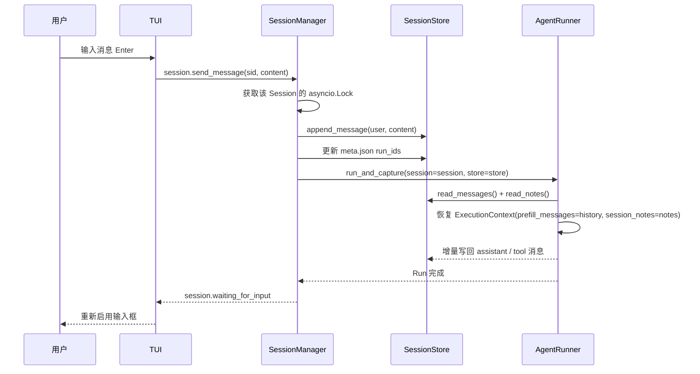
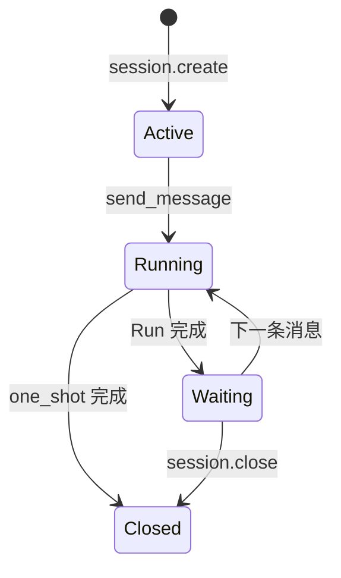

# 💬 KamaClaude · Stage S4

> 从一次性 Run 到可持续 Session —— 多轮对话、分层记忆、TUI 交互式输入全部上线

<div align="center">

[](https://www.python.org/)
[](https://textualize.io/)
[]()
[](./docs/S4-Session.md)

**Session 级会话 · JSONL 消息流 · notes.md 长期笔记 · 交互式 TUI**

</div>

---

## 📌 本分支：`stage/s4`

S3 的核心单位是一次 `Run`：用户给目标 → Agent 执行 → 结束。**S4 把核心单位提升为 `Session`**——多个 Run 共享完整消息历史和关键笔记，支持真正的多轮对话。

```
S1 Run 闭环 → S2 daemon + IPC → S3 自主规划 → S4 Session 会话（← 本分支） → S5 工具安全
```

---

## 🎯 S4 核心一句话

> 用户在同一条 Session 里发两条消息，第二条能理解"上一轮说的那个版本"这种指代——因为 `thread.jsonl` 保存了完整 API 消息流（包括 tool_use 和 tool_result），AgentRunner 启动时把它作为 history 前缀恢复进 ExecutionContext。

---

## 🧩 Session / Run / Step 三层关系

```text
Session（一场持续对话）
├── Run 1：用户第 1 条消息 → Agent 执行（2 step）
└── Run 2：用户第 2 条消息 → Agent 继续（共享 Run 1 的完整历史）
    └── Step 1：模型理解"该版本"指代什么
    └── Step 2：模型执行新任务
```

| 概念 | 生命周期 | 主要职责 |
|------|---------|---------|
| **Session** | 多轮对话 | 管理状态、共享历史与笔记 |
| **Run** | 一条用户请求 | 一次完整 Agent 执行 |
| **Step** | 一次模型调用 | 一次推理 + 可能的工具调用 |

---

## 💾 数据落盘结构

```text
~/.kama/sessions/sess-9f3a2c1b8d04/
├── meta.json              ← Session ID / 状态 / run_ids 列表
├── thread.jsonl           ← 完整 API 消息流（每行一条 JSON）
├── notes.md               ← Agent 主动保存的长期事实（note_save 写入）
└── runs/
    └── 20260519-103012-a1b2c3/
        └── events.jsonl   ← 该 Run 的事件流（排错用）
```

### 两层记忆分工

| 维度 | `thread.jsonl` | `notes.md` |
|------|----------------|------------|
| 回答什么 | 上一轮发生过什么 | 以后应该记住什么 |
| 内容 | 用户/模型消息 + tool_use/tool_result | 事实、决策、约束 |
| 谁写 | 运行链路自动追加 | 模型主动调用 `note_save` |
| 进模型 | 作为 `messages` 前缀 | 拼进 system prompt |

---

## 🔄 一次消息的完整链路



> ⚠️ **顺序很重要**：`append_message(user, content)` 必须在 `run_and_capture()` 之前。否则 AgentRunner 读 history 时会缺少本轮问题。

---

## 🏗️ 关键组件

| 组件 | 职责 |
|------|------|
| `SessionManager` | 创建 Session、串行化消息、维护 `asyncio.Lock`、启动 Run |
| `SessionStore` | 读写 `meta.json` / `thread.jsonl` / `notes.md` |
| `AgentRunner.run_and_capture()` | 有 session → 读 history+notes；无 session → 一次性 Run |
| `NoteSaveTool` | 只在 Session Run 中注册，让模型主动保存长期事实 |

### Session 状态机



> 同一 Session 正在执行时，新消息会收到 `session busy`（锁覆盖整个 Run，保证严格串行）。

---

## 🗂️ S4 新增/修改的关键文件

| 文件 | 职责 |
|------|------|
| `src/kama_claude/core/session/manager.py` | **SessionManager** — create / send_message / Lock / 状态机 |
| `src/kama_claude/core/session/store.py` | **SessionStore** — thread/notes/meta 的读写 |
| `src/kama_claude/core/session/model.py` | **Session 数据模型** — Pydantic |
| `src/kama_claude/core/tools/builtin/note_save.py` | **NoteSaveTool** — 模型主动保存笔记 |
| `src/kama_claude/core/runner.py` | **AgentRunner.run_and_capture()** — 新增 session 模式分支 |
| `src/kama_claude/cli/commands/chat.py` | **kama chat** — 交互式命令行参考实现 |
| `src/kama_claude/tui/app.py` | **ChatTextArea** — Enter 提交 / Shift+Enter 换行 / 只读状态联动 |

---

## 🧪 手动验证

```bash
# Terminal A：启动 daemon
uv run kama-core

# Terminal B：启动 TUI
uv run kama-tui

# 第 1 轮：让模型读文件 + 保存笔记
# > 请读取 pyproject.toml，确认 Python 版本，然后调用 note_save 保存到会话笔记

# 第 2 轮：依赖上一轮信息
# > 写一个适合该版本的新特性 demo

# 检查磁盘文件
ls ~/.kama/sessions/sess-*/
cat ~/.kama/sessions/sess-*/notes.md
cat ~/.kama/sessions/sess-*/thread.jsonl | head -20
```

检查点：
- [ ] `meta.json` 有至少 2 个 `run_ids`
- [ ] 第二轮没有重新读 `pyproject.toml`（证明 history 恢复生效）
- [ ] `notes.md` 有内容（证明 `note_save` 被调用）

---

## 🐛 常见坑速查

| 症状 | 原因 | 解决方案 |
|------|------|---------|
| 第二轮理解了上下文，但没有 `notes.md` | `notes.md` 只有模型主动调 `note_save` 才创建 | 明确提示"请调用 note_save 保存" |
| 第二轮 `session busy` | 锁覆盖整个 Run | 等 Run 完成再发 |
| PowerShell 显示中文乱码 | 默认按 ANSI 读 UTF-8 无 BOM 文件 | `Get-Content -Encoding UTF8` |
| `note_save` 不在工具列表 | 只在 Session Run 注册 | 用 `kama chat` 或 TUI，不要 `kama run` |
| 第二轮又读了一遍文件 | history 恢复没问题但窗口裁剪切在 tool_use/tool_result 中间 | 保证原子裁剪 tool_use/tool_result 配对 |

---

## 📚 深度阅读

| 文档 | 内容 |
|------|------|
| [💬 S4 Session 深度指南](./docs/S4-Session.md) | SessionManager / thread+notes 分层 / Prompt Cache / TUI 状态联动 / PowerShell 踩坑 |

---

## 🤝 分支说明

| 分支 | 定位 |
|------|------|
| `stage/s1` | AgentLoop + EventBus + Run 闭环 |
| `stage/s2` | daemon + IPC + 多客户端 |
| `stage/s3` | 自主规划 + Trace + 八工具 |
| **`stage/s4`** | **当前分支 — Session 会话 + 分层记忆 + TUI 交互** |
| `stage/s5` | 工具安全锁 + 异步审批 |
| `s8` | Windows 二次开发：SQLite 持久化 + 跨重启恢复 |
| `s9` | Windows 二次开发：统一摘要 + Tool Result 截断 |
