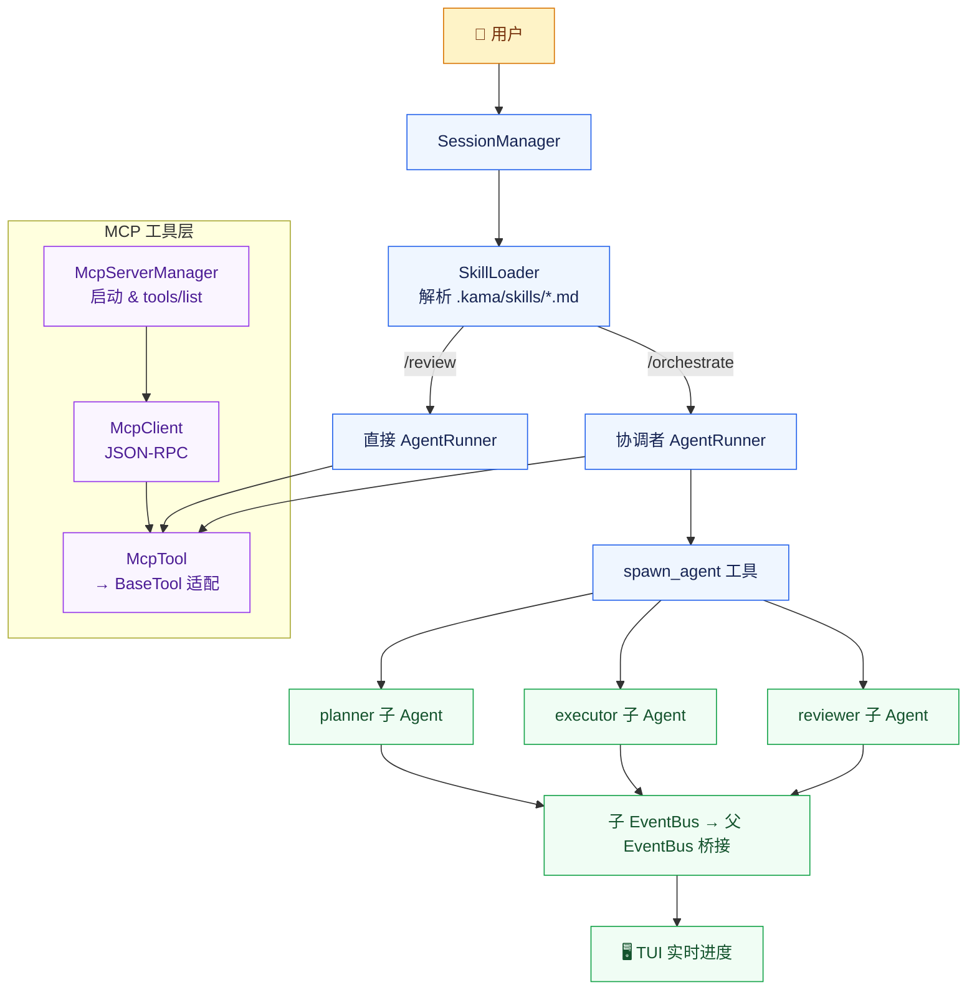
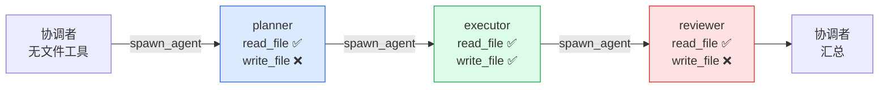
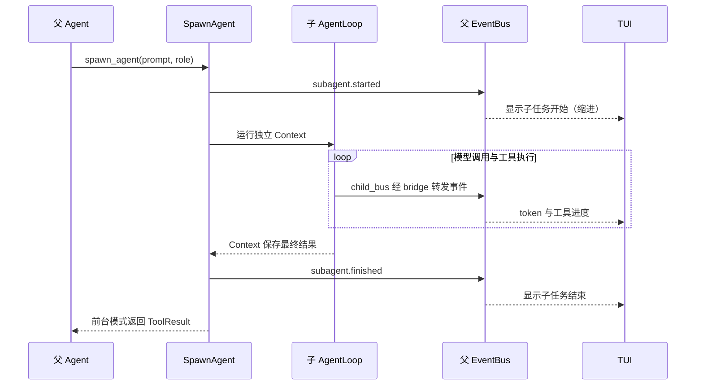
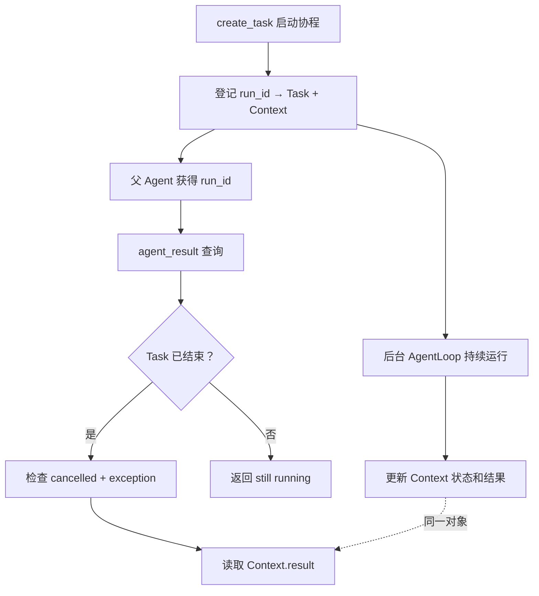
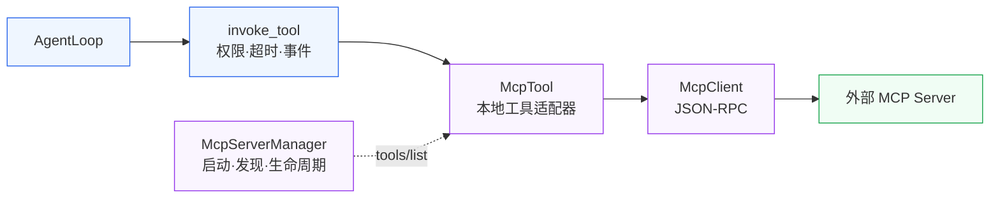

# KamaClaude S7 · Skills · Subagents · MCP

> 从一个 Agent 包办所有任务，走向可复用的工作流、明确的角色分工和可扩展的外部工具。

[](#)


---

## 架构总览



## 三大能力

| 能力 | 组成 | 解决的问题 |
|------|------|-----------|
| **Skill** | Markdown frontmatter + 提示词模板 + 工具白名单 | 把审查、编排等常用流程封装成斜杠命令 |
| **Subagent** | 独立 ExecutionContext + 角色配置 + AgentLoop | 把明确的子任务交给专门角色 |
| **MCP** | 协议客户端 + BaseTool 适配器 | 使用外部服务器提供的工具 |

## Skill 文件结构

```markdown
---
name: orchestrate
description: 使用规划、执行、审查流程完成复杂任务
allowed_tools:
  - spawn_agent
  - agent_result
  - task_create
  - task_update
  - task_list
---
你是多 Agent 协调者，请完成以下目标：

$ARGUMENTS

请先派生 planner，再派生 executor，最后派生 reviewer。
```

### Skill 查找顺序

```
项目本地 .kama/skills/     ← 最高优先级
    ↓ 未找到
用户全局 ~/.kama/skills/
    ↓ 未找到
内建 core/skills/builtin/  ← 兜底
```

支持 `<name>.md` 或 `<name>/SKILL.md` 两种命名。

## spawn_agent 参数

| 参数 | 作用 |
|------|------|
| `description` | 界面上显示的简短任务名称 |
| `prompt` | 子 Agent 所需的完整目标、背景、约束和交付要求 |
| `run_in_background` | 是否启动后立即返回，让任务后台运行 |
| `subagent_type` | 选择角色配置：planner / executor / reviewer |

### 隔离与共享

| 独立拥有 | 仍然共享 |
|---------|---------|
| messages、运行状态和结果 | provider 客户端实例 |
| 工具注册表（按角色重建） | 权限管理器、session ID |
| 子 run 日志与任务文件 | 当前工作目录和文件系统 |

> **子 Agent 不会自动继承父会话的 notes、项目上下文和历史。** prompt 必须自包含。

## 角色配置：planner · executor · reviewer



| 角色 | 职责 | 内建白名单 |
|------|------|-----------|
| planner | 制定计划和成功标准 | `read_file` `list_dir` `task_create` `task_update` |
| executor | 按计划执行并报告产出 | `bash` `read_file` `write_file` `list_dir` `task_update` `task_list` |
| reviewer | 检查实际产出和遗漏 | `read_file` `list_dir` `bash` |

> ⚠️ reviewer 虽然提示词要求只读，但它仍拥有 `bash`。shell 命令可以修改文件，"只读角色"不是操作系统级保证。

## 事件桥与 TUI

子 Agent 有独立 EventBus，通过桥接函数转发到父 bus：

```python
async def _bridge(event):
    await self._parent_bus.publish(event)

child_bus.subscribe(_bridge)
```



## 后台任务生命周期



### 为什么同时保存 Task 和 ExecutionContext

| 对象 | 保存内容 | 查询用途 |
|------|---------|---------|
| `asyncio.Task[None]` | 协程执行状态 | 是否 done / cancelled / exception |
| `ExecutionContext` | Agent 业务状态 | result 文本、status、失败原因 |

`Task.result()` 正常返回 `None`，Agent 的业务结果在 `context.result` 中。

## MCP 四层架构



### 本地名称 vs 远端名称

```python
self.name = f"{server_name}__{tool_def.name}"
# 例如：filesystem__read_file

async def invoke(self, params):
    content = await self._client.call_tool(
        self._tool_def.name,  # 远端仍叫 read_file
        dict(params)
    )
```

### 三种传输方式

| 方式 | 适用场景 | 课程版本 |
|------|---------|---------|
| **stdio** | 客户端管理本地工具进程 | ✅ 已实现（标准传输） |
| **自定义裸 TCP** | 两端约定换行 JSON 的专用服务 | ✅ 已实现（非 HTTP） |
| **Streamable HTTP** | 独立部署的远程 MCP 服务 | ❌ 未实现 |

## 关键组件

| 文件 | 职责 |
|------|------|
| `core/session/manager.py` | 命令解析、Skill 配置传递、runner 创建 |
| `core/skills/loader.py` | 文件查找、frontmatter、参数替换 |
| `core/runner.py` | 白名单过滤、依赖组装、后台注册表生命周期 |
| `core/agents/loader.py` | 角色配置加载 |
| `core/agents/builtin/` | planner / executor / reviewer 内建定义 |
| `core/subagent/tool.py` | spawn_agent 工具实现 |
| `core/subagent/registry.py` | BackgroundTaskRegistry — run_id → Task + Context |
| `core/mcp/client.py` | MCP JSON-RPC 协议交互 |
| `core/mcp/server.py` | 连接管理与工具发现 |
| `core/mcp/tool.py` | McpTool → BaseTool 适配器 |

## 已知边界

| 边界 | 影响 |
|------|------|
| `/review` 和 `/orchestrate` 的 `None` 白名单 | 空列表 `[]` 不表示禁止所有工具，`None` 也不额外限制 |
| reviewer 拥有 `bash` | "只读角色"不是完整操作系统级只读保证 |
| TaskManager ≠ BackgroundTaskRegistry | planner 创建的 `task_create` 记录 ≠ 启动子 Agent |
| 跨消息新建 runner | 每条消息新建注册表，后续无法查询旧后台任务 |
| 角色 `model` 字段未使用 | SpawnAgent 仍复用父 provider，不自动切模型 |
| McpTool 的 `params_model = None` | 远端 JSON Schema 未变成本地 Pydantic 校验 |
| call_tool 不检查 `result.isError` | 工具执行失败可能被当作成功文本返回 |

## 验证步骤

1. **启动程序**：两个终端分别跑 `uv run kama-core` 和 `uv run kama-tui`
2. **验证 Skill**：在 TUI 输入 `/review src/kama_claude/core/loop.py`
3. **验证子 Agent**：输入 `/orchestrate 对 src/kama_claude/core/runner.py 做重构风险分析，不修改任何文件`
4. **验证 MCP**：配置 stdio 类型的 filesystem server，请求读取测试文件

## 深度指南

> 完整的设计说明、代码片段、排查案例与验收清单请阅读 → [`docs/S7-Skills-Subagents.md`](docs/S7-Skills-Subagents.md)

---

## 分支导航

| 分支 | 主题 |
|------|------|
| `stage/s1` | AgentLoop + EventBus + Run 闭环 |
| `stage/s2` | daemon + IPC + 多客户端 |
| `stage/s3` | 自主规划 + Trace + 八工具体系 |
| `stage/s4` | Session 会话 + thread.jsonl + TUI |
| `stage/s5` | 工具安全锁（Pydantic/审批/缓存/退避） |
| `stage/s6` | 上下文治理（三层 context / compact） |
| **`stage/s7`** | **← 你在这里** |
| `s8` ⭐ | Windows 二次开发：SQLite 持久化 |
| `s9` ⭐ | Windows 二次开发：统一摘要系统 |
