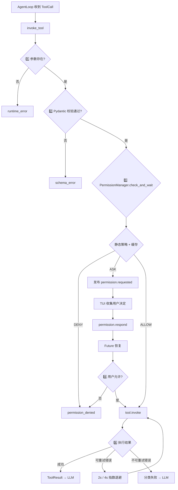

# 🔒 KamaClaude · Stage S5

> 给 Agent 的工具调用链加上安全锁 —— 参数校验 / 静态策略 / 异步审批 / 缓存 / 错误分类 五道关卡

<div align="center">

[](https://www.python.org/)
[](https://docs.pydantic.dev/)
[]()
[]()
[](./docs/S5-Tool-Safety.md)

**参数校验 → 权限策略 → Future 异步审批 → 缓存 → 指数退避**

</div>

---

## 📌 本分支：`stage/s5`

S4 之后 Agent 能持续对话，也能调 Bash、写文件等工具。但新风险随之出现：模型可能漏传参数、理解错路径、执行有副作用的命令，或失败后盲目重试。

**S5 为工具调用补上五道关卡**：参数校验 / 权限策略 / 异步审批 / 决策缓存 / 分类重试。

```
S3 自主规划 → S4 Session 会话 → S5 工具安全（← 本分支） → S6 Context 压缩 → S7 MCP/Skills
```

---

## 🎯 S5 核心一句话

> 工具调用不再是"LLM 找到就执行"——而是经过 Pydantic 校验参数 → 静态权限策略（ALLOW/DENY/ASK）→ 需要用户决定时暂停 Future 等审批 → 审批结果可缓存（always_allow）→ 执行失败按错误类型分类重试，五道关卡层层把关。

---

## 🛡️ 完整五关执行链



---

## 🧠 五道关卡详解

### 1️⃣ Pydantic 参数校验（审批之前）

```python
class BashParams(BaseModel):
    model_config = ConfigDict(extra="ignore")
    command: str                                    # 必填
    timeout: int = Field(default=60, ge=1, le=120)  # 1~120

class BashTool(BaseTool):
    params_model = BashParams                      # 让统一入口知道用哪个模型
```

> ✅ **校验在审批之前**：参数错误不应该让用户判断"是否允许一个本来就无法执行的调用"。

### 2️⃣ 静态权限策略（按顺序匹配）

```python
# 默认策略
DEFAULT_POLICIES = {
    "bash":       ToolPolicy(default=ASK),
    "write_file": ToolPolicy(default=ASK),
    "read_file":  ToolPolicy(default=ALLOW),
}

# 匹配顺序：deny → 越界强制 ASK → allow → 默认策略
def evaluate(tool_name, params, policy):
    for pattern in policy.deny_patterns:   # 1. 强制拒绝
        if re.search(pattern, command): return DENY
    if matches_outside_cwd(command):        # 2. 越界强制 ASK
        return ASK
    for pattern in policy.allow_patterns:   # 3. 允许规则
        if re.search(pattern, command): return ALLOW
    return policy.default                   # 4. 默认策略
```

> 🔐 **越界检查在 allow 之前**：即使配置 `allow_patterns = [".*"]`，`cd ../` 这种命令仍会触发 ASK。

### 3️⃣ Future 异步审批

```python
future = loop.create_future()
self._pending[tool_use_id] = _PendingRequest(future=future, ...)

await bus.publish(PermissionRequestedEvent(tool_use_id=tool_use_id, ...))

raw = await asyncio.wait_for(future, timeout=self._timeout_s)
# ↑ 工具调用暂停，但 daemon 事件循环继续跑
```

用户在 TUI 里按 y/a/n/d 后：
```python
def respond(self, tool_use_id, decision):
    req = self._pending.pop(tool_use_id)
    req.future.set_result(decision)   # ← 唤醒等待的工具调用
```

### 4️⃣ always 缓存（session + persistent 两层）

| 按键 | 决定 | 是否记忆 |
|------|------|---------|
| `y` | allow_once | ❌ |
| `a` | always_allow | ✅ session + persistent |
| `n` | deny_once | ❌ |
| `d` | always_deny | ✅ session + persistent |

> 缓存粒度是**工具名**不是完整命令：`always_allow bash` 会影响所有 Bash 参数，但越高优先级的 deny/越界规则仍生效。

### 5️⃣ 错误分类 + 指数退避

```python
_RETRYABLE = {"runtime_error", "rate_limited"}
_MAX_RETRIES = 2

for attempt in range(1, _MAX_RETRIES + 2):
    try:
        result = await asyncio.wait_for(tool.invoke(...), timeout=timeout)
        if not result.is_error: return result
    except RateLimitedError:   error_class = "rate_limited"
    except TimeoutError:       return _fail(..., "timeout", ...)
    except Exception:          error_class = "runtime_error"

    if error_class in _RETRYABLE and attempt <= _MAX_RETRIES:
        await asyncio.sleep(2.0 * 2 ** (attempt - 1))   # 2s, 4s
        continue
    return _fail(..., error_class, ...)
```

| 错误类型 | 自动重试? |
|---------|----------|
| `schema_error` | ❌ |
| `permission_denied` | ❌ |
| `timeout` | ❌ |
| `runtime_error` | ✅ 最多 2 次（共 3 次执行） |
| `rate_limited` | ✅ 最多 2 次 |

---

## 🗂️ S5 新增/修改的关键文件

| 文件 | 职责 |
|------|------|
| `src/kama_claude/core/tools/invocation.py` | **统一入口** — 参数校验 / 权限接入 / 重试循环 |
| `src/kama_claude/core/permissions/policy.py` | **静态策略 + 越界启发式** |
| `src/kama_claude/core/permissions/manager.py` | **PermissionManager** — 缓存 / Future / respond / 超时 |
| `src/kama_claude/core/permissions/storage.py` | **always 策略文件读写** |
| `src/kama_claude/core/tools/builtin/bash.py` | **BashParams + 子进程执行 + 内部超时** |
| `src/kama_claude/tui/app.py` | **审批控件 + run_worker + 状态联动** |

---

## 🧪 手动验证

```bash
# Terminal A：daemon
uv run kama-core

# Terminal B：TUI
uv run kama-tui

# 演示 1：普通 Bash 命令 → 审批弹窗
#   输入：用 Bash 显示当前目录 → 按 y 或 n

# 演示 2：always allow 后越界命令仍询问
#   先 always allow bash → 再 cd .. && pwd → 仍触发 ASK

# 演示 3：参数错误直接返回，不弹审批
#   bash {"timeout": -1} → 直接 schema_error
```

---

## 🐛 常见坑速查

| 症状 | 原因 | 解决方案 |
|------|------|---------|
| 卡片出现了按键没反应 | 消息处理器 await 阻塞了 Textual 事件循环 | 长操作用 `run_worker(exclusive=False)` |
| always allow 后越界命令不再询问 | 缓存查询在越界检查之前 | 拆成 mandatory（deny/越界）→ cache → fallback（allow/默认） |
| 审批超时被映射成"用户拒绝" | 统一入口把 `allowed=False` 都当 permission_denied | 保留 timeout 错误类型，不自动重试 |
| 取消工具协程后子进程残留 | 外层 wait_for 取消协程不触发 Bash 内部 kill | 在 finally 路径确保子进程终止回收 |
| 自动重试重复写文件/发请求 | runtime_error 不一定幂等 | 工具声明可重试性 + 幂等键 |
| 权限 pending 内存泄漏 | 事件发送失败/取消路径没清理 | try/finally 清理 |

---

## 📚 深度阅读

| 文档 | 内容 |
|------|------|
| [🔒 S5 工具安全深度指南](./docs/S5-Tool-Safety.md) | Pydantic 校验 / Future 审批 / always 缓存 / IPC 往返 / TUI worker / 指数退避 / 三类超时 / Windows 踩坑 |

---

## 🤝 分支说明

| 分支 | 定位 |
|------|------|
| `stage/s3` | 自主规划 + Trace + 八工具 |
| `stage/s4` | Session 会话 + 分层记忆 + TUI 交互 |
| **`stage/s5`** | **当前分支 — 工具安全锁 + 异步审批 + 指数退避** |
| `stage/s6` | Context 压缩 + Compactor |
| `stage/s7` | MCP + Skills + 子 Agent |
| `s8` | Windows 二次开发：SQLite 持久化 + 跨重启恢复 |
| `s9` | Windows 二次开发：统一摘要 + Tool Result 截断 |
