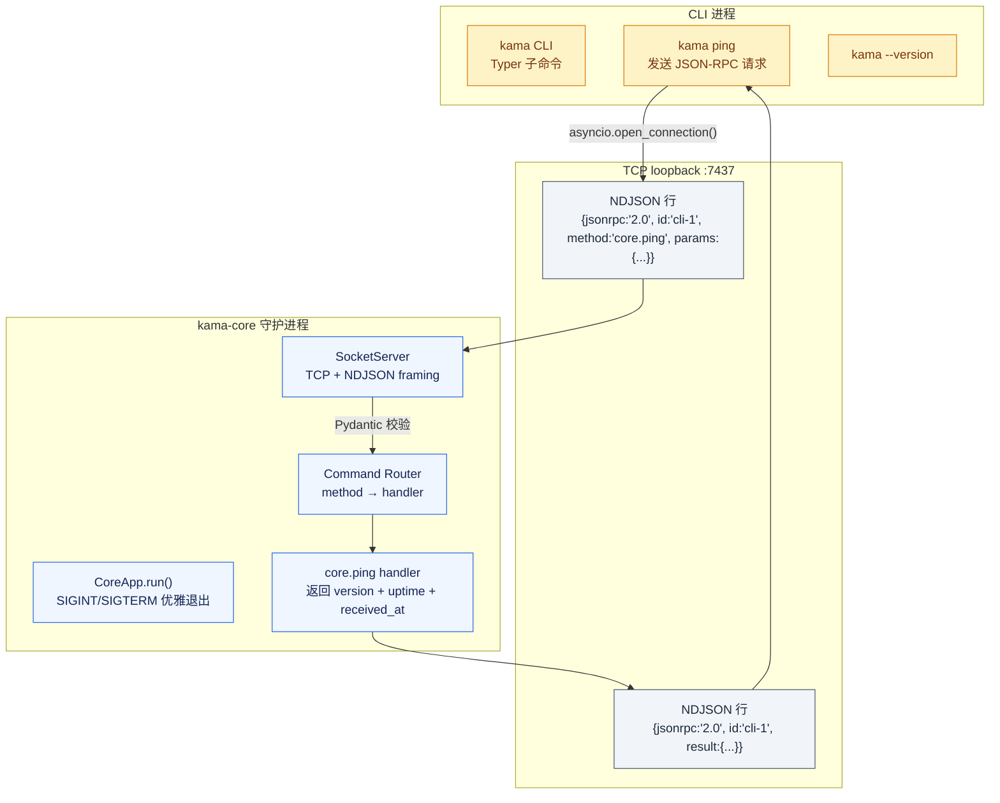
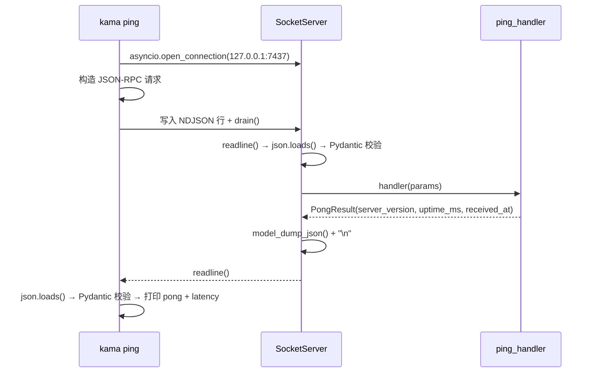

# KamaClaude S0 · 骨架与协议契约

> CLI 和 daemon 通过真实 IPC 完成一次 ping/pong —— 在写第一个 Agent 之前，先立住系统边界。

[](#)


---

## 为什么一开始就要拆 daemon

普通脚手架把所有代码堆在一个进程里，AgentLoop、UI、工具执行全耦合。KamaClaude 在 S0 就先把 **CLI/TUI 前端** 和 **Core 守护进程** 拆开，通过 TCP loopback + JSON-RPC 2.0 通信。

这个"看起来多写了 3 个文件"的决定，换来的是后面所有能力都不用推倒重来：

| 能力 | 直接受益 |
|------|---------|
| TUI 实时渲染 | 复用 IPC 事件订阅通道，不用另开 WebSocket |
| 权限审批 | 通过 IPC 事件推到前端，daemon 不阻塞 |
| Trace 回放 | daemon 记录完整请求/响应，前端只读 |
| 多客户端 | CLI、TUI、未来 Web 前端共用同一个 core |
| Windows 兼容 | TCP loopback 跨平台，不依赖 Unix Socket |

## 架构



## IPC 协议：JSON-RPC 2.0 over NDJSON

S0 选择 **TCP + 换行分隔 JSON** 作为传输层，**JSON-RPC 2.0** 作为消息层 —— 两层解耦，每行一个完整 JSON 对象，天然支持流式。

### 协议规范

| 项目 | 值 |
|------|---|
| 传输 | TCP loopback (`127.0.0.1:7437`，可配置) |
| 帧分隔 | 换行符 `\n`（NDJSON） |
| 单帧上限 | 1 MB（`_MAX_LINE_BYTES`） |
| 协议版本 | JSON-RPC 2.0 |
| 校验 | Pydantic v2 strict model |
| 支持平台 | Windows / macOS / Linux（TCP 跨平台） |

### 请求/响应示例

**请求**（客户端发送）：

```json
{"jsonrpc":"2.0","id":"cli-1","method":"core.ping","params":{"client":"cli/0.0.1"}}
```

**成功响应**（daemon 返回）：

```json
{"jsonrpc":"2.0","id":"cli-1","result":{"server_version":"0.0.1","uptime_ms":42,"received_at":"2026-10-02T08:00:00+00:00"}}
```

**错误响应**（daemon 返回）：

```json
{"jsonrpc":"2.0","id":"cli-1","error":{"code":-32601,"message":"Method not found: agent.run","data":null}}
```

### 标准错误码

| Code | 常量 | 含义 |
|------|------|------|
| -32700 | `PARSE_ERROR` | JSON 解析失败 |
| -32600 | `INVALID_REQUEST` | 请求格式不符合 JSON-RPC 规范 |
| -32601 | `METHOD_NOT_FOUND` | 未注册该 method |
| -32602 | `INVALID_PARAMS` | handler 抛参数校验异常 |
| -32603 | `INTERNAL_ERROR` | handler 内部异常 |

所有请求/响应体都先经过 Pydantic model 校验 —— 脏数据根本到不了 handler。

### Ping Roundtrip 时序



## 核心设计

### 1. Pydantic 驱动的类型安全

不是裸 dict 互发 —— 每个命令和响应都是严格的 Pydantic model：

```python
# bus/envelope.py
class JsonRpcRequest(BaseModel):
    jsonrpc: Literal["2.0"] = "2.0"
    id: str
    method: str
    params: dict[str, Any] = Field(default_factory=dict)

# bus/commands.py
class PingCommand(BaseModel):
    type: Literal["core.ping"] = "core.ping"
    client: str

class PongResult(BaseModel):
    server_version: str
    uptime_ms: int
    received_at: str  # ISO 8601
```

handler 抛 `ValidationError` → 自动变成 `-32602 Invalid params` 返回给客户端。

### 2. Method 注册模式

```python
# core/app.py
server = SocketServer(config.host, config.port)
server.register("core.ping", self._ping_handler)
```

`register(method, handler)` 把 method 字符串映射到 async handler，S1+ 直接继续 `server.register("agent.run", ...)` 就行。

### 3. 优雅退出 + Windows 兼容

```python
try:
    loop.add_signal_handler(signal.SIGINT, shutdown.set)
    loop.add_signal_handler(signal.SIGTERM, shutdown.set)
except NotImplementedError:
    # Windows relies on asyncio.run() cancelling the task on Ctrl+C.
    pass
```

Linux/macOS 用 `SIGINT/SIGTERM`，Windows 靠 `KeyboardInterrupt` —— 双端都能优雅停服。

### 4. 端口冲突检测

```python
# core/transport/socket_server.py
async def start(self) -> str:
    try:
        _r, w = await asyncio.open_connection(self._host, self._port)
        w.close()
        raise SystemExit(f"core already running at {self._host}:{self._port}")
    except (ConnectionRefusedError, OSError):
        pass
    # 端口空着 → 启动 server
```

启动前先探测端口，已被占用直接退出，避免静默起第二个 daemon。

## 文件结构

```
src/kama_claude/
├── cli/
│   ├── main.py              ← Typer 入口，kama ping / kama --version
│   └── commands/
│       ├── ping.py          ← cmd_ping() + async _ping() 客户端
│       └── version.py       ← 打印 __version__
├── core/
│   ├── app.py               ← CoreApp.run() daemon 启动 + 信号处理
│   ├── config.py            ← get_config() 环境变量 + TOML 加载
│   ├── logging_setup.py     ← setup_logging()
│   ├── runs.py              ← Run 元信息骨架
│   ├── bus/
│   │   ├── envelope.py      ← JsonRpcRequest/Success/Error Pydantic models
│   │   ├── commands.py      ← PingCommand + PongResult + Command 判别联合
│   │   └── events.py        ← 事件类型占位
│   └── transport/
│       └── socket_server.py ← SocketServer：TCP + NDJSON framing + handler 路由
└── tui/                     ← 目录占位，S2 开始填充

tests/
├── conftest.py
├── unit/
│   ├── test_app.py              ← CoreApp handler 注册 + 生命周期
│   ├── test_commands_events.py  ← PingCommand/PongResult 序列化
│   └── test_config_env.py       ← 配置加载 + 环境变量覆盖
└── integration/
    └── test_ping_roundtrip.py   ← 启动 server → 发 ping → 收 pong → 断连
```

## 验证步骤

```bash
# 终端 1：启动 daemon
uv run kama-core
# 预期输出：kama-core 0.0.1 listening addr=127.0.0.1:7437

# 终端 2：验证连通
uv run kama ping
# 预期输出：pong server=0.0.1 uptime=XXXms latency=XXms

uv run kama --version
# 预期输出：0.0.1

# 跑测试
uv run pytest tests/ -v
```

## 下一个阶段

S0 立住了 CLI ↔ daemon 的系统边界。从 S1 开始，**AgentLoop、ToolRegistry、EventBus** 全部搬进 daemon，CLI 和 TUI 变成纯前端 —— 同一份 IPC 协议继续用，架构不改。

## 分支导航

| 阶段 | 主题 | 分支 |
|------|------|------|
| **S0** | **← 你在这里** | [`stage/s0`](https://github.com/gandi0/windows-kamaclaude/tree/stage/s0) |
| S1 | Agent 最小闭环 | [`stage/s1`](https://github.com/gandi0/windows-kamaclaude/tree/stage/s1) |
| S2 | 事件流外化 | [`stage/s2`](https://github.com/gandi0/windows-kamaclaude/tree/stage/s2) |
| S3 | 自主规划 + Trace | [`stage/s3`](https://github.com/gandi0/windows-kamaclaude/tree/stage/s3) |
| S4 | 会话与记忆 | [`stage/s4`](https://github.com/gandi0/windows-kamaclaude/tree/stage/s4) |
| S5 | 工具安全锁 | [`stage/s5`](https://github.com/gandi0/windows-kamaclaude/tree/stage/s5) |
| S6 | 上下文治理 | [`stage/s6`](https://github.com/gandi0/windows-kamaclaude/tree/stage/s6) |
| S7 | Skills · Subagents · MCP | [`stage/s7`](https://github.com/gandi0/windows-kamaclaude/tree/stage/s7) |
| S8 ⭐ | SQLite 持久化 + 跨重启恢复 | [`s8`](https://github.com/gandi0/windows-kamaclaude/tree/s8) |
| S9 ⭐ | 统一摘要系统 | [`s9`](https://github.com/gandi0/windows-kamaclaude/tree/s9) |
