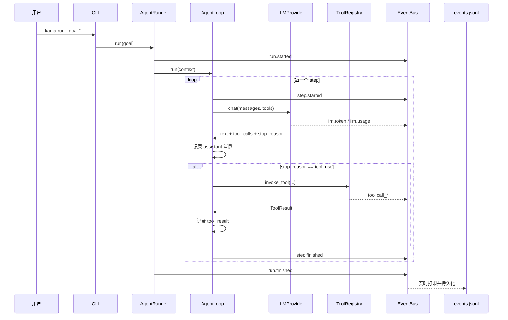

# 🤖 KamaClaude · Stage S1

> 让 Agent 第一次真正运行起来 —— 模型调用、工具执行、消息回填、事件落盘和异常收尾组成完整闭环

<div align="center">

[](https://www.python.org/)
[](https://docs.python.org/3/library/asyncio.html)
[](./docs/S1-Agent-Runtime.md)
[](./docs/S1-Agent-Runtime.md#为什么默认最大步数是-20)

**单进程闭环 · asyncio 驱动 · 八事件链路 · Prompt Caching 接入**

</div>

---

## 📌 本分支：`stage/s1`

基于 S0 项目骨架，**S1 完成 Agent 的第一次端到端可运行闭环**——用户给一个目标，Agent 调模型、执行工具、把结果交还模型、最终输出答案，并保存完整运行记录到 `events.jsonl`。这是 Agent 框架从"能启动"到"能干活"的关键跃迁。

```
S0 骨架（配置/日志/进程）  →  S1 第一次运行闭环（← 本分支）  →  S2 双进程 daemon/IPC  →  S3 自主规划 + Trace
```

---

## 🎯 S1 核心一句话

> AgentLoop 驱动 **plan → observe → act** 的多轮循环：模型决定是否调用工具 → 程序执行工具并把结果写回消息历史 → 模型根据新信息继续决策，直到任务结束。

---

## 🏗️ S1 整体架构



五个核心组件：

| 组件 | 职责 |
|------|------|
| `ExecutionContext` | 保存消息历史、步数、运行状态（Agent 的工作记忆） |
| `AgentLoop` | 驱动每一轮模型调用和工具执行 |
| `LLMProvider` | 屏蔽模型 SDK 细节，返回统一 `LlmResponse` |
| `ToolRegistry` / `invoke_tool` | 暴露工具定义并安全执行 |
| `EventBus` | 把执行过程广播给终端和事件文件 |

---

## 🧠 关键机制速览

### AgentLoop 核心循环

```python
while not context.is_done():
    context.step += 1
    publish(step_started)
    response = await provider.chat(context.messages, tool_schemas)
    context.add_assistant_message(response)          # 先记录模型回复
    if response.stop_reason == "tool_use":
        for tool_call in response.tool_calls:
            result = await invoke_tool(tool_call)
            context.add_tool_result(...)              # 再追加工具结果
    if response.stop_reason == "end_turn":
        context.mark_success()
    elif context.step >= context.max_steps:           # 保险丝：默认 20
        context.mark_failed("exceeded_max_steps")
    publish(step_finished)
```

> ⚠️ **顺序很重要**：必须先存模型的 `assistant(tool_use)`，再追加 `user(tool_result)`。否则消息历史里会出现"没有请求来源的工具结果"。

### 消息协议

```text
user:      总结 README.md
assistant: 我要调用 read_file, tool_use_id=tool_01      ← tool_use 请求
user:      tool_01 的结果是 README 内容                  ← tool_result 写回
assistant: 最终总结                                      ← end_turn
```

### 事件链

```
run.started → step.started → llm.model_selected → llm.token × N → llm.usage
           → tool.call_started → tool.call_finished/failed
           → step.finished → run.finished
```

---

## 🧪 运行验证

```bash
# 正常完成（两步闭环）
uv run kama run --goal "总结 README.md 的主要章节"

# 工具失败后恢复（模型换策略）
uv run kama run --goal "读取 missing-file.md；如果文件不存在，请明确说明"

# 查看完整事件链
python -m json.tool --json-lines --no-ensure-ascii \
  "runs/$(ls -t runs | head -1)/events.jsonl"

# PowerShell 查看 usage
Get-Content .\runs\<run_id>\events.jsonl -Encoding UTF8 |
  ForEach-Object { $_ | ConvertFrom-Json } |
  Where-Object { $_.type -eq "llm.usage" } | Format-List
```

---

## 🗂️ S1 新增/修改的关键文件

| 文件 | 职责 |
|------|------|
| `src/kama_claude/core/loop.py` | **AgentLoop.run()** — 整个 S1 的核心循环 |
| `src/kama_claude/core/runner.py` | **AgentRunner** — 组装依赖、async with EventWriter 保证收尾 |
| `src/kama_claude/core/context.py` | **ExecutionContext** — 消息历史、步数、状态 |
| `src/kama_claude/core/llm/base.py` | **LLMProvider 接口** + LlmResponse 统一响应 |
| `src/kama_claude/core/tools/base.py` | **BaseTool / ToolResult** — is_error + error_type |
| `src/kama_claude/core/tools/registry.py` | **invoke_tool()** — 查找、校验、超时、事件、异常转换 |
| `src/kama_claude/core/events/bus.py` | **EventBus** — 订阅/发布，业务与展示解耦 |
| `src/kama_claude/core/events/writer.py` | **EventWriter** — 逐行 flush 写 events.jsonl |

---

## 📚 深度阅读

| 文档 | 内容 | 适合谁 |
|------|------|--------|
| [🔁 S1 Agent 运行深度指南](./docs/S1-Agent-Runtime.md) | AgentLoop.run、ExecutionContext、ToolResult、EventBus、Prompt Caching、14 页速记 | 想彻底理解 Agent 内部机制 |

---

## 🐛 常见坑速查

| 症状 | 可能原因 | 查哪里 |
|------|---------|--------|
| `events.jsonl` 报 `Extra data` | 用 `json.tool` 直接解析 JSONL | 加 `--json-lines` 参数或逐行反序列化 |
| `cache_creation_input_tokens = 0` 且 `cache_read_input_tokens = 0` | 没达到服务商最小缓存门槛（阿里云约 1024 token） | 增大可缓存前缀再试 |
| 工具失败后 Agent 炸了 | 工具异常直接抛出，没转成 ToolResult | `invoke_tool` 的 try/except 转换逻辑 |
| 两个文件同路径读取 | 绝对路径未校验 + `..` 检查不够 | ReadFileTool 的路径安全处理 |
| step.finished 缺失 | 模型调用异常时 `break`，不发布 step 收尾 | AgentLoop.run 的 finally 块 |

---

## 🤝 分支说明

| 分支 | 定位 |
|------|------|
| **`stage/s1`** | **当前分支 — 第一次运行闭环（单进程）** |
| `stage/s2` | 双进程 daemon + IPC |
| `stage/s3` | 自主规划 + Trace + 八工具体系 |
| `stage/s4` ~ `stage/s7` | 上游后续阶段 |
| `s8` | Windows 二次开发：SQLite 持久化 + 跨重启恢复 |
| `s9` | Windows 二次开发：统一摘要 + Tool Result 截断 |
