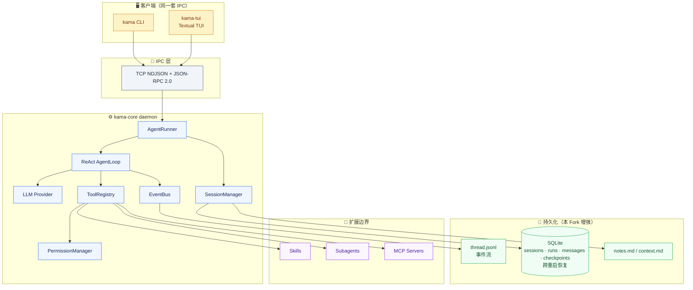

# 🤖 KamaClaude · Windows Fork

> 从零实现的本地 Agent 运行时 —— daemon + IPC + ReAct Loop + 多 Agent + MCP + **跨重启恢复**

[](https://www.python.org/downloads/release/python-3120/)
[](#)
[](#)
[](#)
[](#)
[](#)

---

**KamaClaude** 不是一个"调用大模型 API"的脚本，而是一套完整的本地 Agent 运行时。从 `kama-core` daemon 到 TUI 前端，从 ReAct AgentLoop 到多 Agent 编排，从工具安全锁到上下文治理 —— 每个阶段解决一个真实的工程问题。

**本 Fork 在上游 S0~S7 基础上，额外贡献了 S8（SQLite 持久化 + 跨重启恢复）和 S9（统一摘要系统），并完整适配 Windows 平台 。**

---

## 🏗️ 架构总览



## ✨ 核心能力

| 能力 | 说明 |
|------|------|
| 🛡️ **Daemon 多客户端架构** | `kama-core` 独立守护进程，CLI/TUI/Web 共用同一套 IPC，权限审批、事件订阅、Trace 回放全链路统一 |
| 🧠 **ReAct AgentLoop** | 模型思考 → 工具调用 → 结果回填的多步执行循环，支持 `stop_reason` 驱动的自然终止 |
| 🔒 **工具安全体系** | Pydantic 参数校验 → PermissionManager 权限审批 → 失败分类 + 指数退避重试，三层防护 |
| 🗂️ **会话与记忆** | Session + thread.jsonl + notes.md 三层记忆，多层 context.md 拼进 system prompt 不占对话 |
| 📊 **上下文治理** | `context_pct` 水位可见、`tool_result` 字符截断、自动 compact（`auto_threshold ≥ 0.80`）+ 手动 `/compact` |
| 🤝 **多 Agent 编排** | `/review` 单角色审查 · `/orchestrate` planner/executor/reviewer 三阶段 · 独立 Context + 事件桥接 |
| 🔌 **MCP 协议支持** | stdio / 自定义 TCP 两种传输，McpTool → BaseTool 适配器，`{server}__{tool}` 命名空间 |

## ⭐ Windows Fork 独家贡献

> 在上游 S0~S7 基础上，本 Fork 额外实现了两个关键阶段

### S8 · SQLite 持久化 + 跨重启恢复

```
┌─────────────────────────────────────────────────────┐
│  上游：JSONL 持久化                                    │
│  session_id → thread.jsonl + runs/ + notes.md        │
│  ❌ 进程挂了 = run 丢了                                │
│  ❌ 没有 checkpoint，没法续跑                           │
├─────────────────────────────────────────────────────┤
│  ⭐ 本 Fork：SQLite + checkpoint                      │
│  12 张表：sessions · runs · messages · checkpoints …  │
│  ✅ 进程挂了 → context 进入 interrupted 状态           │
│  ✅ kama resume → 从最近 checkpoint 续跑              │
│  ✅ 已完成工具结果直接复用，不重复执行                   │
└─────────────────────────────────────────────────────┘
```

- **Windows Shell Worker 三层防护**：独立子进程执行 shell，Windows Job Object 绑定父子生命周期，sandbox 隔离
- **会话状态机**：`active` → `interrupted` → `needs_review` → `cancelled` → `completed`
- **12 张表完整 schema**：覆盖 session、run、message、checkpoint、tool_call、permission 全链路

### S9 · 统一摘要系统

- 合并 S6 自动 compact 和 S8 恢复场景的摘要需求为统一 Compactor
- Tool Result 截断增强：智能保留头尾 + 错误优先 + 按需读取完整事件
- 摘要质量校验：程序化检查六段结构，短历史拒绝扩写

---

## 🗺️ 完整阶段导航

点击分支名直达对应阶段的 README 和源码：

| 阶段 | 主题 | 解决的工程问题 | 分支 |
|------|------|---------------|------|
| **S0** | 骨架与协议契约 | CLI 和 daemon 通过真实 IPC 完成 ping/pong | [`stage/s0`](https://github.com/gandi0/windows-kamaclaude/tree/stage/s0) · 🚧 待重写 |
| **S1** | Agent 最小闭环 | 一次 `kama run` 从 goal 到 LLM、工具、事件文件完整跑通 | [`stage/s1`](https://github.com/gandi0/windows-kamaclaude/tree/stage/s1) |
| **S2** | 事件流外化 | AgentRunner 搬进 daemon，CLI/TUI 通过 IPC 订阅同一份事件流 | [`stage/s2`](https://github.com/gandi0/windows-kamaclaude/tree/stage/s2) |
| **S3** | 自主规划 + Trace | Agent 能用任务工具拆解复杂目标；IPC / EventBus / LLM 三层数据流可追踪回放 | [`stage/s3`](https://github.com/gandi0/windows-kamaclaude/tree/stage/s3) |
| **S4** | 会话与记忆 | 多轮 run 进入同一个 session，thread 和 notes 接住上下文 | [`stage/s4`](https://github.com/gandi0/windows-kamaclaude/tree/stage/s4) |
| **S5** | 工具安全锁 | 工具调用前有参数校验、权限审批、失败分类和重试 | [`stage/s5`](https://github.com/gandi0/windows-kamaclaude/tree/stage/s5) |
| **S6** | 上下文治理 | 长会话下有 context 水位、`tool_result` 截断和 compact | [`stage/s6`](https://github.com/gandi0/windows-kamaclaude/tree/stage/s6) |
| **S7** | 扩展边界 | Skills、Subagents、MCP 让 Agent 可组织、可派生、可接外部工具 | [`stage/s7`](https://github.com/gandi0/windows-kamaclaude/tree/stage/s7) |
| **S8** ⭐ | **SQLite 持久化 + 跨重启恢复** | **进程挂了能续跑 — checkpoints + Windows Shell Worker** | [`s8`](https://github.com/gandi0/windows-kamaclaude/tree/s8) |
| **S9** ⭐ | **统一摘要系统 + Tool Result 截断** | **S6 compact + S8 恢复场景的摘要需求合并** | [`s9`](https://github.com/gandi0/windows-kamaclaude/tree/s9) |

<details>
<summary>📋 每个阶段的主 README 和深度指南</summary>

| 分支 | 主 README | 深度指南 |
|------|-----------|---------|
| stage/s1 | [README](https://github.com/gandi0/windows-kamaclaude/blob/stage/s1/README.md) | [Agent Runtime](https://github.com/gandi0/windows-kamaclaude/blob/stage/s1/docs/S1-Agent-Runtime.md) |
| stage/s2 | [README](https://github.com/gandi0/windows-kamaclaude/blob/stage/s2/README.md) | [IPC](https://github.com/gandi0/windows-kamaclaude/blob/stage/s2/docs/S2-IPC.md) |
| stage/s3 | [README](https://github.com/gandi0/windows-kamaclaude/blob/stage/s3/README.md) | [Planning](https://github.com/gandi0/windows-kamaclaude/blob/stage/s3/docs/S3-Agent-Planning.md) · [Trace](https://github.com/gandi0/windows-kamaclaude/blob/stage/s3/docs/S3-Trace-System.md) |
| stage/s4 | [README](https://github.com/gandi0/windows-kamaclaude/blob/stage/s4/README.md) | [Session](https://github.com/gandi0/windows-kamaclaude/blob/stage/s4/docs/S4-Session.md) |
| stage/s5 | [README](https://github.com/gandi0/windows-kamaclaude/blob/stage/s5/README.md) | [Tool Safety](https://github.com/gandi0/windows-kamaclaude/blob/stage/s5/docs/S5-Tool-Safety.md) |
| stage/s6 | [README](https://github.com/gandi0/windows-kamaclaude/blob/stage/s6/README.md) | [Compact](https://github.com/gandi0/windows-kamaclaude/blob/stage/s6/docs/S6-Compact.md) |
| stage/s7 | [README](https://github.com/gandi0/windows-kamaclaude/blob/stage/s7/README.md) | [Skills/Subagents](https://github.com/gandi0/windows-kamaclaude/blob/stage/s7/docs/S7-Skills-Subagents.md) |
| s8 | [README](https://github.com/gandi0/windows-kamaclaude/blob/s8/README.md) | — |
| s9 | [README](https://github.com/gandi0/windows-kamaclaude/blob/s9/README.md) | — |

</details>

---

## 🚀 Quick Start

```bash
# 1. 克隆并进入项目
git clone https://github.com/gandi0/windows-kamaclaude.git
cd windows-kamaclaude

# 2. 安装依赖（需要 Python 3.12+）
uv sync --python 3.12

# 3. 启动 daemon + TUI
# 终端 1
uv run kama-core
# 终端 2
uv run kama-tui
```

第一次运行前，在 `~/.kama/config.toml` 配置模型凭据。Windows 用户请使用 Git Bash 或 PowerShell 执行以上命令。

## 🧰 技术栈

| 类别 | 技术 |
|------|------|
| 语言 | Python 3.12（async/await 全链路） |
| 异步 | asyncio |
| TUI | Textual |
| 数据校验 | Pydantic v2 |
| 持久化 | SQLite + JSONL |
| 进程管理 | Windows Job Object（fork 增强） |
| 协议 | TCP NDJSON + JSON-RPC 2.0 |
| 代码质量 | mypy strict · ruff · pytest |

## 🤔 这不是另一个 AI 套壳

学完这个项目，你能在面试里说：

> 我实现了 ReAct AgentLoop 和工具调用闭环，用 EventBus 把执行过程外化成事件流，设计了 JSON-RPC + NDJSON 的类型化 IPC 协议，实现了 Session/thread/notes 三层记忆、上下文水位检测和自动 compact，支持 Skills/Subagents/MCP 多 Agent 编排，以及 SQLite 持久化和跨重启恢复。

而不是：*"我调用了大模型 API"*。

## 📄 License

MIT
