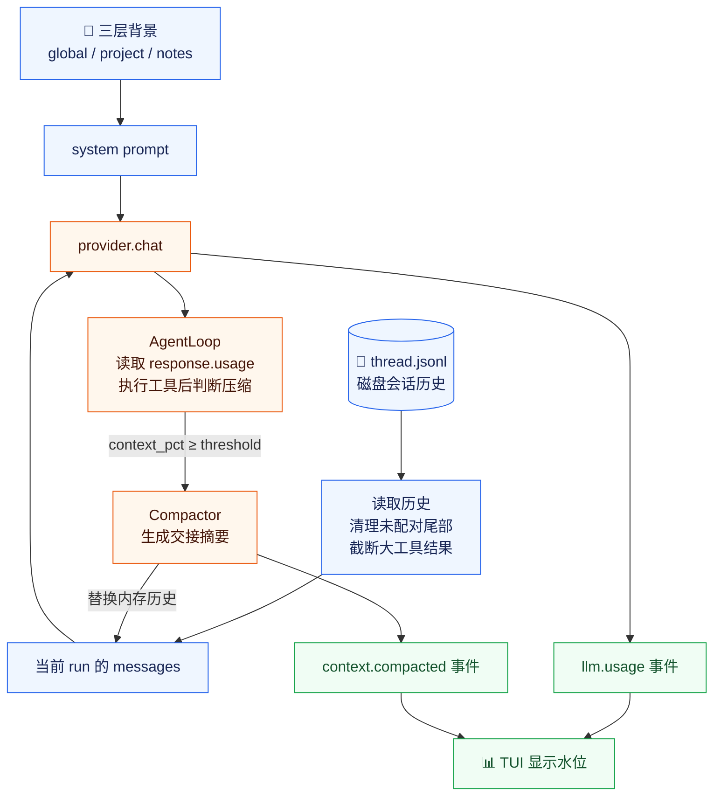
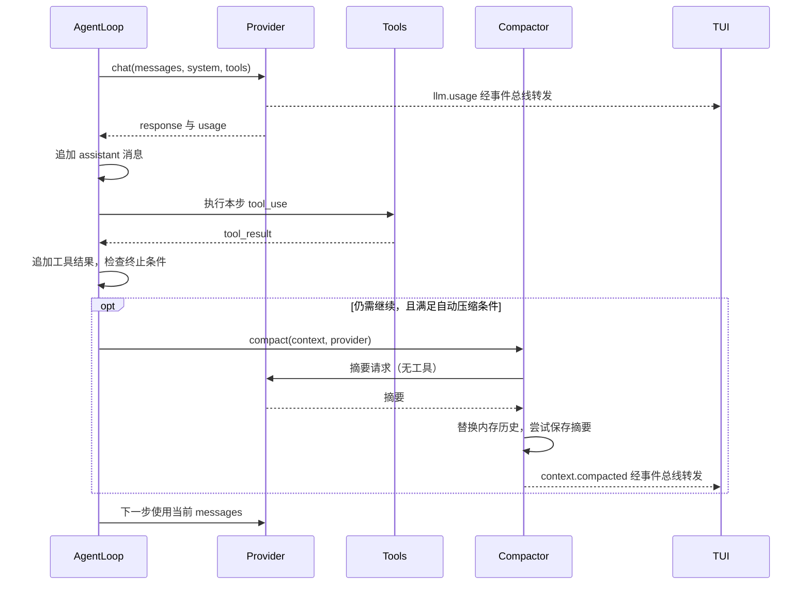

# KamaClaude S6 · 上下文治理

> 三层 context、工具结果截断、水位可见、自动/手动 compact —— 让长对话可持续。

[](#)


---

## 架构总览



## 核心机制

### 三层 context：稳定背景进入 system prompt

| 层级 | 默认路径 | 维护方式 |
|------|----------|----------|
| Global | `~/.kama/context.md` | 用户编辑 — 长期偏好 |
| Project | `<project>/.kama/context.md` | 用户编辑 — 项目约定 |
| Session | `~/.kama/sessions/<sid>/notes.md` | Agent 通过 `note_save` 保存 |

> 三层背景**不追加到对话历史**，而是拼进 system prompt。下一轮用户只说"补一下测试"，模型仍能从背景中找到测试目录。

### tool_result 截断：只改内存，不改磁盘

```python
TOOL_RESULT_LIMIT = 8_000   # 超过此长度才截断
TOOL_RESULT_KEEP  = 4_000   # 保留前 4,000 字符
```

- 截断在 `truncate_tool_results()` 中完成，作用于模型可见的副本
- 磁盘上的 `thread.jsonl` **保留原始长输出**
- 截断的是字符数（`len(text)`），不是 token 数

### context_pct：水位可见

```python
context_pct = usage.input_tokens / context_window
```

- 取值范围 `[0.0, 1.0]`，0.80 表示 80%
- 事件 `llm.usage` 发布后，TUI 实时更新 `tokens in=X out=Y cache=Z ctx:XX.X%`

### 自动 compact：当前 run 内续航

| 条件 | 说明 |
|------|------|
| `auto_threshold > 0` | 默认关闭，需配置 `[compaction] auto_threshold = 0.80` |
| `response.stop_reason == "tool_use"` | 工具循环仍在继续 |
| `context_pct ≥ threshold` | 水位达到阈值 |
| `not context.is_done()` | run 尚未结束 |

**关键时机**：在本步 `tool_use` → `tool_result` 都完成**之后**才检查。这样摘要能包含刚产生的工具结果。

### 自动 vs 手动 compact

| 对比项 | 自动 compact | 手动 compact (`/compact`) |
|--------|-------------|--------------------------|
| 触发方式 | 水位达标 | 用户在 TUI 输入 `/compact`（精确匹配） |
| 摘要来源 | 当前 run 的内存消息 | `read_messages()` 返回的完整会话历史 |
| 更新位置 | 当前 `context.messages`（内存） | 磁盘 `thread.jsonl`，下次读取生效 |
| 改写既有 thread | ❌ 不直接改写 | ✅ 备份为 `thread_<时间>.jsonl.bak`，写摘要版 |
| 另存摘要文件 | 尝试写 `summary_<时间>.md` | 快照未实现 |
| 发布事件 | `context.compacted` | TUI 显示成功提示 |

### auto compact 执行时序



## 关键组件

| 文件 | 职责 |
|------|------|
| `core/memory/loader.py` | `load_context_file()` — 加载三层 Markdown 背景 |
| `core/context.py` | `ExecutionContext`、`system_prompt()`、消息追加 |
| `core/runner.py` | 恢复历史与背景，创建 Compactor，run 结束落盘 |
| `core/compact/budget.py` | `truncate_tool_results()` — 字符截断 |
| `core/compact/compactor.py` | 摘要 prompt、文本转换、压缩结果与副作用 |
| `core/llm/provider.py` | usage、窗口映射、事件发布与响应返回 |
| `core/loop.py` | 工具执行顺序与自动压缩触发 |
| `core/session/store.py` | `read_messages()`、`write_compacted()` |
| `core/session/manager.py` | 会话锁、手动 compact |
| `tui/app.py` | 输入解析、水位显示、`/compact` 精确匹配 |

## 已知边界

| 边界 | 影响 |
|------|------|
| 截断配置未传入调用点 | 修改 TOML 中 `tool_result_limit/keep` 不生效，仍用函数默认值 |
| 只在读取历史时截断 | 当前 run 新产生的大输出可能迅速占满窗口 |
| 只保留输出开头 | 可能遗漏末尾错误或测试结论 |
| 快照不检查"摘要是否更短" | 很短的历史可能被扩写成长摘要 |
| `prefill_len` 固定下标 | 自动 compact 替换 messages 后，结束时 `messages[prefill_len:]` 可能返回空列表，新增消息丢失 |
| 水位公式只用 `input_tokens` | 缓存 token 未计入分子，可能低估 |

## 验证步骤

1. **准备背景**：在项目根目录创建 `.kama/context.md`
2. **启动程序**：两个终端分别跑 `uv run kama-core` 和 `uv run kama-tui`
3. **验证背景生效**：让 Agent 只凭 system prompt 回答测试目录位置
4. **制造长输出**：让 Agent 读取大文件，观察水位变化
5. **手动压缩**：在 TUI **单独输入** `/compact`（不带参数）
6. **检查结果**：确认 `thread.jsonl.bak` 备份存在，新 thread 为两条摘要消息

## 深度指南

> 完整的设计说明、代码片段、工程边界与排查案例请阅读 → [`docs/S6-Compact.md`](docs/S6-Compact.md)

---

## 分支导航

| 分支 | 主题 |
|------|------|
| `stage/s1` | AgentLoop + EventBus + Run 闭环 |
| `stage/s2` | daemon + IPC + 多客户端 |
| `stage/s3` | 自主规划 + Trace + 八工具体系 |
| `stage/s4` | Session 会话 + thread.jsonl + TUI |
| `stage/s5` | 工具安全锁（Pydantic/审批/缓存/退避） |
| **`stage/s6`** | **← 你在这里** |
| `stage/s7` | Skills / subagent / MCP |
| `s8` ⭐ | Windows 二次开发：SQLite 持久化 |
| `s9` ⭐ | Windows 二次开发：统一摘要系统 |
