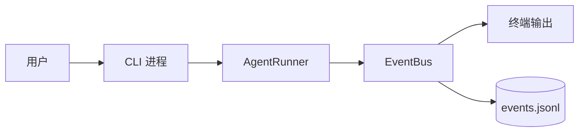
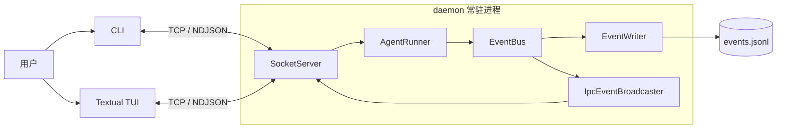
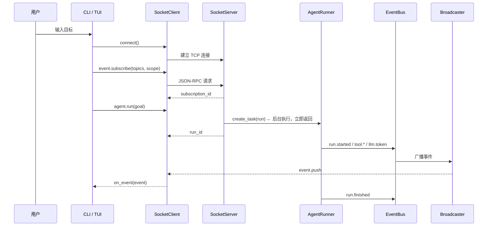

# 🔌 KamaClaude · Stage S2

> 把 Agent 从"CLI 里跑"变成"daemon 托管 + 多客户端可同时观察"——IPC、TCP、NDJSON、JSON-RPC 四件套全部上线

<div align="center">

[](https://www.python.org/)
[](https://docs.python.org/3/library/asyncio.html)
[]()
[](https://docs.pydantic.dev/)
[](https://textualize.io/)
[](./docs/S2-IPC.md)

**daemon 常驻 · TCP 长连接 · 事件订阅 · 断线回放 · TUI 实时渲染**

</div>

---

## 📌 本分支：`stage/s2`

基于 S1 单进程闭环，**S2 把 Agent 的执行权从 CLI 移到常驻 daemon**。CLI 和 Textual TUI 都变成客户端——通过 TCP 发送命令，通过同一条连接接收事件流。daemon 崩溃前、客户端断线后都不影响正在跑的 Agent。

```
S1 单进程闭环  →  S2 daemon + IPC（← 本分支）  →  S3 自主规划 + Trace  →  S4~S7 上游后续
```

---

## 🎯 S2 核心一句话

> daemon 统一托管所有 Agent 执行，EventBus 发布过程事件，`IpcEventBroadcaster` 按订阅筛选并推送给多客户端——一份事件落盘，一份广播，CLI 和 TUI 同时观察同一次 Run。

---

## 🏗️ S1 → S2 架构变化

### S1：CLI 自己执行 Agent



CLI 既是操作入口，也是执行进程。CLI 一退出，Agent 也随之消失。

### S2：daemon 统一托管



三个直接收益：

1. ✅ CLI 退出后，daemon 仍可继续运行 Agent
2. ✅ CLI 和 TUI 能同时观看同一个 Run
3. ✅ 客户端断线后凭 `run_id` 回放历史事件

---

## 📦 组件职责速览

| 组件 | 职责 | 生命周期 |
|------|------|---------|
| `daemon` | 托管 Agent、管理连接、广播事件 | **常驻** |
| `SocketServer` | TCP 服务端，NDJSON 解析 + JSON-RPC 路由 | 随 daemon |
| `SocketClient` | 发送命令 + 接收事件推送 | 随客户端 |
| `AgentRunner` | 真正执行一次 Agent 目标 | 一次 Run |
| `EventBus` | daemon 内部事件分发 | 随 daemon |
| `EventWriter` | 事件落盘到 `events.jsonl` | 一次 Run |
| `IpcEventBroadcaster` | 按订阅筛选 + 向客户端推送 | 随 daemon |

**核心边界**：Agent 负责执行，EventBus 表达过程，daemon 托管任务，IPC 跨进程传输，客户端负责交互与展示。

---

## 🔄 一次任务的完整链路



> ⚠️ **必须先 `event.subscribe` 再 `agent.run`**——后台任务可能很快发布 `run.started`，订阅尚未建立时实时事件没有接收者。

---

## 🧠 关键机制速览

### CLI 只做四件事

```python
client = SocketClient(host, port)
await client.connect()
loop_task = asyncio.create_task(client.run_event_loop())  # 启动接收循环

await client.send_command("event.subscribe", {...})       # 1. 订阅
result = await client.send_command("agent.run", {"goal": goal})  # 2. 发起
await finished.wait()                                     # 3. 等待结束
loop_task.cancel(); await loop_task                       # 4. 清理
```

### SocketClient._dispatch：一条连接分两类消息

```python
async def _dispatch(self, message):
    if message.get("method") == "event.push":     # 事件推送
        for handler in self._event_handlers:
            await handler(message["params"]["event"])
        return

    future = self._pending.pop(message["id"])      # 命令响应
    if "error" in message:
        future.set_exception(IpcError.from_response(...))
    else:
        future.set_result(message.get("result"))
```

### IpcEventBroadcaster：两层过滤 + 先记后删

```python
for sub in list(self._subscriptions):     # 遍历快照，避免遍历时删漏
    if not self._matches_topic(event_type, sub.topics):
        continue
    if not self._matches_scope(run_id, sub.scope):
        continue
    try:
        sub.writer.write(event_bytes)
        await sub.writer.drain()
    except (ConnectionResetError, BrokenPipeError):
        dead.append(sub.writer)

for writer in dead:                       # 统一删死连接
    self.unsubscribe(writer)
```

### ContextVar：每个异步任务独立上下文

```python
_writer_var: ContextVar[asyncio.StreamWriter] = ContextVar("writer")

# SocketServer 处理请求前：
_writer_var.set(writer)
result = await handler(req.params)

# handler 内部：
def _subscribe_handler(self, params):
    writer = _writer_var.get()            # 拿到当前请求的 writer
    ...
```

普通全局变量会被并发请求覆盖；ContextVar 为每个 `create_task()` 保存独立副本。

---

## 🗂️ S2 新增/修改的关键文件

| 文件 | 职责 |
|------|------|
| `src/kama_claude/core/daemon.py` | **daemon 主进程** — 启动 SocketServer、托管 EventBus/Broadcaster |
| `src/kama_claude/core/ipc/server.py` | **SocketServer** — TCP accept + NDJSON 解析 + JSON-RPC 路由 |
| `src/kama_claude/core/ipc/client.py` | **SocketClient** — send_command + Future 配对 + _dispatch |
| `src/kama_claude/core/ipc/broadcaster.py` | **IpcEventBroadcaster** — topic/scope 过滤 + 死连接清理 |
| `src/kama_claude/core/ipc/protocol.py` | **JSON-RPC 2.0 + NDJSON 协议定义** |
| `src/kama_claude/core/ipc/replay.py` | **事件回放** — 读 events.jsonl 并重新推送 |
| `src/kama_claude/tui/` | **Textual TUI** — worker + token 缓冲 + 实时渲染 |

---

## 🧪 手动验证

```bash
# Terminal A：启动 daemon
uv run kama-core

# Terminal B：启动 TUI（实时观察）
uv run kama-tui

# Terminal C：CLI 发起任务
uv run kama run --goal "总结 README.md 的主要章节"
```

检查点：
- CLI 和 TUI 是否展示相同 `run_id`
- 两个客户端是否都能看到工具调用与模型输出
- CLI 退出后 daemon 是否继续运行（`netstat -ano | findstr :7437`）
- TUI 断线重连 + `replay_from_run` 是否恢复历史

---

## 🐛 常见坑速查

| 症状 | 原因 | 解决方案 |
|------|------|---------|
| `send_command()` 一直等待 | 接收循环没启动 | 先 `create_task(run_event_loop())` 再发命令 |
| CLI 收不到 `run.started` | 先跑再订阅 | 订阅成功后再 `agent.run` |
| 多客户端事件串线 | 普通全局变量保存 writer | ContextVar 或显式传连接上下文 |
| 遍历时漏发事件 | 边遍历边删死连接 | 遍历快照 `list(...)` + 先记后删 |
| 慢客户端拖慢所有人 | 广播器顺序 `drain()` | 每连接独立发送队列 |
| `Task exception was never retrieved` | 后台 Task 异常无人读取 | done callback 调 `task.result()` |
| 回放后缺一条新事件 | 历史与实时之间有窗口 | 递增 `seq` + 高水位游标 |
| TUI 断线前最后一段文字丢失 | token 缓冲未 flush | 连接清理 finally 中 flush |

---

## 📚 深度阅读

| 文档 | 内容 | 适合谁 |
|------|------|--------|
| [🔌 S2 IPC 深度指南](./docs/S2-IPC.md) | SocketClient/Server/Broadcaster/Replay/Textual 全链路 + 外卖类比 + 一页速记 | 想彻底理解 IPC 架构 |

---

## 🤝 分支说明

| 分支 | 定位 |
|------|------|
| `stage/s1` | 单进程闭环 — AgentLoop + EventBus + events.jsonl |
| **`stage/s2`** | **当前分支 — daemon + IPC + 多客户端** |
| `stage/s3` | 自主规划 + Trace + 八工具体系 |
| `stage/s4` ~ `stage/s7` | 上游后续阶段 |
| `s8` | Windows 二次开发：SQLite 持久化 + 跨重启恢复 |
| `s9` | Windows 二次开发：统一摘要 + Tool Result 截断 |
