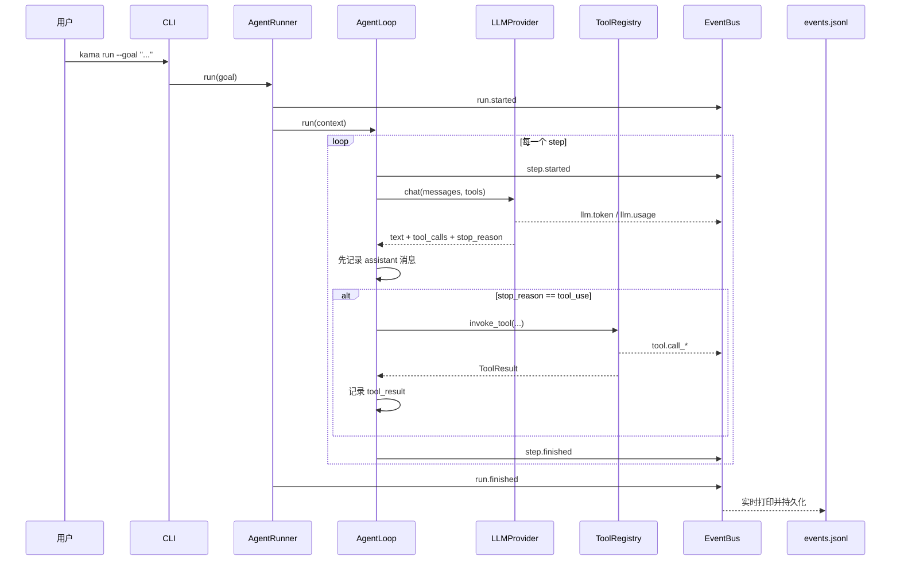
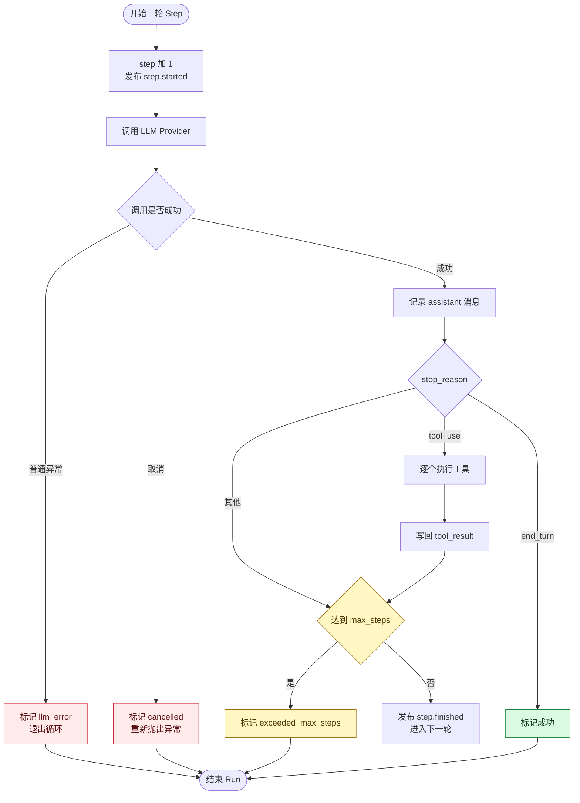
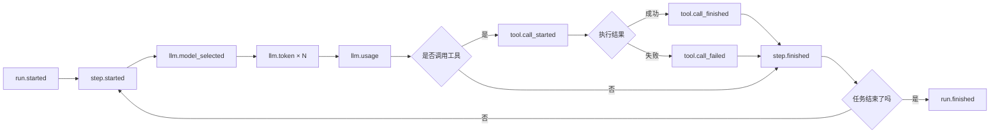

# KamaClaude S1：让 Agent 第一次真正运行起来

> 一份面向 Agent 工程初学者的源码导读。从一条 `kama run` 命令出发，看懂 **模型调用、工具执行、消息回填、事件落盘和异常收尾** 如何组成完整闭环。


本文以 `stage/s1` 的代码为讲解基线，适合作为个人学习笔记、组内技术分享材料或源码阅读入口。当前主分支已经加入 IPC、权限、上下文压缩和子 Agent 等后续能力，这些不混入 S1 主线，以便看清最小可运行 Agent 的核心结构。

> [!IMPORTANT]
> S1 的核心闭环只有一句话：**模型决定是否调用工具，程序执行工具并把结果写回消息历史，模型再根据新信息继续决策，直到任务结束。**

## 你将学到什么

- 🧠 `AgentLoop.run()` 如何驱动"模型 → 工具 → 模型"的多轮循环
- ⚙️ `asyncio`、`await`、`finally` 和 re-raise 在运行链路中的作用
- 🛠️ `tool.invoke()`、`is_error` 与 `error_type` 如何统一工具执行
- 📡 `LlmTokenEvent`、`EventBus` 和 `events.jsonl` 如何记录全过程
- 💾 为什么 `llm.usage` 中的 cache 可能一直是 `0`
- 🧯 最大步数为什么是 `20`，以及取消、超时、路径和 JSONL 的常见坑

## 阅读导航

| 想解决的问题 | 建议阅读 |
| --- | --- |
| 先理解一次 Agent 运行的全貌 | [整体执行链](#架构) |
| 看懂异步语法 | [CLI 与异步入口](#cli异步入口) |
| 重点研究 `AgentLoop.run()` | [核心循环](#agentlooprun核心) |
| 理解工具调用与错误处理 | [工具系统](#工具系统) |
| 排查 cache 为 `0` | [Prompt caching](#prompt-caching为什么-cache-一直是-0) |
| 运行后检查 `events.jsonl` | [验证事件链](#验证不仅看最终答案还要看事件链) |
| 分享前快速复习 | [一页速记](#一页速记) |

<details>
<summary><strong>用于技术分享时的 35 分钟节奏</strong></summary>

| 环节 | 时间 | 内容 |
| --- | ---: | --- |
| 问题与演示 | 5 分钟 | 从命令出发，看两步任务如何完成 |
| 核心执行链 | 15 分钟 | `AgentRunner`、`ExecutionContext`、`AgentLoop` |
| 工具与事件 | 8 分钟 | 错误结果化、流式事件、JSONL |
| 踩坑复盘 | 5 分钟 | 取消、路径、JSONL、缓存为 0 |
| 总结与提问 | 2 分钟 | 四条模块边界与后续演进 |

</details>

---

## 🚀 S1 到底解决了什么问题

S0 留下的是一个能读取配置、输出日志、启动进程的项目骨架。S1 要完成的事情很具体：用户给出一个目标，Agent 能调用大模型、按模型要求执行工具、把工具结果交还模型，最后输出答案，并保存完整运行记录。

演示命令：

```bash
uv run kama run --goal "总结 README.md 的主要章节"
```

理想运行过程：

```text
[run] 20260511-161020-abc123
[step 1] planning...
I'll read the README.md file to get its contents.
[tool] read_file {"path": "README.md"}
[tool] read_file ✓  4ms
[step 1] done
[step 2] planning...
# Summary
The README covers the following sections...
[step 2] done
[run] success  2 steps  5.3s
```

这两步分别是：

1. 模型判断需要读取文件，发出 `read_file` 工具调用。
2. 程序读取文件并把内容交还模型，模型根据内容生成最终答案。

Agent 与普通的一次性 LLM 调用的区别就在这里：它不是"问一次、答一次"，而是一个可以反复"思考—行动—观察"的循环。

---

## 🗺️ 先看全局：一次运行经过哪些组件



五个核心角色：

| 组件 | 职责 |
|---|---|
| `ExecutionContext` | 保存消息历史、步数和运行状态，相当于 Agent 的工作记忆 |
| `AgentLoop` | 驱动每一轮模型调用和工具执行 |
| `LLMProvider` | 屏蔽模型 SDK 细节，返回统一的 `LlmResponse` |
| `ToolRegistry` / `invoke_tool` | 暴露工具定义并安全执行工具 |
| `EventBus` | 把执行过程广播给终端和事件文件 |

---

## ⚙️ CLI：异步程序从哪里启动

关键代码：

```python
def cmd_run(goal: str, config: KamaConfig) -> None:
    printer = StdoutPrinter()
    runner = AgentRunner(config, extra_handlers=[printer.handle])
    try:
        asyncio.run(runner.run(goal))
    except KeyboardInterrupt:
        sys.exit(130)
```

`runner.run()` 是用 `async def` 定义的异步函数。直接调用它只会得到协程对象；`asyncio.run()` 创建事件循环并驱动协程执行。

`await` 可以理解为：当前协程要等待异步操作的结果，但等待期间把执行权交还给事件循环。它不会让当前函数越过这一行继续执行。

```python
response = await provider.chat(...)
# 一定在 chat 完成后才会执行这里
context.add_assistant_message(...)
```

### ⚠️ 踩坑：把异步理解成"后面的代码会同时执行"

`await` 只允许事件循环调度其他已经存在的任务。当前协程仍按顺序执行。下面的工具调用仍是串行的：

```python
for tool_call in response.tool_calls:
    result = await invoke_tool(...)
```

如果未来确实要并行执行多个互不依赖的工具，应显式使用 `asyncio.gather()` 或 `TaskGroup`，同时考虑结果顺序、取消和限流。

### ⚠️ 踩坑：在已有事件循环中再次调用 `asyncio.run()`

`asyncio.run()` 适合普通 CLI 顶层入口；在 Jupyter、异步 Web 框架等已经运行事件循环的环境中，应直接 `await runner.run(goal)`。

---

## 🧩 AgentRunner：组装依赖并保证有始有终

S1 中，`AgentRunner` 创建运行目录、事件总线、模型 Provider、工具注册表和执行上下文：

```python
run_id = new_run_id()
run_path = self._runs_dir / run_id
run_path.mkdir(parents=True, exist_ok=True)

bus = EventBus()
provider = self._provider or AnthropicProvider(self._config.llm.default_model)
registry = ToolRegistry()
registry.register(ReadFileTool())
loop = AgentLoop(provider, registry, bus)

context = ExecutionContext(
    run_id=run_id,
    goal=goal,
    max_steps=self._config.agent.max_steps,
)
```

`run_id` 同时承担三个作用：区分不同运行、命名落盘目录、关联同一次运行产生的事件。

事件文件通过异步上下文管理器打开：

```python
async with EventWriter(run_path / "events.jsonl") as writer:
    writer.subscribe(bus)
    await bus.publish(RunStartedEvent(...))
    await loop.run(context)
    await bus.publish(RunFinishedEvent(...))
```

`async with` 离开代码块时会调用 `__aexit__()`，正常完成、抛异常或被取消时都能关闭文件。

### `finally` 是什么

`finally` 表示离开 `try` 结构前一定尝试执行的收尾代码：

```python
try:
    await do_work()
finally:
    await close_resource()
```

即使 `do_work()` 抛出异常、执行 `return` 或退出循环，`close_resource()` 仍会运行。上下文管理器在资源管理场景中承担类似职责，通常更清晰。

### ⚠️ 踩坑：吞掉取消异常

`AgentLoop` 捕获取消异常后会重新抛出：

```python
except asyncio.CancelledError:
    context.mark_failed("cancelled")
    raise
```

单独的 `raise` 就是 re-raise：把当前捕获的同一个异常继续交给外层。这样内层可以先更新状态，外层仍能感知取消、发布 `run.finished`、关闭事件文件，最后再把取消信号传出去。

如果只标记状态却不 `raise`，取消信号会被吞掉，调用方可能误以为任务正常结束。

---

## 🧠 ExecutionContext：Agent 的工作记忆

第一次创建上下文时，目标会成为第一条用户消息：

```python
def __post_init__(self) -> None:
    if not self.messages:
        self.messages.append({"role": "user", "content": self.goal})
```

一次典型任务的消息历史会逐渐变成：

```text
user:      总结 README.md
assistant: 我要调用 read_file，tool_use_id=tool_01
user:      tool_01 的结果是 README 内容
assistant: 最终总结
```

工具结果虽然由程序生成，在 Anthropic 消息协议中仍以 `user` 角色发回，并通过 `tool_use_id` 与工具请求配对。

多个并行工具请求的结果要合并到同一条 `user` 消息中，因此 `add_tool_result()` 会检查最后一条消息：

```python
if last_is_tool_result_user_message:
    last["content"].append(block)
else:
    self.messages.append({"role": "user", "content": [block]})
```

### ⚠️ 踩坑：先执行工具，再记录模型回复

消息历史应先保存模型发出的 `tool_use`，随后保存对应的 `tool_result`：

```text
assistant(tool_use) → user(tool_result)
```

否则历史里会先出现一个没有请求来源的工具结果。即使某些兼容接口校验较宽松，这种顺序也会破坏调用配对和跨 Provider 的可移植性。

---

## 🔁 AgentLoop.run：整个 S1 的核心

把代码压缩成伪代码后，它的职责非常清楚：

```python
while not context.is_done():
    context.step += 1
    publish(step_started)

    try:
        response = await provider.chat(context.messages, tool_schemas, ...)
    except CancelledError:
        mark_failed("cancelled")
        raise
    except Exception:
        mark_failed("llm_error")
        break

    context.add_assistant_message(response)

    if response.stop_reason == "tool_use":
        for tool_call in response.tool_calls:
            result = await invoke_tool(...)
            context.add_tool_result(...)

    if response.stop_reason == "end_turn":
        context.mark_success()
    elif context.step >= context.max_steps:
        context.mark_failed("exceeded_max_steps")

    publish(step_finished)
```

这里的实际顺序是：

```text
plan（调用模型）→ observe（记录模型回复）→ act（执行工具并记录结果）
```

代码注释中出现的 `plan → act → observe` 是概念性表达；从消息协议看，必须先把 assistant 的回复写进历史，再追加工具结果。



> [!NOTE]
> 图中的"记录 assistant 消息"必须发生在"写回 tool_result"之前，否则工具结果在消息历史中找不到对应的 `tool_use` 请求。

### 为什么默认最大步数是 20

`20` 不是算法上的最佳值，而是一个保险丝：防止模型反复调用同一工具、持续从错误中重试或产生意外循环。

一步指"一次模型调用，加上这一轮要求的工具处理"，不等于一次工具调用。一次响应包含多个工具调用时，它们仍属于同一步。

```python
if response.stop_reason == "end_turn":
    context.mark_success()
elif context.step >= context.max_steps:
    context.mark_failed("exceeded_max_steps")
```

`end_turn` 放在前面，因此模型恰好在第 20 步完成时仍算成功。

### ⚠️ 踩坑：以为工具失败应该立即终止循环

工具失败是可以被模型理解和修正的业务结果，例如文件不存在时，模型可以换一个路径。S1 将失败转换成 `ToolResult`，再交还模型，而不是让异常直接炸掉整个 Agent。

真正终止运行的主要情况是：模型明确结束、超过最大步数、模型 API 异常或任务被取消。

### ⚠️ 踩坑：以为所有异常路径都有 `step.finished`

S1 中模型调用发生普通异常时会 `break`，取消时会 `raise`，因此当前 step 不会走到末尾的 `StepFinishedEvent`。`run.finished` 仍由外层发布，但事件序列可能是：

```text
step.started → run.finished
```

如果业务要求每个 step 都严格成对，可以把 step 收尾放入覆盖整轮逻辑的 `finally`，同时避免在尚未真正开始的阶段误报完成。

---

## 🌊 LLM Provider：流式输出与统一响应

模型流式返回文字时，Provider 一边广播片段，一边累积完整答案：

```python
text_parts: list[str] = []

async with client.messages.stream(**kwargs) as stream:
    async for text in stream.text_stream:
        await bus.publish(LlmTokenEvent(run_id=run_id, token=text, ts=_now()))
        text_parts.append(text)

text = "".join(text_parts)
```

`LlmTokenEvent` 表示"模型刚输出了一小段文本"：

```python
class LlmTokenEvent(BaseModel):
    type: Literal["llm.token"] = "llm.token"
    run_id: str
    token: str
    ts: str
```

这里的 `token` 实际是 SDK 返回的文本片段，不保证正好等于模型分词意义上的一个 token。

终端订阅者这样实时打印：

```python
print(event.token, end="", flush=True)
```

`end=""` 不自动换行，`flush=True` 立即刷新，所以用户能看到文字逐步出现。

### `stop_reason` 决定下一步做什么

| `stop_reason` | AgentLoop 的处理 |
|---|---|
| `tool_use` | 执行工具，写回结果，进入下一轮 |
| `end_turn` | 标记成功，结束循环 |
| 其他值 | S1 没有完整分类；达到最大步数前可能继续下一轮 |

### ⚠️ 踩坑：把 `max_tokens` 当成任务完成

`max_tokens` 通常表示模型输出被截断，并不等于任务完成。生产实现应显式处理：增加合理输出上限、提示模型拆分任务，或把本次运行标记为输出不完整。

---

## 🛠️ 工具系统：从 schema 到真正执行

### BaseTool 定义统一契约

```python
@dataclass
class ToolResult:
    content: str
    is_error: bool = False
    error_type: str | None = None

class BaseTool(ABC):
    name: str
    description: str
    input_schema: dict[str, object]

    @abstractmethod
    async def invoke(self, params: dict[str, object]) -> ToolResult: ...
```

`tool.invoke()` 是具体工具真正干活的地方。例如 `ReadFileTool.invoke()` 负责读取文件；外层 `invoke_tool()` 负责通用的查找、校验、超时、事件和异常转换。

```text
AgentLoop
  └─ invoke_tool（通用安全外壳）
       └─ tool.invoke（具体业务操作）
```

### `is_error` 与 `error_type`

`is_error` 回答"这次工具调用成功了吗"，并随 `tool_result` 发给模型；`error_type` 回答"属于哪类错误"，主要用于日志、统计和策略判断。

| `error_type` | 典型场景 |
|---|---|
| `schema_error` | 缺少必填参数 |
| `timeout` | 工具超过执行时限 |
| `runtime_error` | 工具不存在、文件不存在或工具内部异常 |

成功结果：

```python
ToolResult(content="README 内容")
```

失败结果：

```python
ToolResult(
    content="tool timed out after 10.0s",
    is_error=True,
    error_type="timeout",
)
```

### 超时保护

```python
result = await asyncio.wait_for(
    tool.invoke(dict(tool_call.input)),
    timeout=10.0,
)
```

工具超过 10 秒未完成时，`wait_for()` 取消内部协程并抛出 `TimeoutError`，外层再把它转换为失败结果。

### ⚠️ 踩坑：以为 `async def` 里面的代码自动变成非阻塞

S1 的文件读取是：

```python
async def invoke(...):
    raw = path.read_bytes()
```

`path.read_bytes()` 仍是同步磁盘 I/O。小文件问题不大，但大文件或高并发场景会阻塞事件循环。可使用 `await asyncio.to_thread(path.read_bytes)` 或异步文件库。

### ⚠️ 踩坑：只检查 `..` 不等于限制在工作目录

S1 禁止了路径中的 `..`：

```python
if ".." in Path(path_str).parts:
    raise PermissionError(...)
```

但绝对路径可能仍被读取。更严谨的处理应拒绝绝对路径，并在解析后确认目标路径仍位于允许的根目录中：

```python
root = Path.cwd().resolve()
requested = Path(path_str)
if requested.is_absolute():
    raise PermissionError("absolute path not allowed")

target = (root / requested).resolve()
if not target.is_relative_to(root):
    raise PermissionError("path escapes workspace")
```

---

## 📡 EventBus：业务逻辑与展示、落盘解耦

EventBus 的实现很小：

```python
class EventBus:
    def subscribe(self, handler):
        self._subscribers.append(handler)

    async def publish(self, event):
        for handler in self._subscribers:
            await handler(event)
```

AgentLoop 只负责声明"发生了什么"，不用知道事件最终是显示在终端、写进文件，还是被测试代码收集。

S1 运行主链路会用到：

- `run.started` / `run.finished`
- `step.started` / `step.finished`
- `llm.model_selected` / `llm.token` / `llm.usage`
- `tool.call_started` / `tool.call_finished` / `tool.call_failed`



事件定义文件里总共可数到 12 个事件模型，因为还包含 S0 或通用的 `core.started` 和 `log.line`。所以分享时应区分"文件中定义的事件数"和"一次 Agent 运行实际出现的事件类型数"。

### EventWriter 为什么每行都 flush

```python
self._file.write(event.model_dump_json() + "\n")
self._file.flush()
```

这样进程中途崩溃时，已经产生的事件大概率仍在磁盘中。代价是频繁写盘，因此它适合强调可观测性的学习项目；高吞吐系统可能需要缓冲、批量写入或独立日志线程。

### ⚠️ 踩坑：慢订阅者会拖慢整个运行

当前 `publish()` 按顺序 `await` 每个 handler。任何订阅者卡住，模型流式输出和 AgentLoop 都会被拖慢。生产环境可考虑队列隔离，但需要额外处理背压、事件顺序和关闭时的数据排空。

---

## 💾 Prompt Caching：为什么 cache 一直是 0

S1 为固定的 system prompt 和工具定义添加了缓存标记：

```python
{
    "type": "text",
    "text": SYSTEM_PROMPT,
    "cache_control": {"type": "ephemeral"},
}
```

缓存命中不会复用旧答案，只会复用相同输入前缀的处理结果。模型仍会重新生成输出。

> [!TIP]
> 看到 cache 为 `0` 时，先判断请求是否达到服务商的缓存门槛，再检查前缀是否稳定。cache 为 `0` 本身不能证明 Agent 或缓存代码有故障。

查看两个字段：

```text
cache_creation_input_tokens  本次创建了多少缓存 token
cache_read_input_tokens      本次命中了多少缓存 token
```

S1 开发中实际使用阿里云 qwen3.7-plus 验证时，短任务两轮输入分别只有 351 和 697 token，都没有达到其显式缓存至少 1024 token 的条件，所以两个缓存字段都是 0。使用超过门槛的稳定 system 内容连续请求两次后，结果是：

```text
第一次：cache_creation_input_tokens = 3846
第二次：cache_read_input_tokens     = 3846
```

### ⚠️ 踩坑：看到 0 就认定缓存代码坏了

缓存值为 0 可能有多种原因：

1. 可缓存前缀未达到服务商的最小长度。
2. 两次请求的前缀并不完全一致。
3. 缓存已经过期。
4. 当前模型或兼容接口不支持相同的缓存协议。
5. API 没有返回对应字段，而代码使用 `getattr(..., 0)` 将"字段缺失"也记成了 0。

因此，排查时应同时观察 `cache_creation_input_tokens`。首次创建也是 0，通常意味着根本没有建立缓存。

### ⚠️ 踩坑：认为不同模型服务的规则完全相同

缓存规则属于模型服务接口能力，不是 AgentLoop 的通用规则：

- 阿里云 Qwen 的显式缓存有最小 token 门槛，并识别 `cache_control`。
- OpenAI GPT 的提示词缓存通常由服务端自动处理，不使用同一套 Anthropic 请求格式。
- DeepSeek 官方 API 默认进行上下文缓存，重点是匹配已经持久化的公共前缀，usage 字段名称也不同。

接入新 Provider 时，应把"请求格式、缓存规则、usage 字段映射"封装在 Provider 内，避免把厂商细节泄漏到 AgentLoop。

### 不要为了命中缓存故意灌水

缓存主要影响输入处理费用和延迟，不扩大上下文窗口，也不会自动提高回答质量。原本只有 350 token 的任务，硬填到 4000 token 即使命中缓存，也可能更贵、更慢，并干扰模型注意力。只缓存本来就要反复使用的长规则、代码、知识库材料或工具定义。

> [!CAUTION]
> 最小缓存长度不是各家模型统一的 `1000` token。它由具体模型、API 和缓存模式决定；接入新 Provider 时应查对应服务文档，并以实际 usage 字段验证。

---

## 🔍 验证：不仅看最终答案，还要看事件链

先运行任务：

```bash
uv run kama run --goal "总结 README.md 的主要章节"
```

查看最新日志：

```bash
# Linux / macOS / Git Bash
python -m json.tool --json-lines --no-ensure-ascii \
  "runs/$(ls -t runs | head -1)/events.jsonl"
```

`events.jsonl` 是 JSON Lines 格式：每一行都是一个独立 JSON。缺少 `--json-lines` 时，`json.tool` 会把整个文件当成单个 JSON，通常报 `Extra data`。

> [!WARNING]
> 不要直接把 `events.jsonl` 当成一个 JSON 数组解析。JSONL 的每一行都要独立反序列化。

PowerShell 查看最新日志：

```powershell
$latestRun = Get-ChildItem .\runs -Directory |
    Sort-Object LastWriteTime -Descending |
    Select-Object -First 1

$eventsPath = Join-Path $latestRun.FullName "events.jsonl"
Get-Content -LiteralPath $eventsPath -Encoding UTF8 |
    ForEach-Object { $_ | ConvertFrom-Json | ConvertTo-Json -Depth 20 }
```

只看 usage：

```powershell
Get-Content -LiteralPath $eventsPath -Encoding UTF8 |
    ForEach-Object { $_ | ConvertFrom-Json } |
    Where-Object { $_.type -eq "llm.usage" } |
    Format-List
```

建议验证以下事实：

- 第一条和最后一条分别是 `run.started`、`run.finished`。
- 每个成功步骤都有 `step.started` 和 `step.finished`。
- 工具调用的 `tool_use_id` 能和消息历史中的结果配对。
- 工具失败会产生 `tool.call_failed`，但 Agent 仍有机会进入下一步。
- 两步任务确实发生两次 `llm.usage`。
- `run.finished.steps` 与实际模型调用次数一致。

---

## 🎬 分享时可以现场演示的三个场景

### 场景一：正常完成

```bash
uv run kama run --goal "总结 README.md 的主要章节"
```

观察"模型请求工具 → 文件读取成功 → 模型给出总结"的两步闭环。

### 场景二：工具失败后恢复

```bash
uv run kama run --goal "读取 missing-file.md；如果文件不存在，请明确说明"
```

观察工具错误如何变成 `is_error=True` 的结果，并由模型生成对用户友好的说明。

### 场景三：缓存验证

缓存值为 0 时不一定是 bug——换一个更长的稳定前缀（如 system prompt + 长工具定义）连续请求两次，看第二次的 `cache_read_input_tokens` 是否大于 0。

---

## ✅ 最后的总结

S1 最有价值的不是增加了一个 `run` 命令，而是建立了四条边界：

1. `AgentLoop` 只负责控制循环，不直接处理终端和文件。
2. `LLMProvider` 隔离模型 SDK 和厂商协议。
3. 工具失败被建模为可观察、可反馈的结果，模型能够继续决策。
4. 所有关键动作都转化为事件，使运行过程可显示、可落盘、可回放。

这套结构也为后续阶段留下了扩展位置：事件可以通过 IPC 发给另一个进程，消息历史可以变成持久会话，工具可以增加权限系统，上下文可以压缩，Provider 可以接入更多模型，而 S1 的核心循环不需要推倒重来。

---

## 📌 一页速记

```text
async def     定义协程函数
await         等待异步结果，期间允许事件循环调度其他任务
asyncio.run   在同步 CLI 入口创建事件循环并运行顶层协程
finally       无论正常还是异常退出，都尝试执行收尾逻辑
re-raise      在 except 中用 raise 继续传播当前异常

AgentLoop     驱动"模型 → 工具 → 模型"的多轮循环
Context       保存消息、步数和状态
Provider      调模型并转换统一响应
Registry      保存工具并生成工具 schema
invoke_tool   查找、校验、限时执行并统一处理工具错误
EventBus      广播过程事件
EventWriter   把事件逐行写入 events.jsonl

is_error      这次工具调用是否失败
error_type    失败属于 schema、timeout 还是 runtime 等类别
stop_reason   模型为什么结束本轮输出
max_steps     防止 Agent 无限循环的保险丝
cache_control 标记可缓存的稳定输入前缀，具体规则取决于模型服务
```

---

> [!TIP]
> 推荐学习顺序：先运行一次正常任务，再对照 `events.jsonl` 阅读本文；遇到术语时查看"一页速记"，最后用工具失败和缓存示例验证自己的理解。
