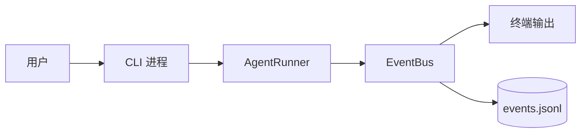
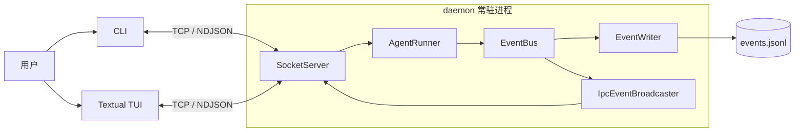
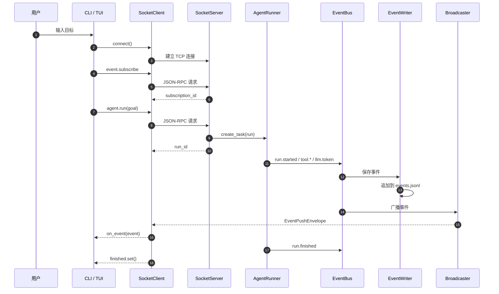
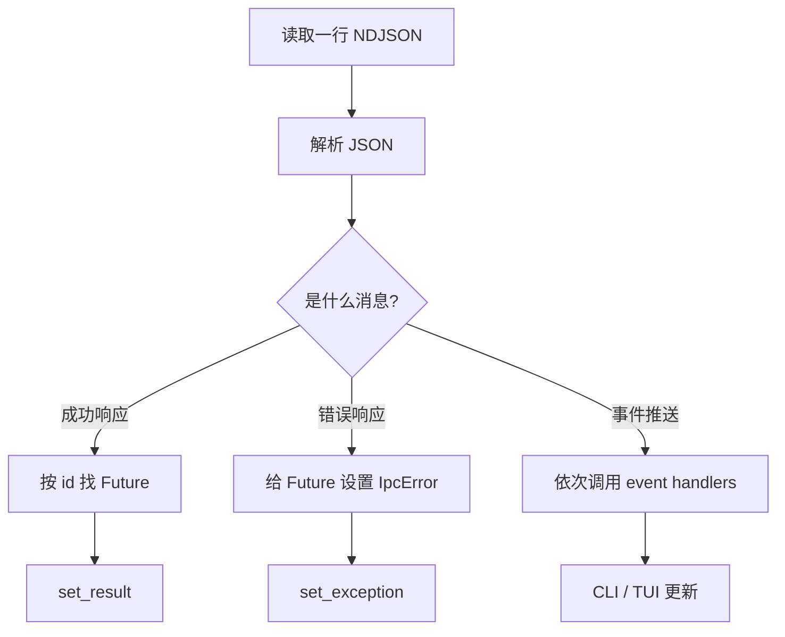
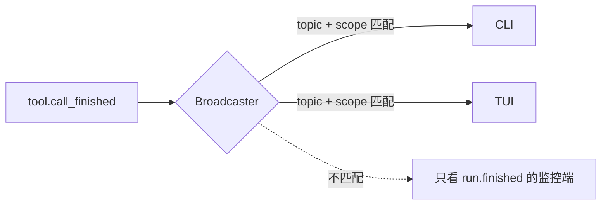
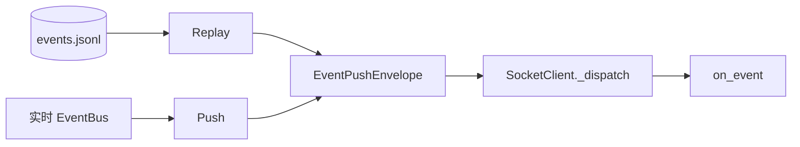
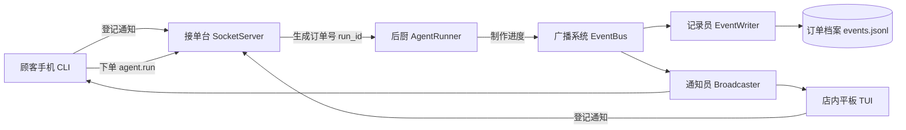

# KamaClaude S2：把 Agent 事件流外化为 IPC

> 一份面向 Python / Agent 工程学习者的源码导读。本文从 **daemon、TCP、JSON-RPC、事件订阅、广播、回放和 Textual TUI** 入手，解释如何让 CLI 与 TUI 同时观察同一次 Agent 运行，并把常见踩坑和解决方案放在相关代码旁边。


本文依据项目源码 `stage/s2` 整理，适合用作自学笔记、组内分享稿或源码阅读入口。

> [!NOTE]
> 本文聚焦 S2 的架构主线。代码片段经过裁剪，用来突出职责和调用关系；"改进方案"描述的是更稳健的工程做法，不一定已经在 S2 中全部实现。

## 目录

- [先看结论](#overview)
- [S1 到 S2 的架构变化](#architecture)
- [核心技术栈](#stack)
- [一次任务的完整链路](#flow)
- [CLI：只发命令和消费事件](#cli)
- [SocketClient：一条连接分发两类消息](#socket-client)
- [SocketServer：接收请求并路由命令](#socket-server)
- [`event.subscribe`：登记想接收的事件](#subscribe)
- [`agent.run`：立即返回，后台执行](#agent-run)
- [IPC 广播：把一个事件送给多个客户端](#broadcast)
- [事件保存与回放](#replay)
- [Textual TUI 与 token 缓冲](#tui)
- [如何测试](#testing)
- [用"外卖店"串起整套系统](#analogy)
- [排障速查表](#troubleshooting)
- [局限与下一步改进](#limitations)
- [学习检查表](#checklist)

---

<a id="overview"></a>

## 先看结论

S2 最重要的变化，是把 **Agent 的执行权从 CLI 移到常驻 daemon**。CLI 和 TUI 都变成客户端：它们通过网络发送命令，通过同一条连接接收事件。

| 组件 | 核心职责 | 生命周期 |
| --- | --- | --- |
| `daemon` | 接收命令、托管 Agent、广播事件 | 常驻 |
| `SocketServer` | 接收 TCP 消息，解析并路由命令 | 随 daemon 常驻 |
| `SocketClient` | 发送命令，接收响应和事件 | 随客户端存在 |
| `AgentRunner` | 真正执行一次 Agent 目标 | 一次 Run |
| `EventBus` | 在 daemon 内部发布执行事件 | 随 daemon 常驻 |
| `EventWriter` | 把事件写入 `events.jsonl` | 一次 Run |
| `IpcEventBroadcaster` | 筛选订阅并向客户端推送事件 | 随 daemon 常驻 |
| CLI / TUI | 触发任务、消费事件并展示 | 一次命令或一次界面会话 |

> [!IMPORTANT]
> S2 的核心边界是：**Agent 负责执行，EventBus 表达过程，daemon 托管任务，IPC 跨进程传输，客户端负责交互与展示。**

这条边界带来三个直接收益：

1. CLI 退出后，daemon 仍可以继续运行；
2. CLI 和 TUI 能同时观看同一个 Run；
3. 客户端断线后，可以根据 `run_id` 回放已经保存的事件。

---

<a id="architecture"></a>

## S1 到 S2 的架构变化

### S1：CLI 自己执行 Agent



CLI 既是操作入口，也是执行进程。CLI 一退出，执行环境也随之消失；其他客户端无法观察同一次任务。

### S2：daemon 统一托管 Agent



这里的"通过网络触发"，具体是：客户端把 `agent.run` 命令序列化为一行 JSON，通过 TCP 发给 daemon；daemon 收到后找到对应 handler，创建后台任务并返回 `run_id`。

> [!TIP]
> 即使客户端与 daemon 都在同一台电脑上，使用 `127.0.0.1` 和 TCP 通信也属于网络通信。操作系统负责把字节从一个进程的 socket 交给另一个进程的 socket。

---

<a id="stack"></a>

## 核心技术栈

| 技术 | 在 S2 中解决什么问题 | 学习重点 |
| --- | --- | --- |
| Python `asyncio` | 网络读写、并发连接和后台任务 | `Task`、`Future`、`Event` 的区别 |
| TCP | 跨进程、双向、长连接通信 | TCP 是字节流，没有天然消息边界 |
| NDJSON | 给 TCP 字节流划分消息边界 | 一行一个 JSON 对象 |
| JSON-RPC 2.0 | 表达命令请求、成功响应和错误响应 | 用请求 `id` 配对响应 |
| Pydantic | 校验命令参数并序列化消息 | 错误应转换为稳定的协议响应 |
| `ContextVar` | 保存"当前请求属于哪条连接" | 并发任务之间互不覆盖 |
| EventBus | daemon 内部事件分发 | 执行层不依赖 CLI / TUI |
| Textual | 构建异步终端界面 | worker、生命周期、UI 更新 |
| pytest | 验证组件与完整 IPC 链路 | 单元、集成和手动验证的边界 |

### `Task`、`Future`、`asyncio.Event` 不要混淆

| 对象 | 可以把它想成 | 在 S2 中的用途 |
| --- | --- | --- |
| `asyncio.Task` | 已排进事件循环的工作单 | 让 Agent 在后台执行，让接收循环持续运行 |
| `Future` | 等待某个结果的取件盒 | `send_command()` 等待同一请求 `id` 的响应 |
| `asyncio.Event` | 可置位的通知灯 | CLI 等待 `run.finished` 到达 |

> [!WARNING]
> `asyncio.create_task()` 不会创建操作系统线程或进程。它只是把协程登记到当前事件循环；协程遇到 `await` 时，其他任务才有机会继续执行。

---

<a id="flow"></a>

## 一次任务的完整链路



把这条链路压缩成一句话：

```text
客户端先订阅 -> 再发起 Run -> daemon 后台执行 -> EventBus 发布过程
-> 一份落盘，一份广播 -> SocketClient 分发 -> CLI / TUI 更新展示
```

为什么必须先 `event.subscribe`，再 `agent.run`？因为后台任务可能很快发布 `run.started`。订阅尚未建立时，这个实时事件没有接收者。

---

<a id="cli"></a>

## CLI：只发命令和消费事件

"CLI 只负责发命令和消费事件"意味着：CLI 不再构造 `AgentRunner`，不直接调用模型，也不执行工具。它只做四件事：连接、订阅、发起任务、等待结束事件。

```python
async def _run_async(goal: str, config: KamaConfig) -> int:
    client = SocketClient(config.host, config.port)
    await client.connect()

    printer = StdoutPrinter()
    finished = asyncio.Event()
    exit_code = 0

    async def on_event(event: dict[str, Any]) -> None:
        nonlocal exit_code
        await printer.handle(event)

        if event.get("type") == "run.finished":
            if event.get("status") != "success":
                exit_code = 1
            finished.set()

    client.on_event(on_event)
    loop_task = asyncio.create_task(client.run_event_loop())

    await client.send_command("event.subscribe", subscribe_params)
    result = await client.send_command("agent.run", {"goal": goal})
    await finished.wait()
```

### 这段代码做了什么

1. `connect()` 建立到 daemon 的 TCP 长连接；
2. `on_event()` 登记事件到达后的处理方法；
3. `run_event_loop()` 持续读取 socket，并被安排为后台 Task；
4. `event.subscribe` 告诉 daemon 想看哪些事件；
5. `agent.run` 触发任务，并立即得到 `run_id`；
6. `finished.wait()` 等待 `run.finished`，避免 CLI 提前退出。

### `on_event` 到底是什么

`on_event` 是一个回调函数。`client.on_event(on_event)` 只是登记它；真正收到服务器推送后，`SocketClient._dispatch()` 才会调用它。

> [!CAUTION]
> 必须先启动 `run_event_loop()`，再调用 `send_command()`。`send_command()` 会等待响应；如果没有协程读取 socket，响应即使已经到达操作系统缓冲区，也没人解析，程序看起来就会"卡死"。

推荐顺序：

```python
loop_task = asyncio.create_task(client.run_event_loop())
await client.send_command("event.subscribe", params)
await client.send_command("agent.run", {"goal": goal})
```

清理时要取消接收 Task，并等待取消完成：

```python
loop_task.cancel()
with contextlib.suppress(asyncio.CancelledError):
    await loop_task
await client.close()
```

---

<a id="socket-client"></a>

## SocketClient：一条连接分发两类消息

同一条 TCP 连接同时承载两类数据：

- **命令响应**：`event.subscribe`、`agent.run` 等请求的结果；
- **事件推送**：`run.started`、`llm.token`、`tool.call_finished`、`run.finished` 等。

它们通过消息形状区分：响应带 JSON-RPC `id`，事件推送使用固定方法名或事件信封。



### `_dispatch()` 的核心逻辑

```python
async def _dispatch(self, message: dict[str, Any]) -> None:
    if message.get("method") == "event.push":
        event = message["params"]["event"]
        for handler in list(self._event_handlers):
            await handler(event)
        return

    request_id = message.get("id")
    future = self._pending.pop(request_id, None)
    if future is None:
        return

    if "error" in message:
        future.set_exception(IpcError.from_response(message["error"]))
    else:
        future.set_result(message.get("result"))
```

当 `send_command()` 发出请求时，它会创建一个 Future，并用请求 `id` 保存：

```python
request_id = self._next_id()
future = asyncio.get_running_loop().create_future()
self._pending[request_id] = future
await self._write(request)
return await future
```

响应到达后，`_dispatch()` 按相同 `id` 找到 Future，调用 `set_result()` 或 `set_exception()`，原来等待的 `send_command()` 就会继续。

> [!WARNING]
> 事件回调在接收循环中被 `await`。如果回调做大量计算、慢磁盘操作或长时间等待，命令响应和后续事件都会被拖慢。回调应只做轻量处理；耗时工作放进 `asyncio.Queue`，由独立消费者完成。

---

<a id="socket-server"></a>

## SocketServer：接收请求并路由命令

SocketServer 是 daemon 的"接待层"，负责：

1. 接受客户端连接；
2. 按行读取 NDJSON；
3. 解析 JSON-RPC 请求；
4. 根据 `method` 找到 handler；
5. 返回成功或错误响应。

```python
server.register("core.ping", self._ping_handler)
server.register("event.subscribe", self._subscribe_handler)
server.register("agent.run", self._agent_run_handler)

handler = self._handlers.get(req.method)
result = await handler(req.params)
await self._send(
    writer,
    JsonRpcSuccess(id=req.id, result=result),
)
```

这种注册表结构让传输层不需要知道 Agent 的业务细节。新增命令时，实现一个 handler 并注册即可。

### 为什么会设置多条连接

每个独立客户端通常使用自己的连接。例如同时打开：

- 终端 A：daemon；
- 终端 B：TUI，持续观察所有事件；
- 终端 C：CLI，发起一次任务并等待完成；
- 后台监控：只订阅 `run.finished` 和错误事件。

多条连接让每个客户端拥有独立生命周期、订阅条件和断线处理。CLI 退出不会关闭 TUI 的连接。

> [!TIP]
> 一条连接足以同时承载该客户端的命令响应与事件推送。只有当存在多个独立客户端、不同权限边界，或需要隔离慢消费者时，才需要多条连接。

### 错误响应要分层

如果所有异常都变成 `Internal error`，客户端无法区分参数错误、未知命令和任务冲突。更稳妥的做法是定义稳定错误码：

```text
INVALID_PARAMS
METHOD_NOT_FOUND
RUN_ALREADY_ACTIVE
INTERNAL_ERROR
```

客户端根据错误码决定是否重试或提示用户，服务端日志保留完整堆栈。

---

<a id="subscribe"></a>

## `event.subscribe`：登记想接收的事件

订阅命令不是"启动事件流"，而是把这条连接登记进 daemon 的订阅列表，并记录过滤条件。

```python
async def _subscribe_handler(self, params: dict[str, Any]):
    cmd = EventSubscribeCommand.model_validate(params)
    writer = get_connection_writer()

    replayed_count = 0
    if cmd.replay_from_run is not None:
        replayed_count = await self._replay_events(
            cmd.replay_from_run,
            writer,
            cmd.topics,
        )

    sub_id = self._broadcaster.subscribe(
        writer,
        cmd.topics,
        cmd.scope,
    )
    return EventSubscribeResult(
        subscription_id=sub_id,
        replayed_count=replayed_count,
    )
```

| 参数 | 含义 | 示例 |
| --- | --- | --- |
| `topics` | 想接收哪些事件类型 | `run.*`、`tool.*`、`llm.token` |
| `scope` | 接收哪些 Run 的事件 | `global`、`run:<id>` |
| `replay_from_run` | 先回放哪个 Run 的历史记录 | 某个 `run_id` |

### 为什么要用 `ContextVar`

handler 只有业务参数，但订阅还需要知道"当前请求来自哪条连接"。服务端可以在处理请求前，把对应 `StreamWriter` 放进 `ContextVar`：

```python
_writer_var: ContextVar[asyncio.StreamWriter] = ContextVar("writer")

_writer_var.set(writer)
result = await handler(req.params)

def get_connection_writer() -> asyncio.StreamWriter:
    return _writer_var.get()
```

普通全局变量会被并发请求覆盖：客户端 B 的请求可能把客户端 A 的 writer 换掉。`ContextVar` 为每个异步任务保存独立上下文。

> [!NOTE]
> 另一种清晰做法是显式传递连接上下文：`handler(params, connection)`。它减少隐式依赖，但会让所有 handler 签名都携带连接参数。两种方案都可以，关键是不能用一个可被并发覆盖的普通全局变量。

---

<a id="agent-run"></a>

## `agent.run`：立即返回，后台执行

```python
async def _agent_run_handler(self, params: dict[str, Any]):
    cmd = AgentRunCommand.model_validate(params)

    if self._current_run_task and not self._current_run_task.done():
        raise RuntimeError("a run is already in progress")

    run_id = new_run_id()
    runner = AgentRunner(self._config, bus=self._bus)
    self._current_run_task = asyncio.create_task(
        runner.run(cmd.goal, run_id=run_id)
    )
    return AgentRunResult(run_id=run_id)
```

### 为什么不直接 `await runner.run()`

如果 handler 直接等待整个 Agent 完成，`agent.run` 的命令响应会一直不返回。客户端无法及时拿到 `run_id`，长任务也会占住请求处理流程。

`create_task()` 把执行安排到后台，handler 可以立即返回。任务进度和最终状态通过事件表达：

```text
agent.run 响应：这张订单已经受理，编号是 run_id
run.finished 事件：这张订单最终成功或失败
```

### daemon 为什么要持有全局 EventBus

```python
self._bus = EventBus()
self._broadcaster = IpcEventBroadcaster()
self._bus.subscribe(self._broadcaster.handle)

runner = AgentRunner(config, bus=self._bus)
```

`AgentRunner` 只向 EventBus 发布事件，不关心 CLI 或 TUI 是否在线。`EventWriter` 负责落盘，Broadcaster 负责网络推送，执行层和展示层由此解耦。

> [!CAUTION]
> 后台 Task 抛异常后，如果没人读取 `task.result()`，控制台可能出现 `Task exception was never retrieved`，客户端也可能永远等不到 `run.finished`。

可以用 done callback 读取并记录结果：

```python
def report_result(task: asyncio.Task) -> None:
    try:
        task.result()
    except asyncio.CancelledError:
        pass
    except Exception:
        logger.exception("agent run failed")

task.add_done_callback(report_result)
```

更关键的是，把一次完整执行放入 `try / except / finally`，确保失败与取消路径也发布结束事件。

---

<a id="broadcast"></a>

## IPC 广播：把一个事件送给多个客户端

EventBus 收到事件后，`IpcEventBroadcaster` 遍历订阅列表，对每个订阅执行两层过滤：

1. `topic` 是否匹配事件类型；
2. `scope` 是否允许当前 `run_id`。

```python
for sub in list(self._subscriptions):
    if not self._matches_topic(event_type, sub.topics):
        continue
    if not self._matches_scope(run_id, sub.scope):
        continue

    try:
        sub.writer.write(event_bytes)
        await sub.writer.drain()
    except (ConnectionResetError, BrokenPipeError, OSError):
        dead.append(sub.writer)

for writer in dead:
    self.unsubscribe(writer)
```

### 为什么必须遍历整个订阅列表

一个事件可能同时匹配多个客户端。例如 CLI 和 TUI 都订阅 `tool.*`，一次 `tool.call_finished` 应该同时发给两者。找到第一个匹配项后不能停止，因为后面还可能有订阅者。



### 为什么不能边遍历边删除死连接

假设列表是 `[A, B, C]`。遍历到 A 时删除 A，B 会移动到索引 0；循环接着访问索引 1，于是直接跳到 C，B 没有收到事件。

稳妥方案有两种：

```python
# 方案一：遍历快照
for sub in list(self._subscriptions):
    ...

# 方案二：先记录，遍历结束后删除
for writer in dead:
    self.unsubscribe(writer)
```

### 慢客户端为什么会拖慢其他客户端

当前广播按顺序执行 `await writer.drain()`。某个客户端迟迟不读取，发送缓冲区填满后 `drain()` 会等待，后面的客户端只能排队。

> [!TIP]
> 更稳健的设计是为每条连接建立独立发送队列和发送 Task，并给队列设置上限。队列满时可以断开慢客户端、丢弃低优先级 token，或只保留最新状态。

---

<a id="replay"></a>

## 事件保存与回放

`EventWriter` 把每个事件保存为 `events.jsonl` 中的一行 JSON。客户端重连时，在 `event.subscribe` 中携带 `replay_from_run`，daemon 读取历史事件并重新推送。

```python
with path.open(encoding="utf-8") as stream:
    for line in stream:
        event = json.loads(line)
        event_type = event.get("type", "")

        if not any(fnmatch.fnmatch(event_type, p) for p in topics):
            continue

        envelope = EventPushEnvelope(event=event)
        writer.write(envelope.model_dump_json().encode() + b"\n")
        count += 1

await writer.drain()
```

### 为什么客户端不需要区分历史和实时事件

历史事件与实时事件都包装为同一种 `EventPushEnvelope`，都包含同样的事件结构。对客户端而言，它们都是"某个已经发生的状态变化"，因此可以复用 `_dispatch()` 和 `on_event()`。

回放不会重新调用模型或工具，只会再次展示已经保存的记录。



### 回放与实时订阅之间的窗口

如果实现顺序是"先读完历史，再登记实时订阅"，两步之间新发布的事件可能既不在历史快照里，也没有实时订阅者，导致漏事件。

工程化解决方案：

1. 每个事件增加单调递增的 `seq`；
2. 回放读取到一个高水位；
3. 实时流从该高水位之后继续；
4. 客户端保存最后确认的 `seq`，重连时用于续传和去重。

> [!WARNING]
> 不要用 `path.read_text().splitlines()` 回放超大日志，它会把整个文件一次读进内存。应逐行读取，并根据网络发送缓冲情况分批 `drain()`。

---

<a id="tui"></a>

## Textual TUI 与 token 缓冲

Textual worker 是带有界面生命周期管理的工作单元。传入异步协程时，它仍运行在 Textual 的 asyncio 事件循环中；界面关闭时，框架可以统一管理 worker 的取消和清理。

```python
def on_mount(self) -> None:
    self.run_worker(
        self._socket_loop(),
        exclusive=True,
        name="socket",
    )

def _handle_event(self, event: dict, log: RichLog) -> None:
    if event.get("type") == "llm.token":
        self._token_buf += event.get("token", "")
        return

    self._flush_tokens(log)
    # 展示 step、tool、run 和 usage 事件
```

### Textual worker 与 `asyncio.create_task()` 的区别

| 对比项 | Textual worker | `asyncio.create_task()` |
| --- | --- | --- |
| 调度基础 | asyncio 或线程 worker | asyncio 事件循环 |
| 生命周期 | 与 App / Screen / Widget 集成 | 由调用方自行保存和清理 |
| 状态与取消 | Textual 提供统一管理接口 | 自己保留 Task 并调用 `cancel()` |
| 适合场景 | TUI 中的网络循环和后台工作 | 通用异步 Python 代码 |

### 什么是 LLM 流式输出

模型不会等整段回答完成后一次性返回，而是持续发送很小的文本片段，也就是 token 事件：

```text
llm.token: "正在"
llm.token: "读取"
llm.token: "文件"
```

TUI 把连续 token 先放进缓冲区，遇到非 token 事件再整段写入 `RichLog`，避免每个 token 都触发一次昂贵的界面重绘。

"非 token 事件"包括：

- `run.started` / `run.finished`；
- `step.started` / `step.finished`；
- `tool.call_started` / `tool.call_finished`；
- `llm.usage`、错误和状态事件。

> [!CAUTION]
> 如果连接在连续 token 后突然断开，下一条非 token 事件不会到达，缓冲区最后一段文字可能永远不显示。应在连接清理的 `finally` 中调用 `_flush_tokens()`，再关闭 SocketClient。

异步 worker 也不能解决所有卡顿。如果在同一事件循环执行大量同步 CPU 计算，界面仍会冻结。I/O 适合异步 worker；CPU 密集任务应放进线程或进程，再通过 Textual 提供的线程协调接口更新界面。

---

<a id="testing"></a>

## 如何测试

三种验证层次回答的问题不同，不能互相替代。

| 层次 | 回答的问题 | 典型手段 |
| --- | --- | --- |
| 单元测试 | 单个组件在输入、边界和异常下是否正确 | mock writer、临时 TCP server、FakeLog |
| 集成测试 | daemon、网络和多个组件能否正确协作 | 随机端口、子进程、真实 `SocketClient` |
| 手动验证 | 用户看到的终端体验是否符合预期 | 三个终端同时运行 daemon、TUI、CLI |

### 单元测试重点

- `IpcEventBroadcaster`：topic 过滤、scope 过滤、取消订阅、死连接清理；
- `SocketClient`：JSON-RPC 响应配对、`IpcError`、事件回调、断线退出；
- TUI：用 FakeLog 绕过真实渲染，验证 token 缓冲、刷新时机和状态颜色。

### 集成测试重点

1. 发出 `agent.run` 后，在超时范围内收到 `run.started`，并核对 `run_id`；
2. 两个客户端同时订阅，一个客户端触发任务，两者都收到广播；
3. 客户端断开后，用 `replay_from_run` 重连，确认 `replayed_count > 0`。

> [!NOTE]
> 如果 `run.started` 在模型 provider 初始化前发布，集成测试可以在没有真实 API Key 的情况下验证 IPC 链路。但这不等于真实模型任务能够完整成功，仍需单独做端到端验证。

### 手动验证

```bash
# Terminal A：启动 daemon
uv run kama-core

# Terminal B：启动 TUI
uv run kama-tui

# Terminal C：发起任务
uv run kama run --goal "summarize README.md"
```

观察以下现象：

- CLI 和 TUI 是否展示相同 `run_id`；
- 两个客户端是否都能看到工具调用与模型输出；
- CLI 退出后 daemon 是否继续运行；
- TUI 断线重连和 replay 是否符合预期；
- 模型输出是否出现断行、遗漏或重复。

---

<a id="analogy"></a>

## 用"外卖店"串起整套系统

把整个系统想成一家支持手机下单、平板看进度的外卖店：

| 外卖店角色 | 系统组件 | 职责 |
| --- | --- | --- |
| 持续营业的后厨 | `daemon` | 常驻并托管所有任务 |
| 接单台 | `SocketServer` | 接收请求并找到处理函数 |
| 手机通信模块 | `SocketClient` | 发送命令并接收消息 |
| 厨师 | `AgentRunner` / `AgentLoop` | 真正执行用户目标 |
| 订单号 | `run_id` | 标识一次 Agent 运行 |
| 通知登记 | `event.subscribe` | 登记通知类型和接收连接 |
| 后厨广播系统 | `EventBus` | 发布订单的每一步进度 |
| 通知员 | `IpcEventBroadcaster` | 筛选顾客并推送通知 |
| 订单记录员 | `EventWriter` | 把过程写入 `events.jsonl` |
| 手机通知处理 | `on_event` | 更新 CLI 或 TUI 展示 |



完整故事如下：

1. 后厨启动 daemon，接单台 SocketServer 打开；
2. 手机 CLI 和店内平板 TUI 各自建立 TCP 连接；
3. 两者发送 `event.subscribe`，登记联系方式和通知偏好；
4. CLI 发送 `agent.run`，daemon 生成 `run_id` 并把订单交给 AgentRunner；
5. daemon 立即返回订单号，厨师在后台继续工作；
6. 厨师把每一步进度发布到 EventBus；
7. EventWriter 保存记录，Broadcaster 遍历订阅名单并发送通知；
8. SocketClient 的 `_dispatch()` 区分下单回执和进度通知；
9. `on_event` 更新 CLI / TUI，`run.finished` 到达后 CLI 结束等待；
10. 手机断线后可以凭订单号回放通知，后厨仍继续营业。

---

<a id="troubleshooting"></a>

## 排障速查表

| 现象 | 常见原因 | 解决方案 |
| --- | --- | --- |
| `send_command()` 一直等待 | 接收循环没有启动 | 先 `create_task(run_event_loop())` |
| CLI 偶尔收不到 `run.started` | 先运行再订阅 | 先确认订阅成功，再执行 `agent.run` |
| 多客户端事件串线 | 用普通全局变量保存 writer | 使用 `ContextVar` 或显式传连接上下文 |
| 删除死连接后漏发给下一个订阅者 | 遍历时修改原列表 | 遍历快照，或先记录后统一删除 |
| 一个慢客户端拖慢所有人 | 广播器顺序等待 `drain()` | 每连接独立队列和发送 Task |
| `Task exception was never retrieved` | 后台 Task 的异常无人读取 | done callback 调用 `task.result()` |
| 客户端永远等不到结束 | 异常路径未发布 `run.finished` | 在统一异常边界和 `finally` 中收尾 |
| 回放后偶尔缺一条新事件 | 历史与实时订阅之间存在窗口 | 使用递增 `seq` 和高水位游标 |
| 大日志回放占用大量内存 | 一次读取整个文件 | 流式逐行读取，分批 `drain()` |
| TUI 断线前最后一段文字丢失 | token 缓冲未刷新 | 在连接清理 `finally` 中刷新 |
| 异步 worker 仍让界面卡顿 | 执行了同步 CPU 密集工作 | 放到线程或进程中执行 |
| 客户端无法判断错误类型 | 所有异常都返回 Internal error | 定义稳定业务错误码 |

---

<a id="limitations"></a>

## 局限与下一步改进

| 当前限制 | 影响 | 改进方向 |
| --- | --- | --- |
| 同一时刻只允许一个 Run | 无法排队或并发执行 | 任务队列、状态机、并发上限 |
| 回放没有事件游标 | 可能漏事件或重复展示 | 递增 `seq`、高水位、确认游标 |
| 广播逐连接等待 `drain()` | 慢客户端影响其他客户端 | 每连接独立发送队列 |
| 后台异常保护不完整 | 客户端可能等不到结束事件 | 统一异常边界和结束事件 |
| 缺少取消和超时协议 | 长任务难以控制 | `agent.cancel`、超时和取消状态 |
| 没有认证与权限控制 | 不适合暴露到不可信网络 | 本地 socket 或认证授权机制 |

如果未来允许多个 Run 并发，需要把单值 `_current_run_task` 改为按 `run_id` 管理的任务表，并同步调整订阅 scope、取消协议、资源限额和事件序号。

---

<a id="checklist"></a>

## 学习检查表

读完后，可以尝试不看正文回答这些问题：

- [ ] daemon 与普通前台进程的区别是什么？
- [ ] 为什么 CLI 不再直接创建 `AgentRunner`？
- [ ] 一条 TCP 连接如何同时承载命令响应和事件推送？
- [ ] `Future` 与 `asyncio.Event` 分别在等待什么？
- [ ] 为什么 `event.subscribe` 要先于 `agent.run`？
- [ ] `_dispatch()` 如何把响应交回对应的 `send_command()`？
- [ ] 为什么 Broadcaster 必须遍历订阅列表？
- [ ] 为什么遍历期间不能直接删除死连接？
- [ ] 历史事件与实时事件为什么可以使用同一个 `on_event`？
- [ ] 如何让回放与实时流严格不丢、不重？
- [ ] Textual worker 与 `asyncio.create_task()` 的边界是什么？
- [ ] 如何避免慢客户端阻塞整个广播器？

<details>
<summary><strong>建议的源码阅读顺序</strong></summary>

1. CLI 的异步入口：观察连接、订阅、`agent.run` 和结束等待；
2. `SocketClient.send_command()` 与 `_dispatch()`：理解 Future 如何配对响应；
3. `SocketServer`：理解连接处理、NDJSON 和命令注册；
4. `event.subscribe` handler：理解 writer、topic、scope 与回放；
5. `agent.run` handler：理解后台 Task 与 `run_id`；
6. `EventBus`、`EventWriter`、`IpcEventBroadcaster`：理解一份事件如何落盘并广播；
7. TUI 的 socket worker 与 token 缓冲：理解展示层如何消费同一事件流；
8. 单元和集成测试：反向确认各组件边界。

</details>

---

## 参考资料

- 代码学习基线：`stage/s2`
