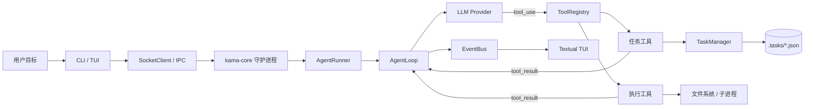
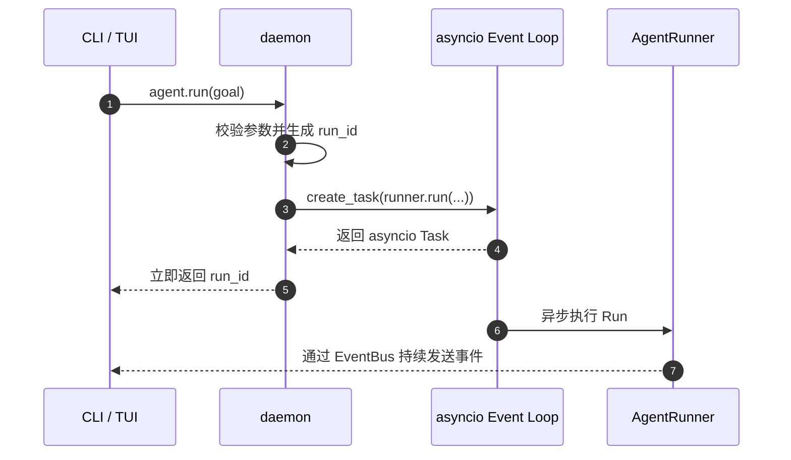
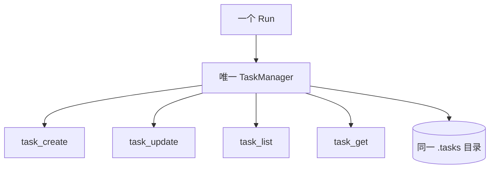
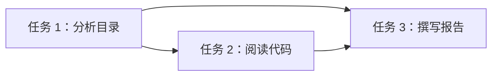
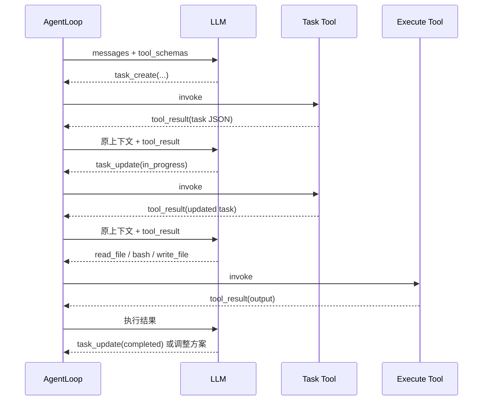
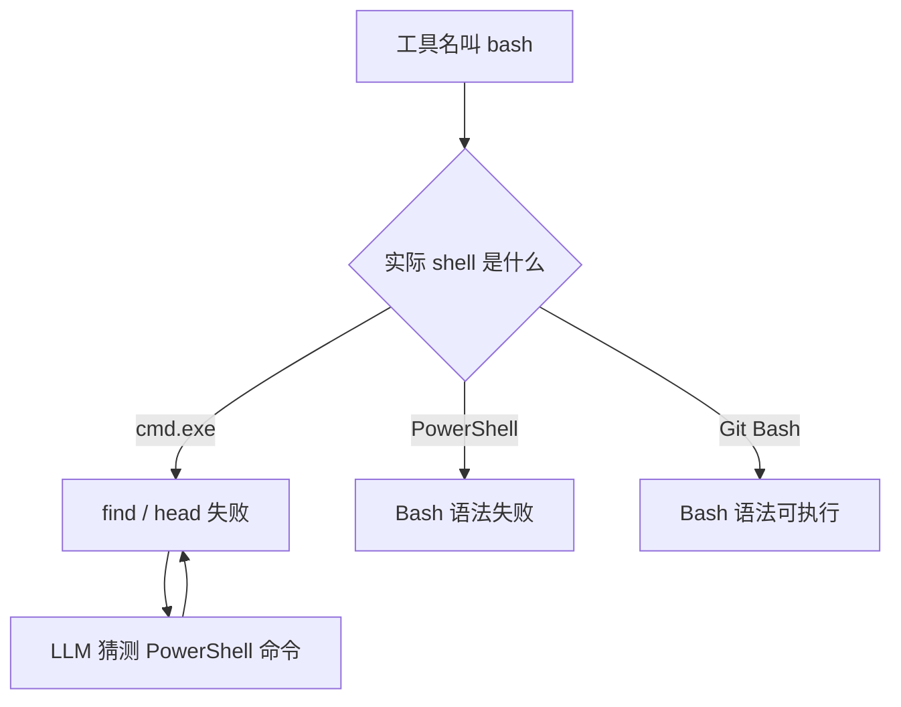
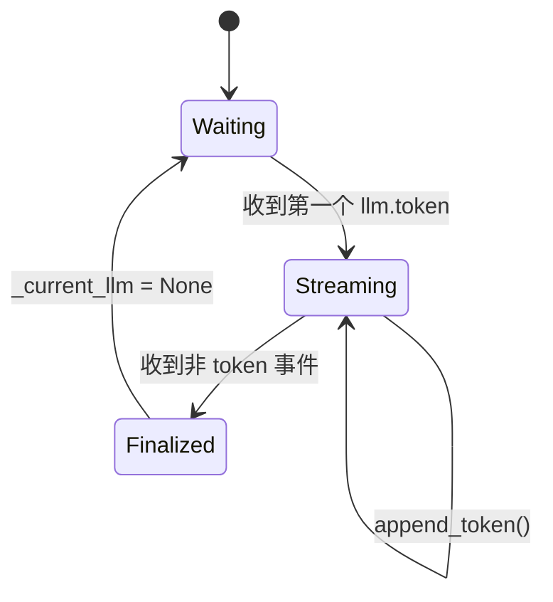
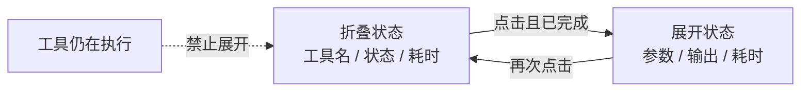
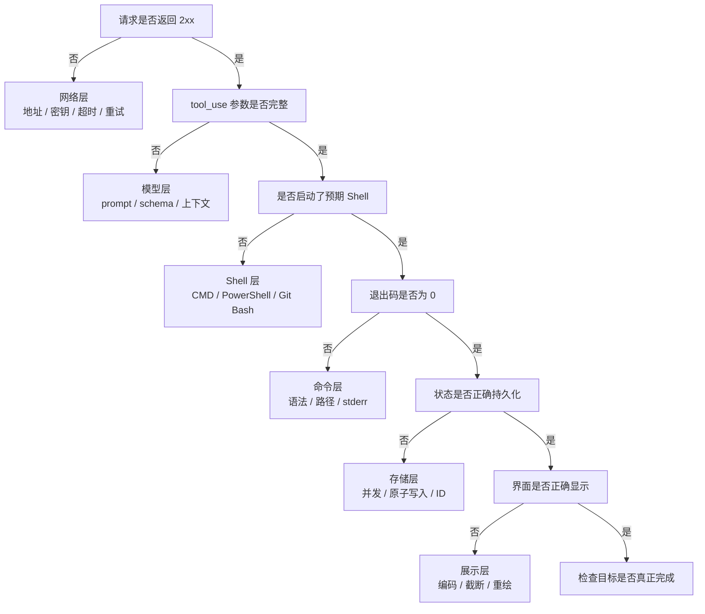

# KamaClaude S3：让 Agent 学会自主规划

> 一份面向 Agent 工程学习者的源码导读，重点解释 **Run 启动、TaskManager、任务依赖、Bash 工具、流式输出和 TUI 组件**，并记录 Windows 环境中的真实踩坑与解决方案。


本文依据项目源码（`stage/s3` 分支）整理，适合作为学习笔记、组内分享材料或源码阅读入口。

> [!NOTE]
> 本文聚焦 KamaClaude S3 的自主规划主线。项目后续阶段已经加入 SQLite 持久化、跨重启恢复、子 Agent 等能力，因此当前 `main` / `s8` / `s9` 分支中的函数参数可能比本文节选更多，但核心职责和调用关系没有改变。文中标明"建议""解决方案"的代码可能属于改进设计，不代表当前分支已经全部实现。

## 目录

- [先看结论](#先看结论)
- [整体架构](#整体架构)
- [一次 Run 是怎样启动的](#一次-run-是怎样启动的)
- [AgentRunner 怎样接入 TaskManager](#agentrunner-怎样接入-taskmanager)
- [文件 CRUD 层与数据分层](#文件-crud-层与数据分层)
- [`blocked_by` 自动级联](#blocked_by-自动级联)
- [LLM 怎样通过工具自主规划](#llm-怎样通过工具自主规划)
- [Bash 工具的实现与 Windows 踩坑](#bash-工具的实现与-windows-踩坑)
- [LLM 流式输出的原地累积](#llm-流式输出的原地累积)
- [Widget 与工具调用块](#widget-与工具调用块)
- [错误分层与排查路线](#错误分层与排查路线)
- [验证清单](#验证清单)
- [源码索引与学习路线](#源码索引与学习路线)

---

## 先看结论

S3 的"自主规划"不是另起一套调度系统，而是在原有 `AgentLoop` 中加入一组 **LLM 可以调用的任务工具**：

| 角色 | 负责什么 | 不负责什么 |
| --- | --- | --- |
| LLM | 决定是否拆任务、任务顺序以及下一步调用哪个工具 | 不直接读写磁盘，也不直接启动进程 |
| TaskManager | 保存任务、更新状态、维护 `blocked_by` | 不决定下一步做什么 |
| AgentLoop | 把模型调用、工具调用和工具结果串成循环 | 不替模型生成计划 |
| Tool | 校验参数并执行一个具体能力 | 不维护整场对话状态 |
| EventBus / TUI | 发布并展示执行过程 | 不改变任务执行结果 |

> [!IMPORTANT]
> 自主规划的关键闭环是：**LLM 提出计划 → 程序持久化并执行 → 工具结果回到上下文 → LLM 根据结果继续决策**。

### 术语不要混淆

| 术语 | 含义 | 典型载体 |
| --- | --- | --- |
| Run | 用户目标的一次完整执行 | `run_id`、`runs/<run_id>/` |
| asyncio Task | 事件循环调度的协程对象 | `asyncio.create_task()` 返回值 |
| Agent Task | LLM 拆出的计划条目 | `.tasks/task_1.json` |
| Tool | LLM 可调用的能力接口 | `input_schema`、`invoke()` |
| Widget | Textual 界面中的可复用组件 | `LLMStreamBlock`、`ToolCallBlock` |

---

## 整体架构



S2 已经具备 daemon、IPC、EventBus 和 AgentLoop。S3 主要增加两组能力：

- 🧠 **规划能力**：`task_create`、`task_update`、`task_list`、`task_get`
- 🛠️ **执行能力**：`read_file`、`list_dir`、`write_file`、`bash`
- 💾 **状态持久化**：每个 Run 使用独立的 `.tasks` 目录
- 👀 **过程可视化**：TUI 展示 token、工具状态、输出和耗时

<details>
<summary><strong>为什么任务列表也要做成 Tool？</strong></summary>

因为 Tool 同时解决了三件事：

1. 用 schema 告诉 LLM 这个能力怎样调用；
2. 把模型输出转换成可校验的结构化参数；
3. 把执行结果以 `tool_result` 放回对话上下文。

如果只在程序内部维护任务列表，LLM 无法读取和更新它；如果只把任务写进提示词，又无法可靠地持久化和校验状态。

</details>

---

## 一次 Run 是怎样启动的

源码入口：`src/kama_claude/core/app.py`

```python
async def _agent_run_handler(
    self,
    params: dict[str, Any],
) -> AgentRunResult:
    cmd = AgentRunCommand.model_validate(params)
    run_id = new_run_id()

    run_task = asyncio.create_task(
        runner.run(cmd.goal, run_id=run_id)
    )
    self._running_runs.add(run_task)
    run_task.add_done_callback(self._running_runs.discard)

    return AgentRunResult(run_id=run_id)
```

### 执行时序



代码中每一步都有明确目的：

1. `model_validate()` 把 IPC 字典转为结构化命令，提前拦截缺失字段或错误类型。
2. `new_run_id()` 在执行前生成统一标识，让事件、日志、任务文件和最终结果能够关联。
3. `asyncio.create_task()` 把长时间运行的协程交给事件循环，handler 可以立即返回。
4. `_running_runs` 保留强引用，也为 daemon 关闭时统一取消任务提供入口。
5. `add_done_callback()` 在执行完成后清理集合，避免活跃任务列表不断增长。

> [!WARNING]
> `asyncio.create_task()` 不会创建新的操作系统进程。它只是在同一个事件循环中调度协程；协程遇到 `await` 时，循环才能处理其他工作。

### 踩坑：立即返回 `run_id` 不等于不会丢事件

客户端可能在收到 `run_id` 后才订阅事件，而后台任务已经发布了 `run.started`。如果这个首事件必须可靠到达，需要补充：

- 订阅握手：确认订阅成功后再启动 Run；
- 事件回放：客户端根据 `run_id` 读取已经写入的 `events.jsonl`；
- 有界缓冲：daemon 暂存最近事件，订阅建立后补发。

---

## AgentRunner 怎样接入 TaskManager

源码入口：`src/kama_claude/core/runner.py`

```python
async def run_and_capture(
    self,
    goal: str,
    *,
    run_id: str | None = None,
) -> RunOutcome:
    run_id = run_id or new_run_id()
    run_path = self._runs_dir / run_id
    run_path.mkdir(parents=True, exist_ok=True)

    task_manager = TaskManager(run_path / ".tasks")
    registry = self._build_registry(task_manager)
    loop = AgentLoop(provider, registry, bus)
```

一个 Run 只创建一个 `TaskManager`，再通过构造函数把同一个实例传给所有任务工具：

```python
def _build_registry(self, task_manager: TaskManager) -> ToolRegistry:
    registry = ToolRegistry()

    for tool in [ReadFileTool(), BashTool(), WriteFileTool(), ListDirTool()]:
        registry.register(tool)

    for tool in [
        TaskCreateTool(task_manager),
        TaskUpdateTool(task_manager),
        TaskListTool(task_manager),
        TaskGetTool(task_manager),
    ]:
        registry.register(tool)

    return registry
```

### 为什么必须共享同一个实例



`task_create` 写入的任务可以立即被 `task_list` 和 `task_get` 读取；`task_update` 也能基于同一份状态解除依赖。工具无需自行猜测存储目录，这就是依赖注入在这里的实际价值。

> [!CAUTION]
> 如果四个工具各自创建 `TaskManager`，它们可能持有不同的 `_next_id`。并发创建时会发生编号冲突，内存状态也可能落后于磁盘。

建议的责任边界：

- `AgentRunner`：组装 Run 级依赖；
- `TaskManager`：保证任务存储一致性；
- Task Tool：转换参数和返回 `ToolResult`；
- LLM：决定调用哪个任务工具。

---

## 文件 CRUD 层与数据分层

### TaskManager 是什么

`TaskManager` 是一个同步的文件 CRUD 层，集中实现任务的创建、读取、更新、列表和保存。上层工具只关心业务参数，不需要知道文件名、JSON 格式和目录位置。

```python
class TaskManager:
    def __init__(self, tasks_dir: Path) -> None:
        self._dir = tasks_dir
        self._dir.mkdir(parents=True, exist_ok=True)
        self._next_id = self._max_id() + 1

    def create(
        self,
        subject: str,
        description: str = "",
        blocked_by: list[int] | None = None,
    ) -> Task:
        task = Task(
            id=self._next_id,
            subject=subject,
            description=description,
            status="pending",
            blocked_by=list(blocked_by or []),
        )
        self._save(task)
        self._next_id += 1
        return task
```

### 可以从三层理解"文件"

| 层次 | 例子 | 解决的问题 |
| --- | --- | --- |
| 数据模型层 | `Task`、`TaskStatus` | 一个任务有哪些字段、允许哪些状态 |
| CRUD 层 | `TaskManager` | 怎样创建、读取、更新和保存任务 |
| 物理存储层 | `.tasks/task_1.json` | 数据最终写到哪里、以什么格式保存 |

任务文件示例：

```json
{
  "id": 1,
  "subject": "分析目录结构",
  "description": "找出项目核心模块",
  "status": "completed",
  "blocked_by": [],
  "created_at": "2026-05-19T10:00:01Z",
  "updated_at": "2026-05-19T10:00:45Z"
}
```

整数 ID 对 LLM 更友好。模型只需要复述 `task_id=1`，不必在后续工具调用中准确复制长 UUID；开发者也能直接打开 JSON 排查问题。

### 这种文件方案的边界

> [!TIP]
> S3 的任务通常只有个位数到十几个，简单文件 CRUD 足够直观，也便于教学和调试。

当任务数量和并发量增加时，需要补齐：

- 原子写入：先写临时文件，再原子替换目标文件；
- 文件锁：避免两个写操作同时覆盖同一任务；
- 审计记录：在当前快照之外追加 `tasks.jsonl` 事件；
- 损坏恢复：JSON 解析失败时保留原文件并输出诊断；
- 数据库迁移：复杂查询和并发写入增加后使用 SQLite 事务（后续 S8 完成）。

---

## `blocked_by` 自动级联

`blocked_by` 保存前置任务 ID。任务 2 的 `blocked_by=[1]` 表示计划上应先完成任务 1。



当任务 1 完成后，`TaskManager` 会从其他任务的依赖列表中删除 `1`：

```python
def _clear_dependency(self, completed_id: int) -> None:
    for file in self._dir.glob("task_*.json"):
        data = json.loads(file.read_text())
        blocked = [int(x) for x in data.get("blocked_by", [])]

        if completed_id in blocked:
            data["blocked_by"] = [
                task_id for task_id in blocked
                if task_id != completed_id
            ]
            data["updated_at"] = _now()
            file.write_text(
                json.dumps(data, indent=2, ensure_ascii=False)
            )
```

| 任务 | 初始依赖 | 任务 1 完成后 | 是否解除阻塞 |
| --- | --- | --- | --- |
| 任务 1：分析目录 | `[]` | `completed` | 不适用 |
| 任务 2：阅读代码 | `[1]` | `[]` | 是 |
| 任务 3：撰写报告 | `[1, 2]` | `[2]` | 否 |

> [!IMPORTANT]
> 自动级联只会**解除依赖**，不会自动把后续任务设为 `in_progress`，也不会自动执行任务。下一步仍由 LLM 决定。

### 当前实现还应补哪些约束

- 创建依赖时检查目标任务是否存在；
- 禁止任务依赖自己；
- 用图遍历检测循环依赖；
- 执行任务前统一调用 `can_start()`；
- 并发修改时对"读取—修改—写回"整体加锁。

一个更严格的开始条件可以写成：

```python
def can_start(task: Task) -> bool:
    return task.status == "pending" and not task.blocked_by
```

---

## LLM 怎样通过工具自主规划

AgentLoop 仍然是经典的 **plan → act → observe** 循环。S3 的变化主要发生在工具集合：模型现在既能维护计划，也能执行实际操作。



核心代码的结构如下：

```python
while not context.is_done():
    response = await provider.chat(
        messages=context.messages,
        tool_schemas=registry.tool_schemas(),
    )

    context.add_assistant_message(response.content)

    for tool_call in response.tool_calls:
        result = await invoke_tool(registry, tool_call)
        context.add_tool_result(
            tool_call.id,
            result.content,
            is_error=result.is_error,
        )
```

### 八个基础工具

| 工具 | 类型 | 作用 |
| --- | --- | --- |
| `task_create` | 任务 | 创建任务并声明依赖 |
| `task_update` | 任务 | 更新状态或依赖 |
| `task_list` | 任务 | 查看当前计划摘要 |
| `task_get` | 任务 | 读取单个任务详情 |
| `read_file` | 执行 | 读取文件内容 |
| `list_dir` | 执行 | 浏览目录结构 |
| `write_file` | 执行 | 创建或更新文件 |
| `bash` | 执行 | 运行非交互命令 |

### 踩坑：注册任务工具不等于模型一定会规划

模型仍可能：

- 完全不创建任务；
- 创建任务后不更新状态；
- 执行仍被 `blocked_by` 阻塞的任务；
- 任务没有完成就直接返回最终答案。

解决这个问题需要同时调整三处：

1. **System prompt**：说明复杂目标何时需要规划，以及开始、完成、失败时怎样更新任务。
2. **Tool schema**：字段名称清楚，错误结果能够指导模型修正。
3. **程序约束**：不能只依赖提示词，关键规则由代码强制检查。

> [!TIP]
> 简单目标应允许直接执行。强制所有请求都创建任务，只会产生形式化计划和额外 token 消耗。

---

## Bash 工具的实现与 Windows 踩坑

源码入口：`src/kama_claude/core/tools/builtin/bash.py`

### Bash 工具做了什么

```python
proc = await asyncio.create_subprocess_shell(
    command,
    stdout=asyncio.subprocess.PIPE,
    stderr=asyncio.subprocess.STDOUT,
)

try:
    stdout_bytes, _ = await asyncio.wait_for(
        proc.communicate(),
        timeout=timeout,
    )
except TimeoutError:
    proc.kill()
    await proc.communicate()
    return ToolResult(
        content=f"[timeout after {timeout}s]",
        is_error=True,
        error_type="timeout",
    )
```

这里有四个关键点：

- `PIPE` 捕获标准输出；
- `STDOUT` 把标准错误合并进去，让 LLM 同时看到诊断信息；
- `wait_for()` 为非交互命令设置超时；
- 超时后先 `kill()`，再 `communicate()`，确保子进程资源被回收。

非零退出码必须作为工具错误返回：

```python
if proc.returncode != 0:
    return ToolResult(
        content=f"[exit {proc.returncode}]\n{output}",
        is_error=True,
        error_type="runtime_error",
    )

return ToolResult(content=output or "[no output]")
```

`[no output]` 很重要，因为"成功但没有输出"和"工具没有执行"是两种不同状态。

### 实际错误：工具叫 Bash，底层却是 CMD

```text
[tool] bash ✗ [exit 255]
拒绝访问 - .
找不到文件 - -NAME
找不到文件 - -TYPE
找不到文件 - F
'head' 不是内部或外部命令，也不是可运行的程序
```

模型生成的是：

```bash
find . -name "*.py" -type f | head -100
```

但 Windows 上的 `asyncio.create_subprocess_shell()` 默认使用 `cmd.exe`：

- `find` 被解释为 Windows 的文本搜索程序；
- `-name`、`-type` 被当作文件名；
- CMD 中没有 `head`；
- 随后模型尝试 `Get-ChildItem`，但底层仍是 CMD，因此再次失败。



> [!CAUTION]
> 工具名称、schema 描述和真实执行环境必须一致。否则模型只能在 Bash、CMD 和 PowerShell 之间反复猜测。

### Windows 解决方案：显式启动 Git Bash

```python
proc = await asyncio.create_subprocess_exec(
    str(git_bash),
    "--noprofile",
    "--norc",
    "-c",
    command,
    stdout=asyncio.subprocess.PIPE,
    stderr=asyncio.subprocess.STDOUT,
    env=git_bash_env,
)
```

实践中还要注意：

- 明确查找 Git for Windows 的 `bin/bash.exe`；
- 不要只从 `PATH` 取第一个 `bash.exe`，它可能是 WSL 启动器；
- schema 中明确写"命令运行于 Git Bash"；
- 要求模型使用 Bash 语法和正斜杠路径；
- 禁止在这个工具中生成 PowerShell cmdlet。

### 中文输出乱码

Windows 原生命令可能按 CP936 输出，固定用 UTF-8 解码会显示为 `�`。更稳妥的策略是先严格尝试 UTF-8，再回退到系统编码：

```python
def decode_output(raw: bytes) -> str:
    try:
        return raw.decode("utf-8")
    except UnicodeDecodeError:
        return raw.decode(
            locale.getencoding(),
            errors="replace",
        )
```

同时可以为子进程设置：

```python
env["LANG"] = "C.UTF-8"
env["LC_ALL"] = "C.UTF-8"
env["PYTHONIOENCODING"] = "utf-8"
```

> [!WARNING]
> 直接把所有输出改成 GBK 会破坏原本就是 UTF-8 的内容；只保留 UTF-8 又无法覆盖部分 Windows 原生命令。编码策略需要有明确的优先级和回退。

### Shell 修好后，命令本身仍可能写错

下面这类错误属于**命令层**，不是 Shell 层：

```text
/usr/bin/bash: -c: line 1:
syntax error near unexpected token `$(cat /tmp/py_files.txt)'
```

原命令把 `done $(...)` 当成循环输入，而且多次使用 `cat $(cat file)`，遇到空格文件名也会拆分。更可靠的写法是：

```bash
total=0
count=0

while IFS= read -r -d '' file; do
  lines=$(wc -l < "$file") || exit 1
  total=$((total + lines))
  count=$((count + 1))
  printf '%s: %s\n' "$file" "$lines"
done < <(
  find . -type f -name '*.py' \
    -not -path './.venv/*' -print0 | sort -z
)

printf 'Python 文件总数: %s\n总行数: %s\n' "$count" "$total"
```

其中 `find -print0` 配合 `read -d ''`，可以正确处理带空格的文件名。

> [!TIP]
> 高频且结构固定的工作应该实现专用工具。例如"代码行数统计"用 Python 遍历目录，比每次让模型临时拼复杂 Bash 更可靠。

---

## LLM 流式输出的原地累积

如果每收到一个 token 就创建一个 widget，组件树会快速膨胀，Textual 也会频繁重算布局。S3 的做法是：**同一段回复始终更新同一个 `LLMStreamBlock`**。

```python
if event_type == "llm.token":
    token = event.get("token", "")

    if self._current_llm is None:
        block = LLMStreamBlock()
        self._append(block)
        self._current_llm = block

    self._current_llm.append_token(token)
    return

self._break_llm()
```

```python
class LLMStreamBlock(Static):
    def __init__(self) -> None:
        super().__init__("")
        self._text = ""

    def append_token(self, token: str) -> None:
        self._text += token
        self.update(self._text)

    def finalize_markdown(self) -> None:
        if self._text.strip():
            self.update(Markdown(self._text, code_theme="monokai"))
```



流式阶段显示普通文本，块结束后再统一渲染 Markdown。这样可以避免不完整的代码围栏、列表和表格在每个 token 到达时反复解析和闪烁。

### 还能怎样优化

`self._text += token` 会不断复制字符串，超长回复时成本会升高。可以把 token 放入列表，并每隔 20～50 ms 合并刷新一次：

```python
self._pending_tokens.append(token)

if should_flush():
    self._text += "".join(self._pending_tokens)
    self._pending_tokens.clear()
    self.update(self._text)
```

---

## Widget 与工具调用块

Widget 是 Textual 中可复用、可挂载、可更新、可响应事件的界面组件。可以把它理解为终端 UI 中的"组件对象"，而不是一段普通字符串。

工具调用块需要同时满足两种阅读需求：

- 默认只看工具名称、成败和耗时；
- 排错时展开参数、完整输出和耗时。

```python
def compose(self) -> ComposeResult:
    yield Static(self._summary(), classes="summary")
    yield Static("", classes="detail")
```

```css
ToolCallBlock > .detail {
    display: none;
}

ToolCallBlock.expanded > .detail {
    display: block;
}
```

```python
def on_click(self) -> None:
    if not self._finished:
        return

    if "expanded" in self.classes:
        self.remove_class("expanded")
        return

    detail = self.query_one(".detail", Static)
    detail.update(
        f"params\n{self._params_full}\n\n"
        f"output\n{self._output}\n\n"
        f"elapsed: {self._elapsed_ms}ms"
    )
    self.add_class("expanded")
```



`detail` widget 始终存在，点击只切换父组件的 `expanded` class。这种实现简单，也让摘要和详情共享同一份组件状态。

> [!WARNING]
> "默认折叠"不等于"没有内存成本"。完整输出仍保存在事件和 widget 中。大输出需要在工具层限流，TUI 只保留前后片段，完整内容写入日志文件后按需加载。

---

## 错误分层与排查路线

日志中出现下面这行：

```text
HTTP Request: POST .../messages "HTTP/1.1 200 OK"
```

它只说明 **模型接口成功响应**，不能证明模型生成了正确工具调用，也不能证明工具执行成功，更不能证明用户目标完成。



| 层次 | 典型现象 | 优先检查 | 解决方向 |
| --- | --- | --- | --- |
| 网络层 | 超时、认证失败、非 2xx | LLM Provider 日志 | 地址、密钥、重试策略 |
| 模型层 | 计划遗漏、参数不完整 | `messages`、`tool_calls` | prompt 和 schema |
| Shell 层 | 命令不存在、环境不符 | BashTool 启动参数 | 固定 shell 并描述环境 |
| 命令层 | `exit 2`、语法错误 | 完整 stderr | 修正命令或改用专用工具 |
| 存储层 | 任务丢失、ID 冲突 | `.tasks` 目录 | 原子写入、锁、事务 |
| 展示层 | 乱码、截断、卡顿 | 解码逻辑和 TUI | 编码回退、限流、批量刷新 |

> [!TIP]
> 排错时先确定"失败发生在哪一层"，再改代码。看到 HTTP 200 就去改 Bash，或看到退出码非零就去改模型地址，都会把问题越查越乱。

---

## 验证清单

### Run 与生命周期

- [ ] daemon 收到请求后能够立即返回 `run_id`；
- [ ] Run 完成后 `_running_runs` 中的引用被清理；
- [ ] 两个 Run 的任务目录互相隔离；
- [ ] daemon 关闭时能够取消仍在运行的协程。

### TaskManager 与依赖

- [ ] 四个任务工具共享同一个 `TaskManager`；
- [ ] 创建任务时会拒绝不存在的 `blocked_by`；
- [ ] 完成前置任务后，其他任务中的依赖会自动移除；
- [ ] 循环依赖和自依赖会被拒绝；
- [ ] 并发写入不会产生重复 ID 或损坏 JSON。

### Bash 与 Windows

- [ ] Windows 上实际启动的是预期的 Git Bash；
- [ ] `find`、`head` 和管道命令能够执行；
- [ ] 中文 stdout 和 stderr 可以正确显示；
- [ ] 带空格、中文的文件名不会被错误拆分；
- [ ] 超时后子进程被终止并回收；
- [ ] 非零退出码和完整错误文本会返回给 LLM。

### TUI

- [ ] 连续 token 更新同一个 `LLMStreamBlock`；
- [ ] 非 token 事件会结束当前文本块并渲染 Markdown；
- [ ] 工具执行结束前不能展开详情；
- [ ] 工具块可以折叠和展开；
- [ ] 超长工具输出受到限制。

---

## 源码索引与学习路线

将本文放到 KamaClaude 项目根目录后，可以按下面的顺序阅读：

| 顺序 | 文件 | 重点 |
| --- | --- | --- |
| 1 | `src/kama_claude/core/app.py` | IPC handler 怎样启动 Run |
| 2 | `src/kama_claude/core/runner.py` | Run 环境、TaskManager 和工具注册表 |
| 3 | `src/kama_claude/core/loop.py` | plan → act → observe 循环 |
| 4 | `src/kama_claude/core/task/model.py` | Task 数据模型和状态 |
| 5 | `src/kama_claude/core/task/manager.py` | 文件 CRUD 和依赖级联 |
| 6 | `src/kama_claude/core/tools/builtin/task_*.py` | 任务工具的 schema 与 invoke |
| 7 | `src/kama_claude/core/tools/builtin/bash.py` | 子进程、超时、退出码和输出 |
| 8 | `src/kama_claude/tui/app.py` | 流式文本与可折叠工具块 |
| 9 | `tests/unit/test_task_manager.py` | 任务 CRUD 和依赖测试 |
| 10 | `tests/unit/test_tui_app.py` | TUI 事件与组件测试 |

### 推荐的分享顺序

1. 用一个复杂目标说明为什么需要任务规划；
2. 展示 daemon 怎样创建 Run 并立即返回 `run_id`；
3. 展示 AgentRunner 怎样创建 TaskManager 并注册工具；
4. 打开一个任务 JSON，解释状态、依赖和整数 ID；
5. 沿着 AgentLoop 展示 `task_create → tool_result → task_update`；
6. 演示一次成功调用和一次失败调用；
7. 用 Windows Bash 问题讲清错误分层；
8. 最后展示 TUI 的流式文字和工具折叠详情。

---

## 后续改进方向

| 方向 | 当前设计 | 建议改进 |
| --- | --- | --- |
| 任务调度 | 依赖主要是提示性信息 | 执行前强制检查依赖并检测环 |
| 并发安全 | 同步文件 CRUD | 原子写入、文件锁或 SQLite 事务 |
| 执行安全 | Bash 能运行任意命令 | 沙箱、工作目录边界、命令策略和审计 |
| 工具可靠性 | 复杂工作依赖临时 Bash | 为高频任务提供结构化专用工具 |
| 可观测性 | 状态和事件分散 | 统一关联 run、task、tool 和 trace（见 S3-Trace） |
| 界面性能 | 每个 token 都触发更新 | 合并 token 并定时刷新 |

S3 最值得掌握的不是某一个类，而是这条可观察的执行闭环：用户给出目标，LLM 维护计划并选择工具，程序执行并返回结构化结果，模型根据结果继续行动，TUI 同步展示全过程。理解这条主线后，再增加并行调度、数据库存储或执行沙箱，都会有清晰的落点。
