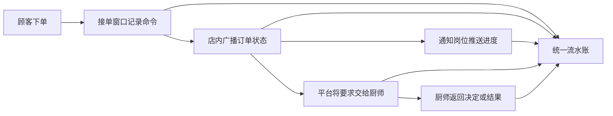
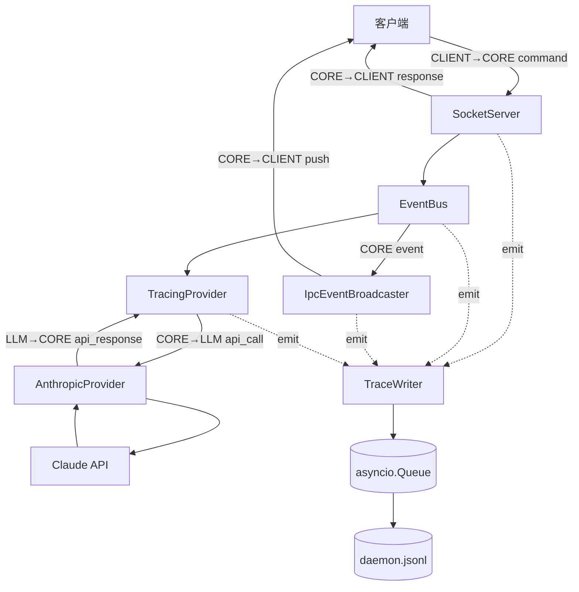
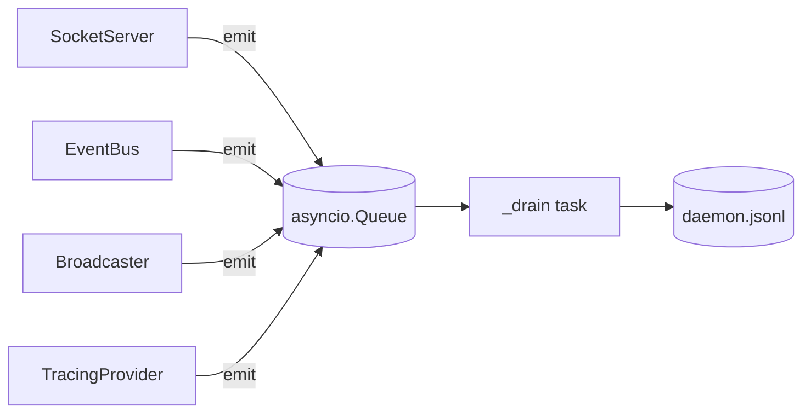
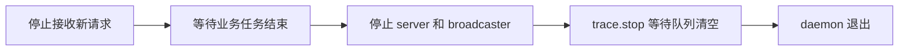
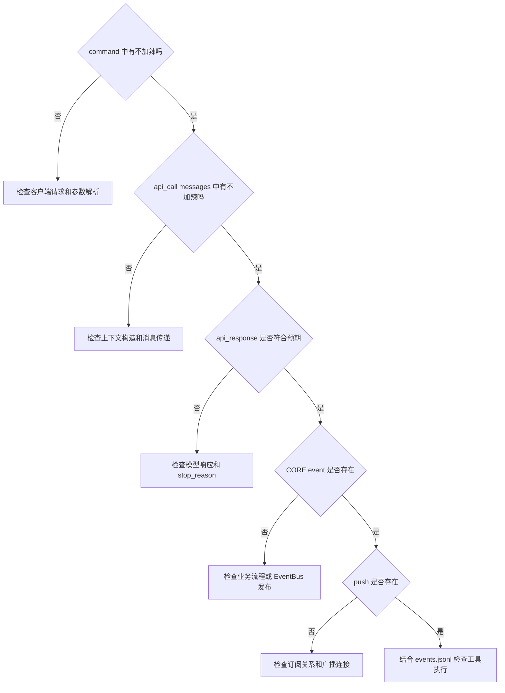

# S3 Trace 系统学习指南

> 从 Agent daemon 黑盒到可回放的系统时间线


这份指南解释如何为一个 Agent daemon 增加统一的 Trace 系统。它不仅介绍关键代码，还会说明代码背后的设计理由、常见误解，以及遇到问题时如何排查。

如果把 Agent 系统看成一家外卖平台，那么 Trace 就是一套覆盖接单、店内处理、通知推送和厨师沟通的完整监控记录。

## 目录

- [学习目标](#学习目标)
- [为什么需要 Trace](#为什么需要-trace)
- [用点外卖理解整个系统](#用点外卖理解整个系统)
- [整体架构](#整体架构)
- [TraceRecord 统一记录格式](#tracerecord-统一记录格式)
- [TraceWriter 队列与后台写入](#tracewriter-队列与后台写入)
- [四个埋点](#四个埋点)
- [TracingProvider 与 Wrapper 模式](#tracingprovider-与-wrapper-模式)
- [CoreApp 如何串联组件](#coreapp-如何串联组件)
- [配置文件和环境变量](#配置文件和环境变量)
- [使用 kama trace 验证](#使用-kama-trace-验证)
- [完整排查案例](#完整排查案例)
- [已知限制和改进方向](#已知限制和改进方向)
- [学习检查清单](#学习检查清单)

## 学习目标

读完后，你应该能够：

- 区分 `events.jsonl` 和 `daemon.jsonl` 的职责；
- 理解 `TraceRecord`、`TraceWriter` 和 `asyncio.Queue`；
- 理解四个埋点分别观察系统的哪个位置；
- 理解 `TracingProvider` 为什么使用 Wrapper 模式；
- 理解 `CoreApp` 如何通过构造函数完成依赖注入；
- 使用 `kama trace`、`jq` 或 PowerShell 分析记录；
- 识别示例代码中同步文件 I/O、异常退出和隐私方面的风险。

## 为什么需要 Trace

上一阶段已经能够将任务事件写入：

```text
runs/<run_id>/events.jsonl
```

它能告诉我们：

- 任务什么时候开始和结束；
- 哪个工具被调用；
- 工具返回了什么；
- LLM 使用了多少 token。

但如果任务结果错误，它无法完整回答：

1. 客户端发送的 `agent.run` 参数是否被正确解析？
2. 工具结果是否真的进入下一轮 LLM `messages`？
3. LLM 返回的是 `tool_use`、`end_turn` 还是错误？
4. EventBus 产生事件后，是否成功推送给客户端？

因此需要增加一条 daemon 全局时间线：

```text
~/.kama/traces/daemon.jsonl
```

| 文件 | 观察视角 | 适合回答的问题 |
| --- | --- | --- |
| `runs/<run_id>/events.jsonl` | 单次任务 | 这次任务做了什么？ |
| `~/.kama/traces/daemon.jsonl` | daemon 全局时间线 | 数据从哪里来，经过哪些层，最后去了哪里？ |

> [!IMPORTANT]
> `daemon.jsonl` 不是 `events.jsonl` 的替代品。两份文件通过 `run_id` 关联，组合起来才能提供完整证据。

## 用点外卖理解整个系统

假设顾客下单：

> 宫保鸡丁一份，不要辣。

系统组件可以对应为：

| 系统组件 | 外卖场景中的角色 |
| --- | --- |
| 客户端 | 顾客的外卖 App |
| `SocketServer` | 接单和回复窗口 |
| EventBus | 店内广播系统 |
| `IpcEventBroadcaster` | 给顾客发送进度通知的岗位 |
| LLM | 理解要求并决定下一步的厨师 |
| `AnthropicProvider` | 负责联系 Claude 厨师的工作人员 |
| `TracingProvider` | 记录平台和厨师沟通过程的观察员 |
| `TraceWriter` | 汇总所有记录的记录员 |
| `CoreApp` | 安排岗位和管理开店关店的店长 |

一份订单会经过以下链路：



如果最终收到的菜仍然很辣，Trace 可以帮助确认"不加辣"究竟丢在了哪一段。

## 整体架构

系统记录五种数据流方向：

| Direction | Layer | 含义 |
| --- | --- | --- |
| `CLIENT→CORE` | `ipc` | 客户端发送 JSON-RPC 命令 |
| `CORE→CLIENT` | `ipc` | daemon 返回响应或主动推送事件 |
| `CORE` | `event` | EventBus 发布内部事件 |
| `CORE→LLM` | `llm` | daemon 发起模型调用 |
| `LLM→CORE` | `llm` | daemon 收到模型响应 |



## TraceRecord 统一记录格式

每一行 Trace 都使用同一个数据模型：

```python
from typing import Any, Literal

from pydantic import BaseModel


class TraceRecord(BaseModel):
    ts: str
    direction: Literal[
        "CLIENT→CORE",
        "CORE→CLIENT",
        "CORE",
        "CORE→LLM",
        "LLM→CORE",
    ]
    layer: Literal["ipc", "event", "llm"]
    kind: str
    run_id: str | None = None
    step: int | None = None
    client_id: str | None = None
    data: dict[str, Any]
```

### 字段解释

| 字段 | 作用 |
| --- | --- |
| `ts` | 记录发生时间，用于按时间回放 |
| `direction` | 数据流动方向 |
| `layer` | 所属的系统层 |
| `kind` | `command`、`response`、`push`、`event`、`api_call` 等细分类型 |
| `run_id` | 关联某次任务，可以为空 |
| `step` | 关联同一任务中的某个步骤 |
| `client_id` | 区分客户端连接 |
| `data` | 保存不同埋点各自需要的数据 |

> [!WARNING]
> 不要强制要求每条记录都有 `run_id`。收到 `agent.run` 时可能还没有创建任务；`core.ping` 和 `event.subscribe` 也不属于某次 run。

解决方法是把 `run_id` 设计成可选字段。能够关联到任务时填写，无法关联时仍然保留系统记录。

## TraceWriter 队列与后台写入

`TraceWriter` 将"产生记录"和"写入文件"分开。



### 初始化和启动

```python
class TraceWriter:
    def __init__(self, path: Path) -> None:
        self._path = path
        self._queue: asyncio.Queue[TraceRecord] = asyncio.Queue()
        self._task: asyncio.Task[None] | None = None

    async def start(self) -> None:
        self._path.parent.mkdir(parents=True, exist_ok=True)
        self._task = asyncio.create_task(self._drain())
```

- 构造函数保存目标路径并创建队列；
- `start()` 创建目录；
- `create_task()` 启动后台消费者 `_drain()`。

### 提交记录

```python
def emit(self, record: TraceRecord) -> None:
    self._queue.put_nowait(record)
```

`emit()` 只负责把记录放入队列，然后立即返回。调用它的 IPC、EventBus 或 LLM 代码不需要等待记录写完。

### 消费队列

```python
async def _drain(self) -> None:
    with open(self._path, "a") as f:
        while True:
            record = await self._queue.get()
            try:
                f.write(record.model_dump_json() + "\n")
                f.flush()
            finally:
                self._queue.task_done()
```

当队列为空时，`await self._queue.get()` 会暂停当前协程，把执行权交还事件循环。拿到记录后，它将 Pydantic 模型序列化为一行 JSON。

### 正常关闭

```python
async def stop(self) -> None:
    await self._queue.join()

    if self._task is not None:
        self._task.cancel()
        try:
            await self._task
        except asyncio.CancelledError:
            pass
```

Queue 内部维护未完成任务计数：

```text
put_nowait()  -> 未完成数 +1
get()         -> 取出记录，计数不变
task_done()   -> 未完成数 -1
join()        -> 等待未完成数变成 0
```

> [!CAUTION]
> 队列为空不代表最后一条记录已经写完。消费者可能已经 `get()` 了记录，但仍在执行 `write()`。

因此关闭时需要等待 `join()`，不能只检查 `queue.empty()`。

### 坑一 后台 task 不等于异步文件 IO

```python
f.write(...)
f.flush()
```

这两个调用仍然是同步文件操作。`create_task()` 不会自动把它们移动到其他线程。

低频课程项目可以接受这个权衡。高吞吐系统可以使用：

```python
await asyncio.to_thread(write_record, record)
```

也可以使用专门写线程或成熟的异步日志系统。

### 坑二 finally 不能保证 join 永远结束

`finally` 只能保证当前记录调用 `task_done()`。如果写文件抛出异常并导致 `_drain()` 任务退出，队列中的剩余记录将无人处理，`join()` 依然可能一直等待。

更完整的实现应该：

- 捕获写入异常；
- 明确重试、丢弃或停止服务的策略；
- 监控 `_drain()` 是否意外结束；
- 向上层暴露写入器的失败状态。

## 四个埋点

四个埋点相当于安装在不同位置的摄像头。

### 1 SocketServer 记录命令与响应

客户端命令解析成功后记录：

```python
if self._trace is not None:
    client_id = str(writer.get_extra_info("peername", "<unknown>"))
    self._trace.emit(
        TraceRecord(
            ts=_now(),
            direction="CLIENT→CORE",
            layer="ipc",
            kind="command",
            client_id=client_id,
            data={
                "method": req.method,
                "id": req.id,
                "params": req.params,
            },
        )
    )
```

它能够回答：

> 顾客下单时是否真的提交了"不加辣"？

发送响应：

```python
writer.write(msg.model_dump_json().encode() + b"\n")
await writer.drain()

if self._trace is not None:
    self._trace.emit(response_record)
```

> [!WARNING]
> `StreamWriter.drain()` 是发送缓冲区的背压控制，不代表客户端已经收到或处理了消息。

如果业务必须确认对方收到，需要在应用协议中增加 ACK。

### 2 IpcEventBroadcaster 记录通知推送

```python
self._trace.emit(
    TraceRecord(
        direction="CORE→CLIENT",
        layer="ipc",
        kind="push",
        run_id=run_id,
        client_id=client_id,
        data={
            "sub_id": sub.sub_id,
            "event_type": event_type,
        },
    )
)
```

它能够回答：

> 平台有没有向这个顾客推送"订单已开始制作"？

Push 记录不保存完整事件正文。完整事件由 EventBus 埋点保存，Push 只说明哪个订阅者收到了哪种事件。

> [!TIP]
> 一个事件可能推送给多个订阅者。只记录 `sub_id` 和 `event_type` 可以避免重复保存大段事件内容。

### 3 EventBus 订阅者记录内部事件

```python
async def _trace_event_handler(self, event: BaseModel) -> None:
    assert self._trace is not None
    event_dict = event.model_dump()

    self._trace.emit(
        TraceRecord(
            ts=_now(),
            direction="CORE",
            layer="event",
            kind="event",
            run_id=event_dict.get("run_id"),
            data=event_dict,
        )
    )


self._bus.subscribe(self._trace_event_handler)
```

Trace 作为 EventBus 的普通订阅者工作，EventBus 本身不需要了解 `TraceWriter`。

如果出现：

```text
CORE event
```

却没有对应的：

```text
CORE→CLIENT push
```

说明内部事件已经产生，问题更可能发生在订阅匹配、连接状态或广播发送阶段。

### 4 TracingProvider 记录模型调用

```python
class TracingProvider:
    def __init__(
        self,
        inner: LLMProvider,
        trace: TraceWriter,
        *,
        include_payload: bool,
    ) -> None:
        self._inner = inner
        self._trace = trace
        self._include_payload = include_payload
```

调用模型前记录 `api_call`，调用结束后记录 `api_response`：

```python
async def chat(
    self,
    messages,
    tool_schemas,
    bus,
    run_id,
    *,
    step: int = 0,
) -> LlmResponse:
    self._trace.emit(api_call_record)

    started = time.monotonic()
    result = await self._inner.chat(
        messages,
        tool_schemas,
        bus,
        run_id,
        step=step,
    )
    latency_ms = int((time.monotonic() - started) * 1000)

    self._trace.emit(api_response_record)
    return result
```

它能够回答：

> 平台有没有把"不加辣"传给厨师？厨师返回了什么？用了多久？

> [!WARNING]
> 如果 `inner.chat()` 抛出异常，后面的 `api_response` 不会执行。

建议补充错误记录：

```python
try:
    result = await self._inner.chat(...)
except Exception as exc:
    self._trace.emit(build_api_error_record(exc))
    raise
```

## TracingProvider 与 Wrapper 模式

不建议把 Trace 直接写入 `AnthropicProvider`：

```text
AnthropicProvider
├── 组织 Claude API 请求
├── 解析 Claude API 响应
├── 记录 Trace
└── 处理 Trace 配置
```

这样会让一个类承担过多职责。

Wrapper 模式把职责拆开：

```mermaid
sequenceDiagram
    participant Loop as AgentLoop
    participant Trace as TracingProvider
    participant Provider as AnthropicProvider
    participant API as Claude API

    Loop->>Trace: chat messages step
    Trace-->>Trace: emit api_call
    Trace->>Provider: chat messages step
    Provider->>API: HTTP request
    API-->>Provider: model response
    Provider-->>Trace: LlmResponse
    Trace-->>Trace: emit api_response
    Trace-->>Loop: LlmResponse
```

这样做的结果是：

- `AnthropicProvider` 只关心如何调用 Claude；
- `TracingProvider` 只关心如何观察调用；
- `AgentLoop` 只依赖 `LLMProvider` 接口；
- 将来替换其他模型 Provider 时，Trace 包装仍然可以复用。

> [!NOTE]
> "解耦"不是完全没有关系。两者仍然依赖共同的 `LLMProvider` 接口；接口变化时，实现仍可能需要同步修改。

### 为什么需要 step

同一个任务可能多次调用模型：

```text
run=123 step=1  模型要求调用工具
run=123 step=2  模型读取工具结果
run=123 step=3  模型生成最终答案
```

因此接口增加：

```python
async def chat(..., *, step: int = 0):
```

- `*` 表示 `step` 必须通过名称传入；
- `step: int` 表示预期为整数；
- `= 0` 为旧调用提供默认值。

调用时写成：

```python
response = await provider.chat(
    messages=context.messages,
    tool_schemas=tool_schemas,
    bus=bus,
    run_id=run_id,
    step=context.step,
)
```

## CoreApp 如何串联组件

`CoreApp` 相当于店长，负责创建唯一的 `TraceWriter`，再把它交给各组件。

```python
if self._config.trace.enabled:
    trace_path = Path(self._config.trace.file).expanduser()
    self._trace = TraceWriter(trace_path)
    await self._trace.start()
    self._bus.subscribe(self._trace_event_handler)

self._broadcaster = IpcEventBroadcaster(trace=self._trace)

server = SocketServer(
    self._config.host,
    self._config.port,
    self._broadcaster,
    trace=self._trace,
)

runner = AgentRunner(
    self._config,
    bus=self._bus,
    trace=self._trace,
)
```

这是一种构造函数注入：

```python
class SocketServer:
    def __init__(self, ..., trace: TraceWriter | None = None):
        self._trace = trace
```

所有组件拿到的是同一个对象引用，因此共用同一队列和同一个输出文件。

### 正确的关闭顺序



> [!CAUTION]
> 不要先停止 `TraceWriter`，再停止仍然可能调用 `emit()` 的组件。

## 配置文件和环境变量

默认配置路径：

```text
~/.kama/config.toml
```

配置示例：

```toml
[trace]
enabled = true
file = "~/.kama/traces/daemon.jsonl"
include_llm_payload = true
```

对应环境变量：

| TOML 配置 | 环境变量 | 含义 |
| --- | --- | --- |
| `trace.enabled` | `KAMA_TRACE_ENABLED` | 是否启用 Trace |
| `trace.file` | `KAMA_TRACE_FILE` | Trace 文件路径 |
| `trace.include_llm_payload` | `KAMA_TRACE_INCLUDE_LLM_PAYLOAD` | 是否保存完整 LLM 内容 |

配置加载顺序通常是：

```text
代码默认值 -> config.toml -> .env -> 系统环境变量
```

后加载的配置覆盖前面的配置。

### Windows 中的实际路径

```text
~/.kama/config.toml
=> C:\Users\<用户名>\.kama\config.toml

~/.kama/traces/daemon.jsonl
=> C:\Users\<用户名>\.kama\traces\daemon.jsonl
```

如果设置：

```dotenv
KAMA_CONFIG=~/.kama/config.toml
```

它只指定程序去哪里读取配置，并不会自动创建文件。

> [!TIP]
> `config.toml` 通常需要手动创建；`daemon.jsonl` 会在启用 Trace 并启动 daemon 后生成。它们默认不在项目源码目录中。

### include_llm_payload 的取舍

开启后可以检查完整的 `messages` 和工具定义，调试能力很强；同时也可能记录用户输入、工具结果和其他敏感内容。

建议：

- 本地调试按需开启；
- 生产环境默认只保存摘要；
- 对 Trace 文件设置访问权限；
- 建立过期清理或脱敏策略。

## 使用 kama trace 验证

### 常用命令

```bash
# 查看所有记录
uv run kama trace

# 只看 LLM 层
uv run kama trace --layer llm

# 查看某次 run
uv run kama trace run-20260516-abc123

# 实时跟踪
uv run kama trace --follow

# 输出原始 NDJSON
uv run kama trace --raw
```

### 使用 jq 分析

筛选所有模型调用，并统计每次调用的消息数量：

```bash
uv run kama trace --raw \
  | jq 'select(.kind == "api_call") | .data.messages | length'
```

输出：

```text
1
1
1
```

它表示：

- 找到了三条 `api_call` 记录；
- 每条记录的 `messages` 数组都有一个元素；
- 不代表一个字或一个 token；
- 也不保证三次调用属于同一个 `run_id`。

### Windows 找不到 jq

安装：

```powershell
winget install --id jqlang.jq --exact
```

或者直接使用 PowerShell：

```powershell
uv run kama trace --raw | ForEach-Object {
    $record = $_ | ConvertFrom-Json
    if ($record.kind -eq "api_call") {
        ($record.data.messages | Measure-Object).Count
    }
}
```

> [!WARNING]
> 从网页复制命令时，请使用英文直引号 `'` 和 `"`。不要使用中文弯引号，也不要把 `api_call` 写成 Markdown 转义形式 `api\_call`。

## 完整排查案例

假设顾客要求"不加辣"，最终得到的结果却仍然很辣。



建议按以下顺序检查：

1. `CLIENT→CORE command`：`params` 是否包含"不加辣"；
2. `CORE event`：任务是否按预期开始和推进；
3. `CORE→LLM api_call`：`messages` 是否仍然包含要求；
4. `LLM→CORE api_response`：模型返回 `tool_use`、`end_turn` 还是错误；
5. `CORE→CLIENT push`：结果是否推送给正确订阅者；
6. 使用 `run_id` 关联 `events.jsonl`，确认工具调用和模型步骤互相印证。

这种方法可以逐层缩小排查范围，而不是在大量普通日志中猜测。

## 已知限制和改进方向

### 1 文件不会轮转

`daemon.jsonl` 会持续增长。

改进方向：

- 根据文件大小进行轮转；
- 限制保留文件数量；
- 对旧记录压缩归档；
- 定期删除超过保留期的文件。

### 2 查询需要全文扫描

```bash
uv run kama trace <run_id>
```

需要扫描整个文件。文件很大时，查询速度会下降。

改进方向：

- 按日期拆分文件；
- 为 `run_id` 建立索引；
- 将长期 Trace 导入 SQLite 或日志平台。

### 3 follow 使用文件轮询

`--follow` 可能存在几十毫秒级延迟。课程项目通常可以接受，高频场景可以考虑专门的流式通道。

### 4 队列没有容量限制

默认 `asyncio.Queue()` 是无界队列。如果磁盘持续跟不上生产速度，内存会不断增长。

可考虑：

```python
self._queue = asyncio.Queue(maxsize=10_000)
```

但使用有界队列后，需要明确队列已满时是阻塞、丢弃、采样还是降级。

## 学习检查清单

- [ ] 能解释 `events.jsonl` 与 `daemon.jsonl` 的区别
- [ ] 能说出五种 `direction`
- [ ] 能解释 `put_nowait()`、`task_done()` 和 `join()` 的关系
- [ ] 知道 `_drain()` 是项目自己的消费者，不是 `StreamWriter.drain()`
- [ ] 知道网络 `drain()` 不代表客户端确认收到
- [ ] 能说出四个埋点分别记录什么
- [ ] 能解释为什么 `TracingProvider` 使用 Wrapper 模式
- [ ] 能解释 `*, step: int = 0` 的含义
- [ ] 能找到 Windows 中的 `config.toml` 和 `daemon.jsonl`
- [ ] 能使用 `kama trace --raw` 分析原始记录
- [ ] 知道完整 LLM Payload 带来的隐私和存储风险
- [ ] 知道示例 `TraceWriter` 仍有哪些工程限制

## 总结

Trace 系统的重点不是"多写一些日志"，而是把客户端、daemon 内部和模型调用放在同一条时间线上。

继续使用点外卖的比喻：

- `events.jsonl` 告诉我们订单做到了哪一步；
- `daemon.jsonl` 告诉我们顾客要求如何传到平台、如何传给厨师，以及结果如何返回顾客；
- `run_id` 将两份记录连接成完整的排查证据链。

当系统出现问题时，我们不再只能看到"订单失败"，而是能够准确判断问题发生在接单、店内广播、通知推送，还是厨师沟通环节。
