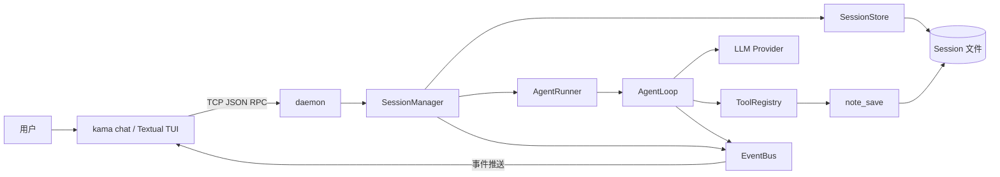
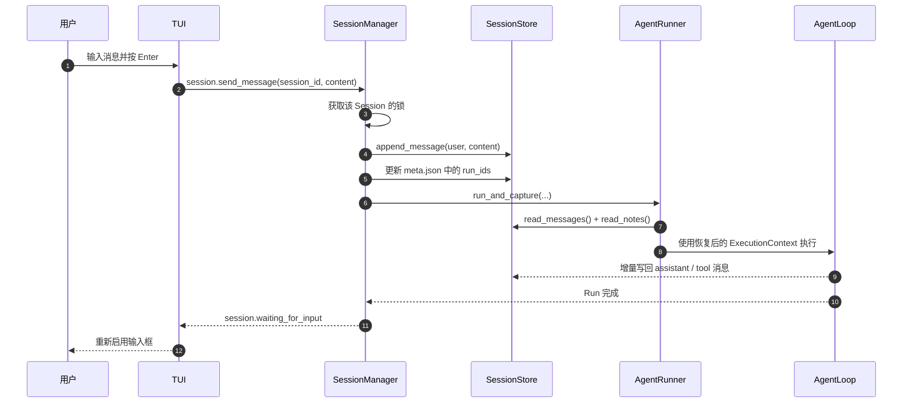
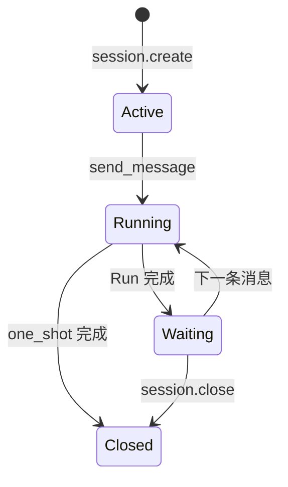
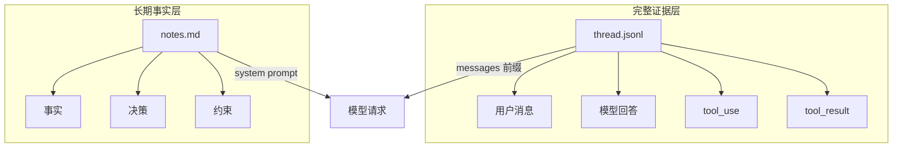
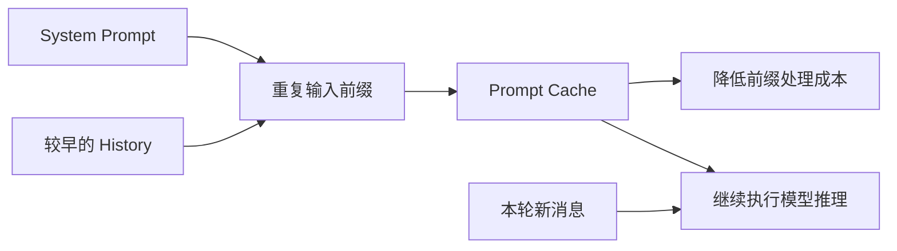
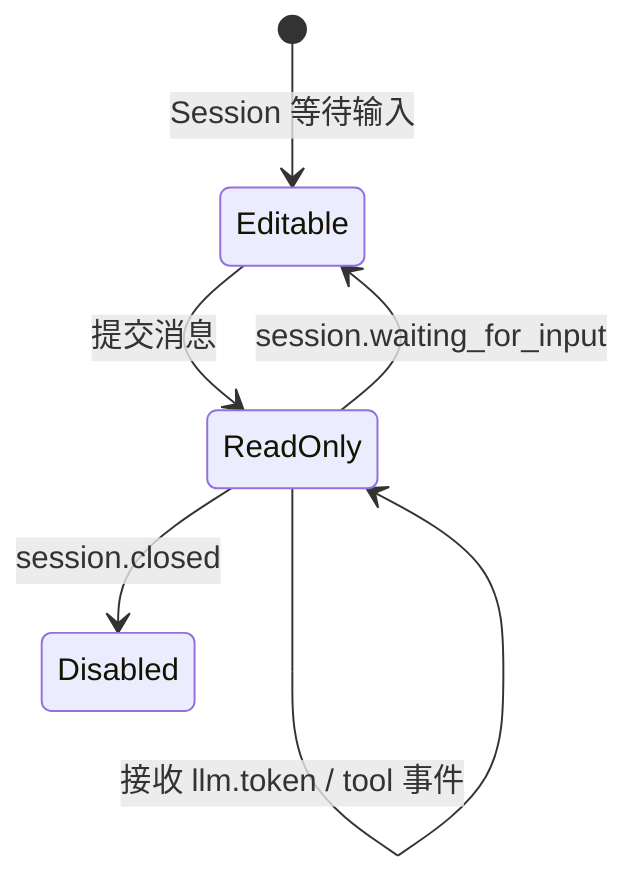
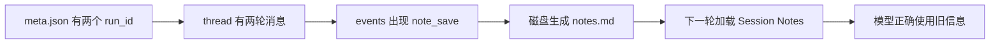

# KamaClaude S4：从一次性 Run 到可持续会话

> 一份面向 Agent 工程学习者的源码导读，重点解释 **SessionManager、上下文恢复、分层记忆、Prompt Cache、TUI 输入和 Windows 排错**。


本文围绕 KamaClaude S4 的完整会话链路展开，适合作为学习笔记、源码阅读入口或组内分享材料。读完后，你应该能够回答：

- 一条用户消息怎样进入 Session 并启动新的 Run？
- `thread.jsonl` 与 `notes.md` 分别保存什么？
- 为什么第二轮能理解上文，却不一定生成 `notes.md`？
- Prompt Cache 为什么能降低成本，却不能充当记忆？
- TUI 怎样在"执行中"和"等待输入"之间切换？

> [!NOTE]
> 文中的代码经过删减，保留了与 S4 主线有关的部分。具体类名、参数和事件字段请以你正在学习的源码版本为准。

## 目录

- [先看结论](#overview)
- [整体架构](#architecture)
- [Session Run Step 的层次](#hierarchy)
- [会话数据怎样落盘](#storage)
- [kama chat 怎样建立会话](#kama-chat)
- [SessionManager 怎样管理生命周期](#session-manager)
- [为什么第一条消息必须先写 thread](#append-first)
- [AgentRunner 怎样恢复上下文](#context-restore)
- [thread 和 notes 的分层记忆](#memory)
- [note_save 和 system prompt](#notes)
- [Prompt Cache 到底缓存什么](#prompt-cache)
- [TUI 怎样从只读变成可输入](#tui)
- [one shot 兼容模式](#one-shot)
- [实际踩坑与解决方案](#pitfalls)
- [验证流程](#verification)
- [验收清单](#checklist)
- [源码索引](#source-map)
- [技术栈与后续演进](#next)

---

<a id="overview"></a>

## 🧭 先看结论

S3 的核心单位是一次 `Run`：用户提交目标，Agent 完成执行，然后结束。S4 把核心单位提升为 `Session`，让多个 Run 能够共享完整历史和关键笔记。

| 概念 | 生命周期 | 主要职责 |
| --- | --- | --- |
| Session | 包含多轮对话 | 管理状态，共享历史与笔记 |
| Run | 对应一条用户请求 | 完成一次完整 Agent 执行 |
| Step | 属于某个 Run | 完成一次模型推理及可能的工具调用 |

> [!IMPORTANT]
> S4 的关键不是"把上一轮回答拼到下一轮问题里"，而是保存并恢复完整的 API 消息结构，包括用户消息、模型回答、`tool_use` 和 `tool_result`。

最核心的职责分工如下：

| 组件 | 负责什么 |
| --- | --- |
| `SessionManager` | 创建 Session、串行化消息、维护状态、启动 Run |
| `SessionStore` | 读写 `meta.json`、`thread.jsonl`、`notes.md` 和 Run 目录 |
| `AgentRunner` | 恢复 history 与 notes，构造本轮执行上下文 |
| `note_save` | 由模型主动保存值得长期保留的事实 |
| system prompt | 向模型提供规则和当前 Session Notes |
| Prompt Cache | 复用重复输入前缀的处理结果，降低费用和延迟 |
| TUI / `kama chat` | 发送 Session 命令并展示 daemon 推送的事件 |

---

<a id="architecture"></a>

## 🏗️ 整体架构



一条消息的主链路是：

```text
用户输入
  -> session.send_message
  -> SessionManager 写入 thread
  -> 创建 run_id 并更新 meta
  -> AgentRunner 读取 history 和 notes
  -> AgentLoop 调用模型与工具
  -> 新消息增量写回 thread
  -> Session 进入 waiting_for_input
```

### 一次消息的时序



---

<a id="hierarchy"></a>

## 🧩 Session Run Step 的层次

```text
Session
├── Run 1：处理第一条用户消息
│   ├── Step 1：模型决定调用 read_file
│   └── Step 2：模型根据工具结果回答
└── Run 2：处理下一条用户消息
    └── Step 1：模型使用已有上下文继续执行
```

假设用户连续发送两条消息：

```bash
uv run kama run --goal "项目用什么 Python 版本？"
uv run kama run --goal "写一个适合该版本的新特性 demo"
```

"该版本"依赖上一轮的结果。两个完全独立的 Run 无法自然理解这个指代；同一个 Session 中的两个 Run 则可以共享第一轮的消息和工具结果。

> [!TIP]
> 可以把 Session 理解成一个长期工作的文件夹，把 Run 理解成其中一次提交，把 Step 理解成这次提交内部的一次模型推理。

---

<a id="storage"></a>

## 💾 会话数据怎样落盘

```text
~/.kama/sessions/sess-9f3a2c1b8d04/
├── meta.json
├── thread.jsonl
├── notes.md
└── runs/
    └── 20260519-103012-a1b2c3/
        ├── events.jsonl
        └── .tasks/
```

| 文件或目录 | 作用 | 所属范围 |
| --- | --- | --- |
| `meta.json` | Session ID、模式、状态、时间和 Run 列表 | Session |
| `thread.jsonl` | 完整 API 消息流，包括工具调用和结果 | Session |
| `notes.md` | Agent 主动保存的事实、决策和约束 | Session |
| `runs/<run_id>/` | 某一轮执行的事件和任务数据 | Run |
| `events.jsonl` | 该轮执行产生的事件流 | Run |

这种结构把"跨轮共享的数据"和"单轮执行的数据"分开：

- Session 层回答"这场会话到目前为止发生了什么"；
- Run 层回答"这一轮具体怎样执行"；
- `events.jsonl` 适合排错和回放事件；
- `thread.jsonl` 适合重新构造模型输入。

---

<a id="kama-chat"></a>

## 💬 kama chat 怎样建立会话

`kama chat` 是 Session 协议的命令行参考实现。它负责读取输入、发送命令和打印事件；真正的 Session 状态、历史和执行调度都在 daemon 中。

```python
async def _chat_async(config: KamaConfig) -> int:
    client = SocketClient(config.host, config.port)
    await client.connect()

    printer = ChatPrinter()
    client.on_event(printer.handle)
    loop_task = asyncio.create_task(client.run_event_loop())

    await client.send_command("event.subscribe", {
        "topics": ["session.*", "run.*", "tool.*", "llm.*"],
    })

    created = await client.send_command(
        "session.create", {"mode": "chat"}
    )
    session_id = str(created["session_id"])

    while True:
        line = await _readline("> ")
        if not line.strip():
            continue
        await client.send_command("session.send_message", {
            "session_id": session_id,
            "content": line,
        })
```

代码中有四个关键顺序：

1. 连接 daemon 后，先启动长期运行的事件接收循环。
2. 先订阅事件，再创建 Session，避免错过 `session.created`。
3. Session 只创建一次，后续输入复用相同的 `session_id`。
4. 每条输入调用 `session.send_message`，由 daemon 决定怎样启动 Run。

### 为什么不能直接在异步函数中调用 `input()`

```python
async def _readline(prompt: str) -> str:
    loop = asyncio.get_running_loop()
    return await loop.run_in_executor(None, input, prompt)
```

`input()` 是阻塞调用。如果直接放进事件循环，键盘等待期间就无法处理 `llm.token` 等流式事件。`run_in_executor()` 把阻塞等待放到线程池，主事件循环仍能继续接收输出。

> [!WARNING]
> `asyncio.create_task()` 和 `run_in_executor()` 的作用不同：前者调度协程，后者把阻塞函数交给线程池。不要把阻塞的 `input()` 仅仅包进 `create_task()`。

---

<a id="session-manager"></a>

## 🔐 SessionManager 怎样管理生命周期

### 创建 Session

```python
async def create(self, mode: SessionMode, title: str = "") -> Session:
    sid = f"sess-{uuid.uuid4().hex[:12]}"
    ts = _now()
    session = Session(
        id=sid,
        mode=mode,
        status="active",
        title=title,
        created_at=ts,
        updated_at=ts,
        run_ids=[],
    )
    self._sessions[sid] = session
    self._locks[sid] = asyncio.Lock()
    self._store.write_meta(session)
    await self._bus.publish(SessionCreatedEvent(...))
    return session
```

创建时同时完成四件事：

- 在内存中登记 Session；
- 为该 Session 创建独立的 `asyncio.Lock`；
- 把元数据写入 `meta.json`；
- 发布 `session.created` 事件。

创建 Session 本身不会启动 AgentRunner，此时 `run_ids` 仍为空。真正的执行从 `session.send_message` 开始。

### 为什么忙时直接拒绝

同一 Session 正在执行时，新的消息会收到 `session busy`。锁覆盖整个 Run，避免两轮同时读写 `thread.jsonl` 和 `notes.md`。



这里的"安全排队"不是简单把消息塞进 FIFO 队列。下一轮依赖上一轮已经完整写回的消息、工具结果和笔记，因此系统必须保证严格串行。

> [!CAUTION]
> 只在写文件时短暂加锁仍然不够。两轮可能读取到相同的旧 history，再各自生成结果，虽然文件没有写坏，语义顺序却已经错了。

---

<a id="append-first"></a>

## 🧷 为什么第一条消息必须先写 thread

```python
async def send_message(self, sid: str, content: str, *, run_id=None):
    session = self._get_session(sid)
    lock = self._locks[sid]

    if lock.locked():
        raise HandlerError(SESSION_BUSY, "session busy")

    async with lock:
        if session.status == "closed":
            raise HandlerError(SESSION_CLOSED, "session already closed")

        self._store.append_message(sid, "user", content)

        run_id = run_id or new_run_id()
        session.run_ids.append(run_id)
        self._store.write_meta(session)

        runner = self._runner_factory()
        await runner.run_and_capture(
            content,
            run_id=run_id,
            session=session,
            store=self._store,
        )
```

> [!IMPORTANT]
> `append_message()` 必须发生在 `run_and_capture()` 之前。

Session 分支中的 AgentRunner 会从 `thread.jsonl` 读取完整 history。如果当前用户消息还没有写入，模型收到的 `messages` 中就缺少本轮问题。

反过来，AgentRunner 读取 history 后也不应该再次追加同一条用户消息，否则当前问题会出现两次。消息写入的所有权必须明确：**SessionManager 写当前 user 消息，AgentLoop 增量写回后续 assistant 与工具消息。**

---

<a id="context-restore"></a>

## 🔄 AgentRunner 怎样恢复上下文

```python
async def run_and_capture(
    self, goal, *, run_id=None, session=None, store=None
):
    run_id = run_id or new_run_id()

    if session is not None and store is not None:
        run_path = store.runs_dir(session.id) / run_id
        history = store.read_messages(session.id)
        notes = store.read_notes(session.id)
    else:
        run_path = self._runs_dir / run_id
        history = [{"role": "user", "content": goal}]
        notes = ""

    context = ExecutionContext(
        run_id=run_id,
        goal=goal,
        max_steps=self._config.agent.max_steps,
        prefill_messages=history,
        session_notes=notes,
    )
```

| 数据 | 读取来源 | 进入模型的方式 |
| --- | --- | --- |
| history | `thread.jsonl` | 作为 `messages` 的前缀 |
| notes | `notes.md` | 拼接到 system prompt |

这段代码同时保留了两个入口：

- 有 `session + store`：进入多轮会话模式；
- 没有 Session：使用当前 `goal` 构造一次性 history。

这使原有 Runner 能继续复用，而 Session 能力作为新的上下文来源接入。

---

<a id="memory"></a>

## 🧠 thread 和 notes 的分层记忆



| 维度 | `thread.jsonl` | `notes.md` |
| --- | --- | --- |
| 回答的问题 | 上一轮发生过什么 | 以后应该记住什么 |
| 内容 | 用户消息、回答、工具调用、工具结果 | 事实、决策、约束 |
| 写入方式 | 运行链路自动追加 | Agent 主动调用 `note_save` |
| 模型输入位置 | `messages` | system prompt |
| 长期价值 | 保留完整证据和过程 | 历史压缩后仍可保留关键事实 |

`thread.jsonl` 不是普通日志，而是可以重新发送给模型 API 的消息结构：

```json
{"role":"user","content":"项目用什么 Python 版本？"}
{"role":"assistant","content":[
  {"type":"tool_use","id":"toolu_01","name":"read_file"}
]}
{"role":"user","content":[
  {
    "type":"tool_result",
    "tool_use_id":"toolu_01",
    "content":"requires-python = >=3.12"
  }
]}
```

> [!WARNING]
> `tool_use` 和 `tool_result` 必须配对。如果上一次 Run 在工具执行途中崩溃，恢复时需要裁掉孤立的 `tool_use`，否则下一次 API 请求可能因为消息格式非法而失败。

### 为什么滑动窗口会破坏连续性

按"最后 N 条消息"机械裁剪时，窗口边界可能落在一个工具交互中间：

```text
保留：assistant -> tool_use(id=42)
丢失：user -> tool_result(tool_use_id=42)
```

也可能丢掉解释后续指代所需的早期决策。实际工程中更稳妥的方案通常组合使用：

1. 保留最近的完整对话块，而不是固定消息条数；
2. 保证 `tool_use/tool_result` 原子保留或原子删除；
3. 把长期事实提炼到结构化状态或 notes；
4. 对更早历史生成摘要，并保留摘要依据的消息范围；
5. 在需要时通过检索恢复相关历史，而不是完整回放所有内容。

---

<a id="notes"></a>

## 📝 note_save 和 system prompt

### `note_save` 负责写入

```python
class NoteSaveTool(BaseTool):
    name = "note_save"

    async def invoke(self, params):
        content = str(params["content"]).strip()
        if not content:
            return ToolResult(content="empty content", is_error=True)
        self._store.append_note(
            self._session_id, content, self._run_id
        )
        return ToolResult(content="saved")
```

`note_save` 只在 Session Run 中注册，因为普通 Run 没有明确的 `session_id` 和 `notes.md` 写入目标。它不会在每轮结束后自动总结，是否保存由模型在执行当下决定。

### system prompt 负责读取

```python
def system_prompt(self, base: str) -> str:
    if not self.session_notes.strip():
        return base
    return (
        base
        + "\n\n## Session Notes\n"
        + self.session_notes.strip()
        + "\n\nRemember important durable facts "
          "by calling note_save."
    )
```

notes 不是某一轮用户说的话，所以不应伪造成 `user` 消息。它作为长期背景拼进 system prompt，每次模型请求都会重新收到当前笔记。

> [!NOTE]
> 当 `session_notes` 为空时，这段实现直接返回 `base`，首次会话不会收到"记住重要事实"的额外提醒。工具仍然可用，但首次保存更依赖模型理解工具描述或用户明确要求调用。

---

<a id="prompt-cache"></a>

## ⚡ Prompt Cache 到底缓存什么

完整回放会让多轮请求拥有大量相同的输入前缀。Prompt Cache 可以复用这些前缀的处理结果，从而降低重复输入的费用和延迟。



| 机制 | 解决的问题 | 不能解决的问题 |
| --- | --- | --- |
| `thread.jsonl` | 持久保存完整历史 | 不能自动控制上下文长度 |
| `notes.md` | 保存长期事实和决策 | 不会自动记录所有事实 |
| system prompt | 向模型提供规则和会话背景 | 自身不是持久存储 |
| Prompt Cache | 降低重复前缀的处理成本 | 不能替代存储、检索或上下文压缩 |

> [!IMPORTANT]
> Prompt Cache 缓存的是输入处理结果，不是上一轮答案。命中缓存不代表模型"记住了"，未命中缓存也不代表会话历史丢失。

当 notes 改变时，system prompt 前缀也会改变，相关缓存可能需要重建。S4 接受这项成本，因为让模型看到最新事实比维持旧缓存更重要。

---

<a id="tui"></a>

## ⌨️ TUI 怎样从只读变成可输入

```python
class ChatTextArea(TextArea):
    class Submitted(Message):
        def __init__(self, area):
            self.text_area = area
            self.value = area.text
            super().__init__()

    async def _on_key(self, event):
        key = event.key

        if key == "enter":
            event.stop()
            event.prevent_default()
            if self.text.strip():
                self.post_message(self.Submitted(self))
            return

        if key in (
            "alt+enter", "shift+enter", "ctrl+j", "super+enter"
        ):
            event.stop()
            event.prevent_default()
            if not self.read_only:
                self.insert("\n")
            return

        await super()._on_key(event)
```

| 按键 | 行为 | 实现要点 |
| --- | --- | --- |
| Enter | 提交整条消息 | 阻止默认换行并发布 `Submitted` |
| Shift / Alt / Cmd + Enter | 插入换行 | 调用 `insert("\n")` |
| 其他按键 | 保留编辑能力 | 交给父类 `TextArea` 处理 |

`Submitted` 是 Textual 的界面消息，不是模型的 `messages`。TUI 收到它以后，才发送 `session.send_message`。



输入框在 Run 执行期间进入只读状态，可以避免用户误以为消息已经被安全排队。收到 `session.waiting_for_input` 后再重新启用，界面状态与后端 Session 状态保持一致。

---

<a id="one-shot"></a>

## 🎯 one shot 兼容模式

S4 没有删除原来的 `kama run`。daemon 会为一次性命令创建 `one_shot` Session，再复用同一条 `send_message` 路径。

```python
if session.mode == "one_shot":
    session.status = "closed"
    await self._bus.publish(SessionClosedEvent(...))
else:
    session.status = "waiting_for_input"
    await self._bus.publish(SessionWaitingForInputEvent(...))
```

这样 CLI、TUI、事件流和存储逻辑只维护一套实现。两种模式的主要区别发生在 Run 完成后：聊天 Session 等待下一条消息，一次性 Session 直接关闭。

---

<a id="pitfalls"></a>

## 🧯 实际踩坑与解决方案

### 1. 第二轮成功，但没有生成 `notes.md`

**现象：** 第一轮询问 Python 版本，第二轮要求写 demo。第二轮理解了"该版本"，`thread.jsonl` 也存在，但 Session 目录中没有 `notes.md`。

**原因：** `notes.md` 只有在模型实际调用 `note_save` 后才会创建。第二轮可以直接从 thread 读取第一轮的工具结果，模型不一定认为还需要保存笔记。

测试时使用更明确的提示：

```text
请读取 pyproject.toml，确认项目要求的 Python 版本，
然后调用 note_save，把这个版本要求保存到当前会话笔记。
```

| 验收目标 | 需要观察的证据 |
| --- | --- |
| thread 生效 | 第二轮能使用第一轮消息和工具结果 |
| notes 生效 | 发生 `note_save` 调用并生成 `notes.md` |
| notes 被恢复 | 下一轮 system prompt 包含已有 Session Notes |

> [!WARNING]
> "第二轮没有再次读取文件"只能证明 history 恢复成功，不能证明 notes 已经生效。

### 2. PowerShell 中的用户目录写错

错误写法在 `~` 前增加了反斜杠，PowerShell 不会将其解析为用户主目录：

```powershell
cat \~/.kama/sessions/sess-*/notes.md
```

正确写法：

```powershell
Get-Content "$HOME\.kama\sessions\sess-*\notes.md" -Encoding UTF8
```

调试时最好填写准确的 `session_id`。通配符会读取多个 Session，输出混在一起后很难判断记录来自哪一轮。

### 3. Windows PowerShell 显示中文乱码

如果看到"椤圭洰""鐗堟湰"等文本，原始文件可能仍是正确的 UTF-8。Windows PowerShell 5.1 常按系统 ANSI 编码读取无 BOM 文件。

临时解决：

```powershell
Get-Content "$HOME\.kama\sessions\sess-xxx\notes.md" -Encoding UTF8
```

为当前 PowerShell 环境设置默认值：

```powershell
$PSDefaultParameterValues['Get-Content:Encoding'] = 'UTF8'
```

> [!TIP]
> `chcp 65001` 主要改变控制台代码页，不能替代 `Get-Content -Encoding UTF8` 对文件解码方式的指定。

### 4. 网页复制代码后出现弯引号

错误：

```python
msg[‘role’]
```

正确：

```python
msg['role']
```

报错中的 `U+2018` 表示复制进来的是弯引号。PowerShell 的续行提示符 `>>`、网页实体 `&#x20;` 和代码块行号也不应该复制进终端。

### 5. PowerShell 管道、BOM 和 Python 标准输入

下面的命令同时处理控制台输出编码、文件读取编码和 Python 标准输入中的 BOM：

```powershell
$OutputEncoding = [Console]::OutputEncoding =
    [System.Text.UTF8Encoding]::new($false)

Get-Content "$HOME\.kama\sessions\sess-xxx\thread.jsonl" `
  -Encoding UTF8 |
python -X utf8 -c "
import json, sys
sys.stdin.reconfigure(encoding='utf-8-sig')

for line in sys.stdin:
    if not line.strip():
        continue
    msg = json.loads(line)
    print(msg['role'], '|', str(msg['content'])[:120])
"
```

末尾的 `[:120]` 只限制终端显示长度，不会修改 `thread.jsonl`，也不会影响下一轮发送给模型的上下文。

### 6. 把 Prompt Cache 当成记忆

```text
thread.jsonl  保存完整历史
notes.md      保存关键事实
system prompt 把笔记交给模型
prompt cache  降低重复输入的处理成本
```

Prompt Cache 不会替应用保存 thread，不会自动找回事实，也不会让历史不占上下文窗口。

---

<a id="verification"></a>

## 🧪 验证流程

1. 启动 daemon：`uv run kama-core`。
2. 在另一个终端启动 TUI：`uv run kama-tui`。
3. 发送第一条消息，要求读取 `pyproject.toml`，并明确要求调用 `note_save`。
4. 等待输入框重新激活，再发送依赖上一轮信息的第二条消息。
5. 检查 `meta.json`、`thread.jsonl`、`notes.md` 和两个 Run 的 `events.jsonl`。
6. 确认第二轮没有为了理解"该版本"而重新读取 `pyproject.toml`。

### PowerShell 检查命令

```powershell
Get-ChildItem "$HOME\.kama\sessions" -Directory

Get-Content `
  "$HOME\.kama\sessions\sess-xxx\notes.md" `
  -Encoding UTF8

Get-Content `
  "$HOME\.kama\sessions\sess-xxx\thread.jsonl" `
  -Encoding UTF8
```

### 应该形成的证据链



不要只看最终回答是否正确。回答可能来自 thread、notes、模型先验或重新读取文件。只有同时检查事件、磁盘文件和下一轮行为，才能判断具体是哪层能力生效。

---

<a id="checklist"></a>

## ✅ 最终验收清单

- [ ] 创建 Session 后生成 `sess-` 前缀 ID 和 `meta.json`
- [ ] 同一 Session 的 `run_ids` 至少包含两轮
- [ ] `thread.jsonl` 包含 `user`、`assistant`、`tool_use` 和 `tool_result`
- [ ] 第二轮能够理解第一轮的信息
- [ ] Run 执行期间再次发送消息会返回 `session busy`
- [ ] `note_save` 成功后生成 `notes.md`
- [ ] 下一轮读取 notes 并注入 system prompt
- [ ] TUI 在执行中禁用输入，在等待状态重新启用
- [ ] `kama run` 能通过 `one_shot` Session 正常完成
- [ ] Windows 下使用 UTF-8 读取文件时中文显示正常

---

<a id="source-map"></a>

## 🗺️ 源码索引

| 阅读目标 | 入口文件 |
| --- | --- |
| `kama chat` 命令和异步输入 | `src/kama_claude/cli/commands/chat.py` |
| Session 模型 | `src/kama_claude/core/session/model.py` |
| Session 文件读写 | `src/kama_claude/core/session/store.py` |
| 生命周期、锁和消息调度 | `src/kama_claude/core/session/manager.py` |
| IPC handler 注册 | `src/kama_claude/core/app.py` |
| history 与 notes 恢复 | `src/kama_claude/core/runner.py` |
| system prompt 拼接 | `src/kama_claude/core/context.py` |
| `note_save` 工具 | `src/kama_claude/core/tools/builtin/note_save.py` |
| TUI 输入框和状态联动 | `src/kama_claude/tui/app.py` |

配套测试建议按下面的顺序阅读：

1. `tests/unit/test_session_store.py`
2. `tests/unit/test_note_save_tool.py`
3. `tests/unit/test_session_manager.py`
4. `tests/unit/test_runner.py`
5. `tests/unit/test_tui_app.py`
6. `tests/integration/test_s4_session_ipc.py`

单元测试分别验证存储、工具和组件行为，集成测试再验证从 IPC 到 Session 的完整链路。遇到文档与当前代码不一致时，优先对照对应测试确认实际契约。

---

<a id="next"></a>

## 🚀 技术栈与后续演进

| 技术 | 在 S4 中的作用 |
| --- | --- |
| Python `asyncio` | 事件循环、并发任务、线程池和 Session 锁 |
| Textual | TUI 输入框、界面消息和状态联动 |
| Pydantic | IPC 命令和返回值的数据校验 |
| TCP / JSON-RPC / NDJSON | CLI、TUI 与 daemon 的双向通信 |
| Anthropic API | 流式输出、工具调用和 Prompt Cache |
| JSON / JSONL / Markdown | 元数据、消息历史和长期笔记 |
| pytest / pytest-asyncio | 存储、工具、Runner 和异步链路验证 |

S4 的完整回放适合较短的会话，但历史会持续增长。更成熟的工程实现还需要逐步增加：

- 按完整语义块裁剪，保证工具调用配对；
- 对早期 history 生成可追溯摘要；
- 把任务、用户偏好和项目事实保存为结构化状态；
- 通过关键词或向量检索按需恢复旧历史；
- 记录 token 预算，在请求前决定保留、摘要或检索哪些内容；
- 为排队、取消、重试和崩溃恢复定义明确的状态机。

> [!IMPORTANT]
> S4 最有价值的部分，是先把存储边界和上下文恢复路径建立正确。只有 thread、notes、Run 和 Session 的职责清晰，后续的压缩、检索和长期记忆才有可靠基础。

---

## 📚 推荐学习顺序

1. 先看整体架构图，明确 TUI、daemon、SessionManager 和 AgentRunner 的边界。
2. 跟踪 `session.send_message`，确认当前 user 消息在哪里写入。
3. 跟踪 `run_and_capture`，观察 history 与 notes 怎样进入 `ExecutionContext`。
4. 对照 `thread.jsonl` 和 `notes.md`，理解完整证据与长期事实的区别。
5. 用 TUI 完成两轮对话，再按验证流程检查磁盘文件和事件。
6. 最后研究上下文增长问题，设计适合自己项目的摘要、检索和裁剪策略。

学完后，尝试不看本文解释下面这条链路：

```text
Submitted
  -> session.send_message
  -> append_message
  -> run_and_capture
  -> prefill_messages + session_notes
  -> AgentLoop
  -> 增量写回 thread
  -> waiting_for_input
```

如果能说明每一步的输入、输出、持久化位置和失败影响，就已经掌握了 S4 的核心。
