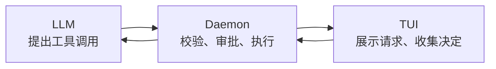
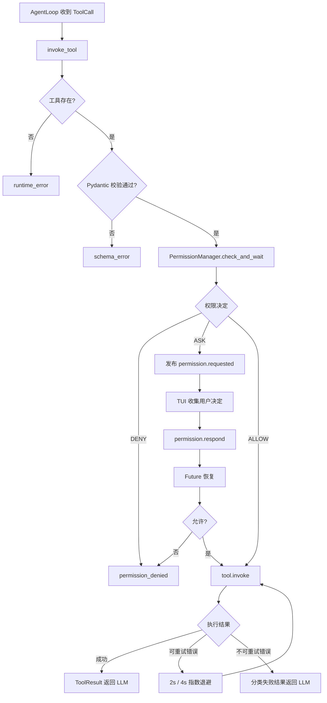
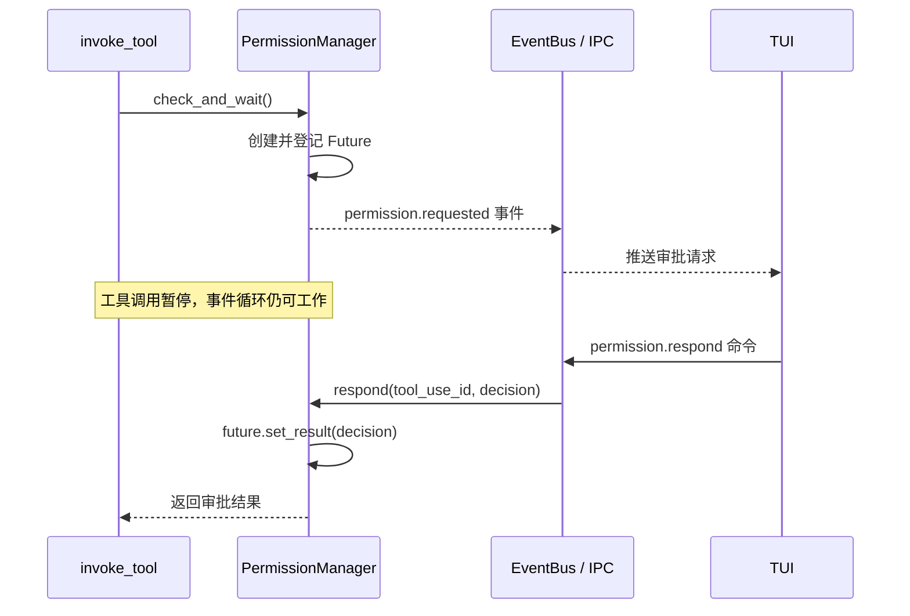
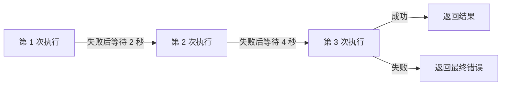

# KamaClaude S5：给 Agent 的工具调用加上安全锁

> 从"模型找到工具就执行"，升级到"参数可校验、操作可审批、失败可分类、过程可追踪"的工具执行链。


这是一份面向学习和分享的 S5 阅读笔记。内容围绕一条真实的工具调用链展开，包含关键代码、设计原因、常见问题、解决方案和验证方式。

> [!NOTE]
> 本文根据源码快照整理。代码均为教学节选，`...` 表示省略内容。标为"改进建议"的代码并非项目当前已经实现的功能。

## 目录

- [这一阶段解决什么问题](#这一阶段解决什么问题)
- [完整执行链](#完整执行链)
- [1. Pydantic 参数校验](#1-pydantic-参数校验)
- [2. 静态权限策略](#2-静态权限策略)
- [3. Future 异步审批](#3-future-异步审批)
- [4. always 缓存与持久化](#4-always-缓存与持久化)
- [5. IPC 与 TUI 审批往返](#5-ipc-与-tui-审批往返)
- [6. TUI 消息泵与 run_worker](#6-tui-消息泵与-run_worker)
- [7. 错误分类与指数退避](#7-错误分类与指数退避)
- [8. 三类 timeout 的区别](#8-三类-timeout-的区别)
- [9. Windows 学习环境踩坑](#9-windows-学习环境踩坑)
- [10. 验证清单](#10-验证清单)
- [源码导航](#源码导航)
- [分享建议](#分享建议)

---

## 这一阶段解决什么问题

S4 之后，Agent 已经能持续对话，也能调用 Bash、文件读写等工具。新的风险随之出现：模型可能漏传参数、理解错路径、执行有副作用的命令，或者在失败后重复执行不该重试的操作。

S5 为工具调用补上四道能力：

| 能力 | 解决的问题 |
|---|---|
| 参数校验 | LLM 给出的参数能否执行 |
| 权限策略 | 这次操作是否允许执行 |
| 异步审批 | 需要用户决定时，怎样暂停并恢复调用 |
| 错误分类与重试 | 执行失败后是否值得再次尝试 |

三个主要角色：



## 完整执行链



> [!IMPORTANT]
> 安全性不只取决于"有没有审批弹窗"，还取决于检查顺序。参数校验、强制拒绝、越界询问、缓存和默认策略的先后关系都会改变最终行为。

---

## 1. Pydantic 参数校验

权限审批之前，先判断参数是否符合工具接口。参数错误应反馈给 LLM 修正，不应该让用户判断"是否允许一个本来就无法执行的调用"。

### 核心代码

```python
class BashParams(BaseModel):
    model_config = ConfigDict(extra="ignore")

    command: str
    timeout: int = Field(default=60, ge=1, le=120)


class BashTool(BaseTool):
    params_model = BashParams
```

- `command` 没有默认值，是必填参数。
- `timeout` 默认 60 秒，范围为 1～120。
- `extra="ignore"` 表示构造模型时忽略未声明字段。
- `params_model` 让统一调用入口知道该使用哪个模型校验。

统一入口在权限判断前执行：

```python
if tool.params_model is not None:
    try:
        tool.params_model.model_validate(dict(tool_call.input))
    except ValidationError as exc:
        return await _fail(
            bus,
            run_id,
            tool_call,
            "schema_error",
            str(exc),
            elapsed(),
        )
```

例如下面的调用会直接返回 `schema_error`，不会弹出审批卡片：

```json
{
  "name": "bash",
  "input": {
    "timeout": -1
  }
}
```

### ⚠️ 坑：校验通过，不代表后续使用了校验结果

`model_validate()` 会返回模型对象，但统一入口没有保存它，后续仍把原始 `dict(tool_call.input)` 传给权限层和工具。

S5 的 `BashTool.invoke()` 内部会再次校验并使用模型字段：

```python
p = BashParams.model_validate(params)
command = p.command
timeout = p.timeout
```

因此当前 Bash 的默认值仍然有效；但统一入口没有为所有工具统一提供规范化参数。

> [!TIP]
> 一个更一致的接口是：统一入口保存 `validated.model_dump()`，再让权限预览和工具执行使用同一份参数。实施前要确认额外字段、别名和默认值不会改变已有工具协议。

### ✅ 验证点

- 缺少 `command` 返回 `schema_error`。
- `timeout=-1` 返回 `schema_error`。
- 参数错误时不发布 `permission.requested`。
- 省略 timeout 时，Bash 实际使用默认值 60。

---

## 2. 静态权限策略

静态策略返回三个结果：

| 决定 | 含义 |
|---|---|
| `ALLOW` | 自动放行 |
| `DENY` | 自动拒绝 |
| `ASK` | 请求用户决定 |

### 核心代码

```python
def evaluate(tool_name, params, policy=None):
    if policy is None:
        policy = DEFAULT_POLICIES.get(tool_name)

    if policy is None:
        return PermissionDecision.ASK

    command = (
        str(params.get("command", ""))
        if tool_name == "bash"
        else ""
    )

    for pattern in policy.deny_patterns:
        if re.search(pattern, command):
            return PermissionDecision.DENY

    if command and matches_outside_cwd(command):
        return PermissionDecision.ASK

    for pattern in policy.allow_patterns:
        if re.search(pattern, command):
            return PermissionDecision.ALLOW

    return policy.default
```

静态顺序是：

```text
deny_patterns
    ↓
outside-cwd 强制 ASK
    ↓
allow_patterns
    ↓
工具默认策略
```

默认策略大致为：

```python
DEFAULT_POLICIES = {
    "bash":       ToolPolicy(default=PermissionDecision.ASK),
    "write_file": ToolPolicy(default=PermissionDecision.ASK),
    "read_file":  ToolPolicy(default=PermissionDecision.ALLOW),
    "list_dir":   ToolPolicy(default=PermissionDecision.ALLOW),
    "note_save":  ToolPolicy(default=PermissionDecision.ALLOW),
}
```

### 🔐 为什么越界命令必须再次询问

绝对路径、`~`、`../`、`$HOME`、`$PWD` 和部分 `cd` 写法会触发越界启发式检查。它们不一定危险，但意味着命令可能离开当前工作目录，所以用户应该知道。

即使配置了：

```python
allow_patterns = [".*"]
```

越界检查仍位于允许规则之前，不能被这条宽泛规则静默绕过。

> [!WARNING]
> 这是命令文本的启发式检测，并非完整 Shell 解析器或操作系统沙箱。它可能误报，也无法证明所有路径写法都被识别。需要严格隔离时，应增加路径解析、能力限制或操作系统级隔离。

### ⚠️ 坑：为什么 `check_and_wait()` 没有直接调用 `evaluate()`？

关键不是同步函数和异步函数的区别，而是缓存需要插入静态规则的中间：

| 优先级 | `evaluate()` | `check_and_wait()` |
|---:|---|---|
| 1 | 拒绝规则 | 拒绝规则 |
| 2 | 越界强制 ASK | 越界强制 ASK |
| 3 | 允许规则 | session 缓存 |
| 4 | 默认策略 | persistent 缓存 |
| 5 | — | 允许规则 |
| 6 | — | 默认策略 |

`echo hello` 可能因为 Bash 的默认策略得到 ASK；`cat /etc/hostname` 则因为越界得到 ASK。已有 `always_allow` 时，前者可以命中缓存，后者仍必须再次询问。但 `evaluate()` 最终只返回同一个 ASK，调用方无法知道它来自哪里。

先查缓存会绕过拒绝和越界规则；把 `evaluate()` 的最终结果直接返回，则会让普通 ASK 无法使用缓存。于是当前实现重新展开了规则。

### 💡 改进建议：拆成两个静态阶段

```python
# 设计示意，不是当前源码
decision = evaluate_mandatory(tool_name, params, policy)

if decision is None:
    decision = lookup_cached_decision(session_id, tool_name)

if decision is None:
    decision = evaluate_fallback(tool_name, params, policy)

if decision == PermissionDecision.ASK:
    return await request_and_wait(...)
```

`None` 表示"这个阶段没有作出决定"；`ASK` 表示"已经决定询问"，两者不能混用。

---

## 3. Future 异步审批

ASK 路径要暂停当前工具调用，但不能卡住整个 daemon。`asyncio.Future` 表示一个稍后才会得到的审批结果。

### 核心代码

```python
future = loop.create_future()

self._pending[tool_use_id] = _PendingRequest(
    future=future,
    session_id=session_id,
    tool_name=tool_name,
)

await event_emitter({
    "type": "permission.requested",
    "tool_use_id": tool_use_id,
    "tool_name": tool_name,
    "params": params,
    "param_preview": param_preview(tool_name, params),
    "session_id": session_id,
    "ts": _now(),
})

raw = await asyncio.wait_for(
    future,
    timeout=self._timeout_s,
)
```

先保存 Future，再发送事件，能够避免回应很快到达时找不到等待对象。用户提交决定后：

```python
def respond(self, tool_use_id: str, decision: str) -> None:
    req = self._pending.pop(tool_use_id, None)
    if req is None:
        return

    if not req.future.done():
        req.future.set_result(decision)
```

`set_result()` 唤醒等待同一个 Future 的工具调用。

### ⚠️ 坑：pending 需要覆盖所有退出路径

当前源码会在正常回应和审批超时时删除 pending；显式调用 `cancel_session()` 时，也能拒绝并清理该会话的等待项。

但事件发送失败、等待任务被取消等路径没有统一的 `finally` 清理。本次核对的 S5 快照中还只发现了 `cancel_session()` 的定义，没有找到客户端断连时的调用点。

> [!TIP]
> 可将"发送事件 + 等待回应"放进 `try/finally`，只清理本次登记的对象；任务取消继续向上传播。断连处理还应考虑一个会话是否可能由多个客户端共同观察。

### ✅ 验证点

- 正常回应后 pending 被移除。
- 审批超时后 pending 被移除。
- 迟到回应只产生未知 ID 日志，不恢复旧调用。
- 事件发送异常、调用取消后不存在 pending 泄漏。
- 相同 `tool_use_id` 不会覆盖尚未结束的旧请求。

---

## 4. always 缓存与持久化

TUI 提供四种决定：

| 按键 | 决定 | 是否记忆 |
|---|---|---|
| `y` | `allow_once` | 否 |
| `a` | `always_allow` | 是 |
| `n` | `deny_once` | 否 |
| `d` | `always_deny` | 是 |

### 核心代码

```python
allow = decision in ("allow_once", "always_allow")

if decision == "always_allow":
    self._session_always[(session_id, tool_name)] = "allow"
    self._persistent_always[tool_name] = "allow"

    if self._policy_file is not None:
        save_policy_file(
            self._persistent_always,
            self._policy_file,
        )
```

缓存粒度是工具名，不是完整命令：

| 缓存 | 键 | 影响范围 |
|---|---|---|
| session | `(session_id, tool_name)` | 当前会话中的该工具 |
| persistent | `tool_name` | 使用同一策略文件的后续会话 |

> [!IMPORTANT]
> `always_allow bash` 不等于只记住刚才那条命令。它会影响其他 Bash 参数，但更高优先级的拒绝规则和越界 ASK 仍然生效。

### ⚠️ 坑：内存生效，不等于文件保存成功

只有初始化时传入 `policy_file`，manager 才会加载和保存文件。保存失败时，内存缓存已经更新，因此可能表现为"当前进程有效，重启后失效"。

此外，当前保存函数会重写整个策略文件，不能假定它会保留手工加入的其他配置节。

### ✅ 验证点

- session 缓存优先于 persistent 缓存。
- 不同参数仍共享同一个工具级缓存。
- 重启 daemon 后，长期选择是否从目标文件恢复。
- 已选 always allow 后，`cd .. && pwd` 仍触发审批。

---

## 5. IPC 与 TUI 审批往返

权限请求通过事件从 daemon 推向 TUI；用户决定通过命令从 TUI 返回 daemon。



### 核心代码

`invoke_tool()` 将权限字典包装成事件：

```python
async def _emit_permission(raw):
    await bus.publish(
        PermissionRequestedEvent(**raw, run_id=run_id)
    )
```

后台接收回应命令：

```python
async def _permission_respond_handler(self, params):
    cmd = PermissionRespondCommand.model_validate(params)
    self._permission_manager.respond(
        cmd.tool_use_id,
        cmd.decision,
    )
    return PermissionRespondResult()
```

`PermissionRespondResult` 只是确认"审批命令已处理"，不是 Bash 的执行结果。

### ⚠️ 坑：长请求不能堵住后续审批命令

`session.send_message` 可能一直等到 Agent run 结束，而 Agent 又可能等待 `permission.respond`。如果 socket 服务端按顺序等待每条请求处理完成，就会形成死锁式等待。

S5 的 socket 读取循环为每条命令创建独立任务：

```python
asyncio.create_task(
    self._handle_line(line, writer)
)
```

因此长请求尚未返回时，后续审批命令仍可以被读取和处理。

> [!CAUTION]
> IPC 请求 ID 与 `tool_use_id` 不是同一个概念。前者匹配一条命令及其响应，后者匹配一次工具调用及其审批 Future。

---

## 6. TUI 消息泵与 `run_worker`

TUI 收到权限事件后，创建展示卡片和交互控件：

```python
perm_block = PermissionBlock(
    tool_use_id,
    tool_name,
    param_preview,
)
self._pending_permission_blocks[tool_use_id] = perm_block
self._append(perm_block)

select = PermissionSelect(tool_use_id)
self._mount_permission_select(select)
```

### ⚠️ 踩坑：卡片出现了，按键却没有反应

如果输入提交处理器直接等待整次 Agent 运行：

```python
await self._client.send_command(
    "session.send_message",
    ...,
)
```

就可能出现：

```text
消息处理函数等待 Agent 完成
        ↓
Agent 等待用户审批
        ↓
审批控件等待消息处理和焦点调度
```

修复是把长操作交给 Textual worker：

```python
async def on_chat_text_area_submitted(self, event):
    self.run_worker(
        self._do_send_message(content),
        name="send_message",
        exclusive=False,
    )
```

这样消息处理器可以尽快返回，Textual 能继续处理焦点和键盘事件。

> [!NOTE]
> 这里传入的是协程，通常仍运行在同一个 asyncio 事件循环中，并不自动创建线程。同步阻塞 I/O 或大量 CPU 工作仍会卡住事件循环，需要使用线程、进程或真正的异步实现。

### ✅ 验证点

- 审批控件挂载后获得焦点。
- `y/a/n/d`、上下键和回车均能提交决定。
- TUI 状态变化与 daemon 中的最终决定一致。
- 审批命令失败时，界面不会错误显示已成功执行。

---

## 7. 错误分类与指数退避

| 错误类型 | 含义 | 是否自动重试 |
|---|---|---|
| `schema_error` | 参数不合法 | 否 |
| `permission_denied` | 审批未通过 | 否 |
| `timeout` | 工具执行超时 | 否 |
| `runtime_error` | 执行阶段错误 | 是 |
| `rate_limited` | 上游限速 | 是 |

### 核心代码

```python
_MAX_RETRIES = 2
_RETRY_BASE_S = 2.0
_RETRYABLE = {"runtime_error", "rate_limited"}

for attempt in range(1, _MAX_RETRIES + 2):
    try:
        result = await asyncio.wait_for(
            tool.invoke(dict(tool_call.input)),
            timeout=timeout,
        )

        if not result.is_error:
            await bus.publish(ToolCallFinishedEvent(...))
            return result

        error_class = result.error_type or "runtime_error"
        error_message = result.content

    except RateLimitedError as exc:
        error_class = "rate_limited"
        error_message = str(exc)
    except TimeoutError:
        return await _fail(..., "timeout", ...)
    except Exception as exc:
        error_class = "runtime_error"
        error_message = str(exc)

    if error_class in _RETRYABLE and attempt <= _MAX_RETRIES:
        await bus.publish(
            ToolCallFailedEvent(..., attempt=attempt)
        )
        await asyncio.sleep(
            _RETRY_BASE_S * 2 ** (attempt - 1)
        )
        continue

    return await _fail(
        ...,
        error_class,
        error_message,
        attempt=attempt,
    )
```

实际最多执行三次：



退避等待总计最多 6 秒，但总耗时还包括三次工具执行和事件处理。

### ⚠️ 坑：`runtime_error` 不一定适合重试

运行错误可能来自暂时故障，也可能来自无效命令、缺少程序或脚本逻辑问题。更危险的是，工具可能已经产生部分副作用，然后才返回错误。自动重试会重复前面的操作。

> [!WARNING]
> 对写文件、发请求、创建资源等有副作用的操作，重试前需要确认幂等性。更稳妥的做法是由工具声明是否可重试，并对可重复操作使用幂等键或去重机制。

### ✅ 验证点

- 连续可重试错误最多调用工具三次。
- 退避顺序为 2 秒、4 秒。
- 参数错误、拒绝和超时不重试。
- 模拟"已产生部分效果后失败"，确认策略不会造成不可接受的重复操作。

---

## 8. 三类 timeout 的区别

| 超时对象 | 位置 | 当前结果 |
|---|---|---|
| 用户审批 Future | `PermissionManager` | 返回 `(False, "timeout")` |
| 一次工具协程 | `invoke_tool()` | 返回工具执行 `timeout` |
| Bash 子进程 | `BashTool.invoke()` | kill 并等待回收后返回 `timeout` |

### ⚠️ 坑一：审批超时被映射成"用户拒绝"

权限管理器能返回 `decision="timeout"`，TUI 也可以显示 timed out；但统一入口把所有 `allowed=False` 都映射为 `permission_denied`，给 LLM 的文字仍然表示"用户拒绝"。

**改进方向：** 保留等待用户响应超时的原因，至少返回准确消息；如果新增错误类型，需要同时更新事件、TUI 和测试，并继续禁止自动重试。

### ⚠️ 坑二：取消工具协程，不等于子进程必然退出

Bash 内部自己的超时分支会执行：

```python
proc.kill()
await proc.communicate()
```

但外层 `wait_for(tool.invoke(...))` 超时会取消工具协程，可能没有进入 Bash 自己的超时分支，因此需要在取消或 `finally` 路径确保子进程被终止和回收。涉及子进程树时还要按平台分别处理。

---

## 9. Windows 学习环境踩坑

### 9.1 Git 切换分支时提示本地修改会被覆盖

典型提示：

```text
Your local changes would be overwritten by checkout.
Please commit your changes or stash them before you switch branches.
```

先确认修改属于哪个阶段，再提交或暂存：

```powershell
git status
git branch --show-current
git branch -a

git add -- src/kama_claude/core/tools/builtin/bash.py tests/unit/test_bash_windows.py
git diff --cached
git commit -m "fix(tools): use Git Bash on Windows"
git switch stage/s5
```

> [!TIP]
> `git add`、`git commit` 和 `git switch` 只影响本地仓库；执行 `git push` 才会上传远程。临时文件如 `.env.swp` 不应随代码提交。

保存到 S4 的新提交不会自动出现在已经存在的 S5 分支。S5 也需要这项修改时，应有意识地合并或挑选，并处理 S5 对同一文件新增的参数模型代码。

### 9.2 uv 提示无法 hardlink，退回复制

```text
Failed to hardlink files; falling back to full copy.
```

缓存和项目位于不同磁盘时，硬链接可能不可用。uv 会自动复制文件，通常不影响正确性，但安装可能更慢、占用更多空间。

PowerShell 当前会话中可以显式选择复制模式：

```powershell
$env:UV_LINK_MODE = "copy"
```

> [!NOTE]
> 提示中的 `export UV_LINK_MODE=copy` 是 Bash 写法。PowerShell 应使用 `$env:...`。该设置只影响当前终端及其子进程。

### 9.3 工具叫 Bash，不代表 Windows 自动使用 Bash

`asyncio.create_subprocess_shell()` 使用的平台默认 Shell 并不由工具类名决定。若希望 Windows 明确运行 Git Bash，应显式定位并启动解释器：

```python
bash = _find_git_bash()

proc = await asyncio.create_subprocess_exec(
    str(bash),
    "--noprofile",
    "--norc",
    "-c",
    command,
    stdout=asyncio.subprocess.PIPE,
    stderr=asyncio.subprocess.STDOUT,
    env=_git_bash_env(bash),
)
```

配套处理还包括：

- 工具描述明确要求模型使用 Bash/POSIX 语法。
- Git Bash 的 `usr/bin` 位于 PATH 前部，避免命中 Windows 同名程序。
- 设置 UTF-8 相关环境变量。
- UTF-8 解码失败时，再用本地编码兜底。

> [!IMPORTANT]
> 这是此前 S4 的本地兼容修改，不是课程原始 S5 已经自带的功能。迁移到 S5 时要保留 `BashParams` 和权限链路。

---

## 10. 验证清单

### 自动化检查建议

- [ ] 非法参数返回 `schema_error`，且没有权限事件。
- [ ] deny pattern 不能被 allow 缓存绕过。
- [ ] outside-cwd 不能被 allow 缓存绕过。
- [ ] session 缓存优先于 persistent 缓存。
- [ ] 不同参数共享同一个工具级 always 缓存。
- [ ] `respond()` 只唤醒相同 `tool_use_id` 的 Future。
- [ ] 审批超时清理 pending，迟到回应无效。
- [ ] 事件发送失败和任务取消不会泄漏 pending。
- [ ] 可重试错误最多执行三次，退避 2 秒、4 秒。
- [ ] schema、permission、timeout 不进入重试循环。
- [ ] 外层取消 Bash 工具后没有残留子进程。

### 手动演示

分别启动两个终端：

```powershell
# 终端 1：后台核心
uv run kama-core
```

```powershell
# 终端 2：终端界面
uv run kama-tui
```

建议使用只读命令演示：

1. 输入"用 Bash 显示当前目录"，分别演示允许和拒绝。
2. 对 Bash 选择 always allow。
3. 再执行 `cd .. && pwd`，确认越界规则仍会询问。
4. 输入一个非法 timeout，确认直接出现参数错误，不弹审批。

> [!CAUTION]
> 演示前检查已有策略文件，避免先前保存的 always 决定改变演示结果。不要用删除目录、覆盖文件等高风险命令验证审批界面。

---

## 源码导航

| 路径 | 关注内容 |
|---|---|
| `src/kama_claude/core/tools/invocation.py` | 统一入口、参数校验、权限接入、重试 |
| `src/kama_claude/core/tools/builtin/bash.py` | BashParams、子进程执行、内部超时 |
| `src/kama_claude/core/permissions/policy.py` | 静态规则与越界启发式 |
| `src/kama_claude/core/permissions/manager.py` | 缓存、Future、回应、审批超时 |
| `src/kama_claude/core/permissions/storage.py` | always 策略文件读写 |
| `src/kama_claude/core/app.py` | 权限管理器初始化、IPC 命令注册 |
| `src/kama_claude/core/transport/` | socket 请求处理与事件广播 |
| `src/kama_claude/tui/app.py` | 审批控件、按键、worker 和状态更新 |

## 分享建议

如果用这份 README 做一次 20～30 分钟的分享，可以按下面顺序：

1. 用完整流程图说明 S5 补上了哪些环节。
2. 用非法参数解释为什么参数检查先于审批。
3. 对比"默认 ASK"和"越界 ASK"，讲清 `check_and_wait()` 的规则顺序。
4. 用时序图串起 Future、事件、IPC 命令和 TUI。
5. 演示普通允许、拒绝、always allow 后的越界再询问。
6. 最后讨论重试的副作用、三类超时和 Windows 环境问题。

---

如果这份笔记用于自己的项目，请优先带走三个原则：**校验在审批之前，强制安全规则在缓存之前，自动重试必须考虑副作用。**
