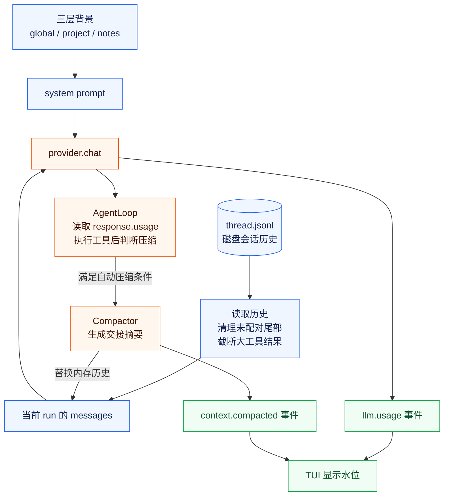
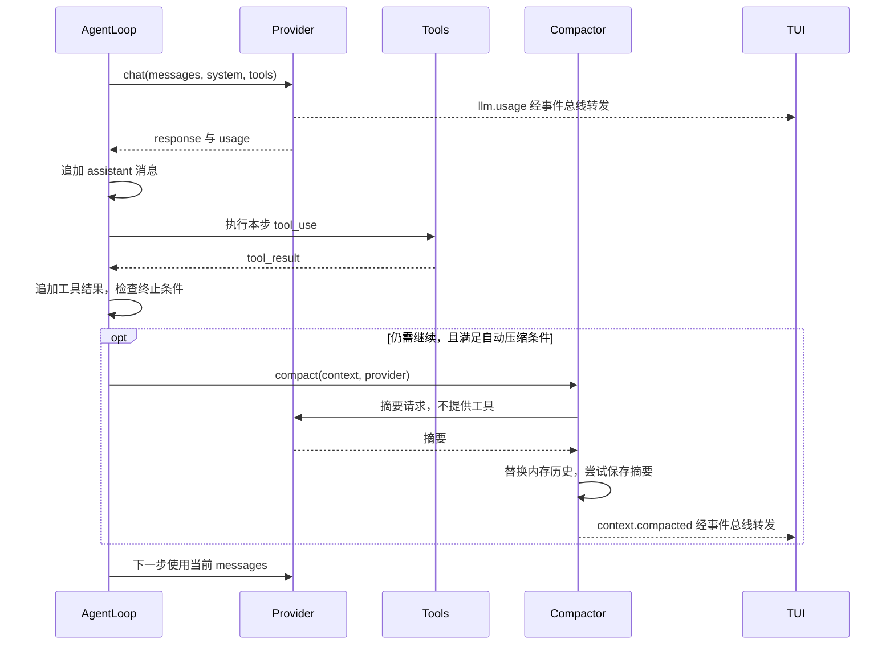
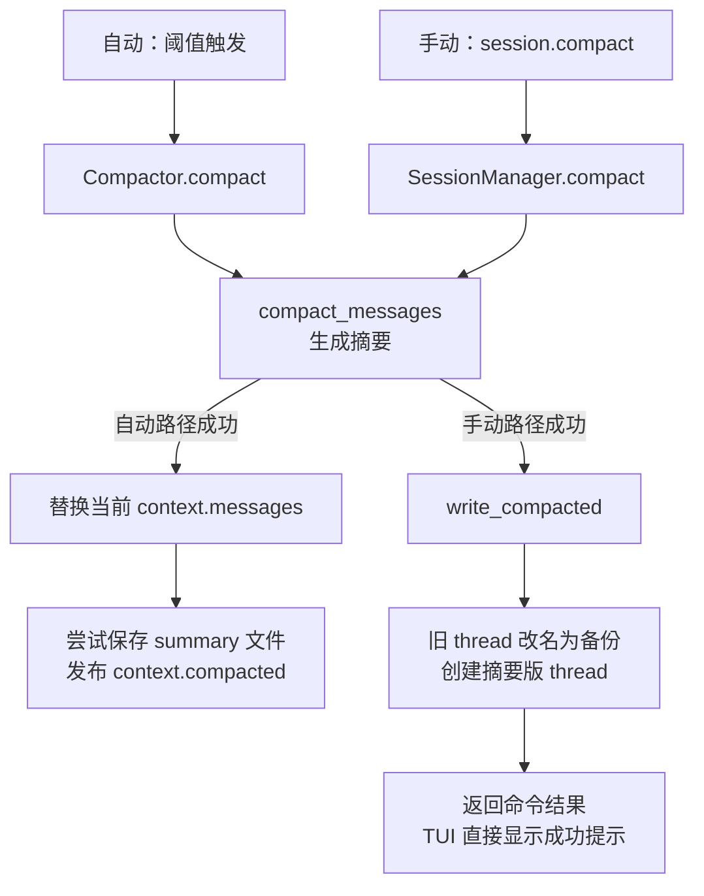
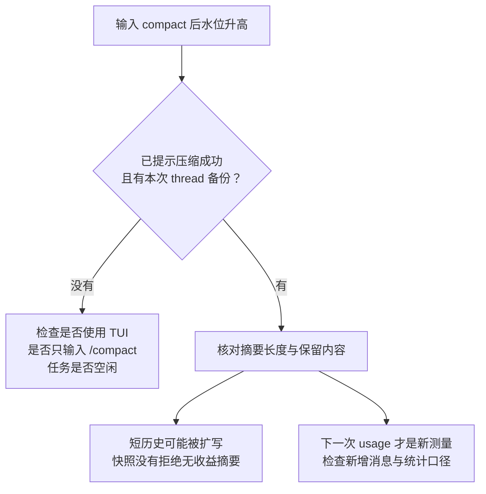

# KamaClaude S6：让上下文可控、可压缩、可续航

> 从完整回放到上下文治理：读懂三层记忆、工具结果截断、上下文水位，以及自动与手动 compact 的执行边界。

[](#)


这是一份可以用于自学、源码导读和技术分享的 S6 学习笔记。正文按课程的十个小节展开，同时提供执行流程图、关键代码说明、Windows 实操和常见问题排查。

读完之后，你应该能够解释：

- 为什么对话历史越来越长，工具输出尤其容易占满上下文？
- `context.md`、`notes.md`、`thread.jsonl` 和 `summary_*.md` 分别有什么用途？
- 工具结果截断与 LLM 摘要压缩有什么区别？
- 自动 compact 为什么只能帮助当前 run，手动 compact 又会改变什么？
- 为什么输入 `/compact 保留当前任务目标……` 后，水位反而可能升高？

> [!NOTE]
> **版本基准**：课程 S6，以及本地保存的 `repair/stage-s6` 源码快照，提交 `e271abca6060e27af20bdad0497fd3753229ad3a`。本文于 2026-10-02 对照该快照复核。标为"快照行为"的结论不代表所有分支或后续版本；代码片段为教学节选，省略了部分导入、类型标注和日志。标为"改进方向"的内容尚非该快照已实现的功能。

## 目录

- [先建立整体认识](#overview)
- [1. 本阶段要做什么](#stage-goal)
- [2. 三层 context：把稳定背景放进 system prompt](#layered-context)
- [3. tool_result 截断：只改内存，不改历史](#truncate)
- [4. context_pct：先让水位可见](#usage)
- [5. 自动 compact：当前 run 内续航](#auto-compact)
- [6. Compactor：把历史压成交接摘要](#compactor)
- [7. 手动 compact：持久化改写 thread](#manual-compact)
- [8. TUI：把上下文水位显示出来](#tui)
- [9. 验证：从项目背景到手动压缩](#verification)
- [10. 小结与展望](#next)
- [常见问题与排查](#faq)
- [工程边界与改进方向](#engineering)
- [学习验收清单](#checklist)
- [源码导航与参考](#source-map)

**阅读路线**：首次学习按正文顺序阅读；想先跑通效果，可以跳到[验证步骤](#verification)；遇到水位升高、命令无效或审批卡住，可以先查[常见问题](#faq)。

---

<a id="overview"></a>

## 🧭 先建立整体认识

一次模型请求主要携带两类内容：**system 背景**与**messages 对话历史**。S6 分别管理它们，再利用模型返回的 usage 决定是否压缩历史。



*图 1：S6 的上下文治理链。TUI 接收事件；AgentLoop 直接读取模型响应中的 usage，两条路径共享同一份用量事实。*

| 名称 | 生命周期与用途 |
| --- | --- |
| **Session** | 持续会话，包含多次用户输入和多个 run |
| **Run** | 一次用户任务的执行过程，内部可以多次调用模型与工具 |
| **Step** | run 中的一轮模型调用及其可能触发的工具执行 |
| **`context.messages`** | 当前 run 使用的内存消息列表 |
| **`thread.jsonl`** | 磁盘上保存的会话消息，每行一个 JSON 记录 |
| **system prompt** | 基础规则、全局背景、项目约定和会话笔记 |

> [!IMPORTANT]
> **截断与自动 compact 不直接改写既有 thread；手动 compact 会备份并重写 thread。** 自动压缩还会尝试另存摘要文件，因此"只改内存"专指会话消息的替换位置，并不表示完全没有磁盘写入。

<a id="stage-goal"></a>

## 1. 🎯 本阶段要做什么

### 问题：完整回放带来连续性，也带来持续增长

S4 会在新一轮用户任务开始时读取会话历史。这样模型知道之前做过什么，也能保留 `tool_use` 与 `tool_result` 的对应关系。

但一个真实任务可能是：

```text
分析这个项目，跑测试，修复失败，再总结改动。
```

Agent 为此读取文件、执行测试、搜索代码。几万字符的测试输出进入历史后，后续请求会反复携带它，导致 token 成本、延迟和窗口压力增长。

S6 在完整回放基础上增加三道处理：

| 时机 | 能力 | 解决的问题 |
| --- | --- | --- |
| 读取历史时 | 截断超长工具结果 | 减少大输出在后续请求中的重复占用 |
| 模型响应后 | 发布上下文水位 | 让上下文使用情况可观察 |
| 达到阈值或用户主动请求时 | 生成交接摘要 | 缩短历史，支持继续执行 |

另外，三层 context 把稳定背景独立组织起来，避免用户每轮重复说明项目约定。

**依赖关系**：S4 提供 Session、thread 和 notes；S5 提供工具权限与失败处理；S2 的事件流负责把用量和状态送到界面。

<a id="layered-context"></a>

## 2. 🧠 三层 context：把稳定背景放进 system prompt

### 2.1 三层分别保存什么

| 层级 | 默认路径 | 典型内容 | 维护方式 |
| --- | --- | --- | --- |
| Global | `~/.kama/context.md` | 用户长期偏好、通用要求 | 用户编辑 |
| Project | `<project>/.kama/context.md` | 源码目录、测试目录、开发约定 | 用户编辑 |
| Session | `~/.kama/sessions/<sid>/notes.md` | 当前会话中值得保留的事实 | Agent 通过 `note_save` 保存 |

它们都是普通 Markdown 文件。这个阶段没有引入向量数据库或检索系统，读取时直接获取整个文件内容。

### 2.2 加载函数

```python
# core/memory/loader.py
def load_context_file(path: Path) -> str:
    p = path.expanduser()
    if not p.exists():
        return ""
    return p.read_text(encoding="utf-8").strip()
```

- `expanduser()` 将 `~` 展开为用户主目录。
- 文件不存在时返回空字符串，背景文件因此是可选项。
- `read_text()` 按 UTF-8 读取，`strip()` 去掉首尾空白。
- 这里只处理"文件不存在"，其他读取异常并没有统一转为空字符串。

### 2.3 Runner 分开读取历史与背景

```python
# core/runner.py，节选
if session is not None and store is not None:
    history = store.read_messages(session.id)
    notes = store.read_notes(session.id)
else:
    history = [{"role": "user", "content": goal}]
    notes = ""

global_ctx = load_context_file(Path("~/.kama/context.md"))
project_ctx = load_context_file(Path(".kama/context.md"))

context = ExecutionContext(
    run_id=run_id,
    goal=goal,
    max_steps=self._config.agent.max_steps,
    prefill_messages=history,
    session_notes=notes,
    global_context=global_ctx,
    project_context=project_ctx,
)
```

`prefill_messages` 用于初始化历史；另外三个 context 字段供 `system_prompt()` 拼接，形成下面的结构：

```text
基础 system prompt
  ├── Global Context：全局偏好
  ├── Project Context：项目约定
  └── Session Notes：会话重要事实

messages
  └── user / assistant / tool_use / tool_result 历史
```

背景没有作为新的用户消息追加到 thread。下一次用户只说"补一下相关测试"，模型仍能从背景中找到测试目录。

> [!TIP]
> 如果当前项目根目录就是 `KamaClaude`，项目背景可以写 `Tests live in tests/`。不要机械复制成 `KamaClaude/tests/`，应让路径与实际工作目录一致。

### 2.4 三个需要分清的边界

1. **system 也占 token**：把背景放入 system 不会让它免费，也不会让它脱离上下文窗口。
2. **拼接顺序不是覆盖算法**：代码依次拼接 global、project、session，没有实现规则冲突的自动消解。
3. **相对路径取决于 core 工作目录**：当前实现读取 `Path(".kama/context.md")`，所以应从目标项目根目录启动 core；它不负责自动向上寻找仓库根目录。

<a id="truncate"></a>

## 3. ✂️ tool_result 截断：只改内存，不改历史

### 3.1 阈值的单位是字符

```python
TOOL_RESULT_LIMIT = 8_000
TOOL_RESULT_KEEP = 4_000
```

含义是：单个字符串形式的工具结果超过 8,000 字符时，保留前 4,000 字符，再追加省略提示。

| 原结果长度 | 处理结果 |
| --- | --- |
| 6,000 字符 | 原样保留 |
| 8,000 字符 | 原样保留，因为判断是 `>` |
| 12,000 字符 | 前 4,000 字符 + "省略 8,000 字符"的提示 |

**Python 的 `len(text)` 计算字符数，不等于 token 数，也不等于 UTF-8 字节数。** 输出还会包含提示语，所以处理后的长度不严格等于 4,000。

### 3.2 核心代码

```python
def truncate_tool_results(messages, limit=8_000, keep=4_000):
    result = []
    for msg in messages:
        if msg.get("role") != "user":
            result.append(msg)
            continue

        content = msg.get("content")
        if not isinstance(content, list):
            result.append(msg)
            continue

        new_blocks = []
        for block in content:
            if block.get("type") == "tool_result" and isinstance(block.get("content"), str):
                text = block["content"]
                if len(text) > limit:
                    omitted = len(text) - keep
                    block = dict(block)
                    block["content"] = (
                        text[:keep]
                        + f"\n[... {omitted} chars omitted. Full output in run events.]"
                    )
            new_blocks.append(block)
        result.append({**msg, "content": new_blocks})
    return result
```

沿着条件读这段代码：

1. 只检查 `role="user"` 的消息。
2. 只检查 `content` 为列表的消息。
3. 只处理类型为 `tool_result`、内容为字符串的 block。
4. 超过阈值才复制 block，并替换其 `content`。
5. 返回新消息列表，不把截断结果写回文件。

### 3.3 工具结果为什么在 user 消息里

本项目采用的 Anthropic 消息结构是：

```text
assistant 消息
  └── tool_use：模型要求调用工具，带 id

user 消息
  └── tool_result：程序回传执行结果，带 tool_use_id
```

这里的 `user` 是协议角色，既可以承载人的输入，也可以承载工具结果。截断只替换结果文本，保留 `tool_use_id` 等字段。

### 3.4 为什么先清理未配对调用

```python
# SessionStore.read_messages() 末尾
messages = self._trim_orphan_tool_use(messages)
return truncate_tool_results(messages)
```

先裁掉尾部未完成配对的工具调用，再缩短结果文本：前者处理消息结构，后者处理内容体积。

> [!IMPORTANT]
> 截断是字符串处理，不调用 LLM，也不生成摘要。它保留既有磁盘原文，但会让模型暂时看不到被省略的部分。返回新列表并不等于深拷贝全部对象：未修改的对象仍可能共享引用。

**快照行为**：截断接在"读取 session 历史"处。当前 run 刚追加的长工具结果，并没有在每次 provider 调用前统一执行同样的截断。

**工程取舍**：只保留开头可能丢掉日志末尾的错误结论。保留头尾、分段摘要或按需读取完整事件记录，都是可以继续讨论的改进方向。

<a id="usage"></a>

## 4. 📊 context_pct：先让水位可见

### 4.1 计算方式

```python
context_pct = usage.input_tokens / _context_window(self._model)
```

假设代码为某模型配置的窗口是 200,000 token，本次请求报告输入 160,000 token：

```text
160,000 / 200,000 = 0.80 → 界面显示 80.0%
```

`context_pct` 存的是比例，`0.80` 才是 80%，不是 `80`。

### 4.2 通过事件发送给 TUI

```python
await bus.publish(
    LlmUsageEvent(
        run_id=run_id,
        input_tokens=usage.input_tokens,
        output_tokens=usage.output_tokens,
        cache_read_input_tokens=cache_read,
        cache_creation_input_tokens=cache_create,
        context_pct=context_pct,
        ts=_now(),
    )
)
```

| 字段 | 用途 |
| --- | --- |
| `run_id`、`ts` | 标识所属任务和时间 |
| `input_tokens`、`output_tokens` | 本次请求与响应的用量 |
| 两个 cache 字段 | 缓存读取与缓存创建用量 |
| `context_pct` | 按当前算法得到的水位 |

Provider 同时把这些数据放进返回值 `LlmResponse.usage`。因此：

- **TUI** 从 `llm.usage` 事件更新显示。
- **AgentLoop** 从 `response.usage.context_pct` 判断自动压缩。

### 4.3 水位能说明什么，不能说明什么

水位是上一次已完成调用的输入统计。随后新增的模型回答和工具结果，可能让下一次请求变得更长。

> [!WARNING]
> 快照公式只使用 `input_tokens`，没有把两个 cache 字段加入分子。如果使用的接口把缓存 token 单独计数，就可能低估完整输入长度。缓存命中减少重复处理成本，并不会让这些内容不占上下文。模型窗口也来自本地映射，未知模型回退到 200,000；接入其他模型时应核对真实窗口与 usage 口径。

水位不能直接当作"整个 session 累计花费"，也不能保证下一次请求一定不会溢出。

<a id="auto-compact"></a>

## 5. 🔄 自动 compact：当前 run 内续航

### 5.1 判断条件

```python
if (
    not context.is_done()
    and response.stop_reason == "tool_use"
    and self._compactor is not None
    and self._compact_threshold > 0
    and response.usage is not None
    and response.usage.context_pct >= self._compact_threshold
):
    await self._compactor.compact(context, self._provider)
```

| 条件 | 为什么需要 |
| --- | --- |
| run 尚未结束 | 已结束的任务不需要为下一步压缩 |
| `stop_reason == "tool_use"` | 当前仍处于需要继续执行的工具循环 |
| 存在 compactor | 具备实际压缩能力 |
| 阈值大于 0 | 明确开启了自动压缩 |
| 有 usage 且达到阈值 | 有依据判断历史是否过长 |

### 5.2 时机：本步工具执行完成以后



*图 2：自动 compact 的时机。图中的摘要替换路径假定摘要生成成功；失败时保留原消息继续。*

这样压缩能看到刚产生的工具结果，不会在本步 `tool_use` 与 `tool_result` 之间切断历史。

### 5.3 默认关闭，显式配置后开启

```python
@dataclass
class CompactionConfig:
    auto_threshold: float = 0.0
    tool_result_limit: int = 8_000
    tool_result_keep: int = 4_000
```

在实际使用的配置文件中加入或修改下面的配置，并重启 core：

```toml
[compaction]
auto_threshold = 0.80
```

默认配置路径为 `~/.kama/config.toml`；使用 `KAMA_CONFIG` 时以指定文件为准，环境变量也可能覆盖配置。已有 `[compaction]` 时编辑该表，不要重复声明。

默认关闭是因为摘要有损，且增加一次模型调用。80% 是一个启发式触发点：用于判断的水位来自刚完成的模型请求，尚未重新计量本步追加的工具结果，因此不能保证还剩多少空间。很大的工具输出仍可能让摘要请求或下一次正常请求超限。

> [!NOTE]
> 快照中 `tool_result_limit` 与 `tool_result_keep` 已出现在配置模型里，但 `read_messages()` 没有把配置值传给 `truncate_tool_results()`。实际截断仍用函数默认值，不能仅凭修改 TOML 就认定这两个参数已经生效。

<a id="compactor"></a>

## 6. 📝 Compactor：把历史压成交接摘要

### 6.1 两个方法承担不同职责

```python
compactor = Compactor(bus, session_dir, session_id_str)
```

`bus` 用于发布事件，`session_dir` 用于保存摘要，`session_id_str` 用于关联会话。无 session 时，Runner 使用当前 run 目录保存摘要。

| 方法 | 主要职责 |
| --- | --- |
| `compact_messages(messages, provider, focus)` | 把输入历史转换成摘要结果，不替换调用方的消息列表 |
| `compact(context, provider, focus)` | 调用前者；成功后替换内存历史、保存摘要并发布事件 |

### 6.2 摘要为什么必须包含六部分

摘要的目标是让后续执行能够接上任务，因此要求明确保留：

| 摘要部分 | 需要交接的信息 | 示例 |
| --- | --- | --- |
| Original Goal | 原始目标 | 修复登录校验并补测试 |
| Completed Steps | 已完成步骤 | 已定位校验分支，已修改输入检查 |
| Key Constraints & Discoveries | 约束与发现 | 不改公开 API；问题只在空输入出现 |
| Current File State | 当前文件状态 | 哪些文件已改、修改了什么 |
| Remaining TODOs | 剩余工作 | 补边界测试，运行相关用例 |
| Critical Data | 必须准确保留的值 | 精确错误信息、配置键、关联 ID |

"修了一些代码，还要继续测试"不足以交接任务；文件路径、命令、结果和下一步应尽量具体。

### 6.3 摘要请求怎样构造

本地实现先用 `_messages_to_text()` 把历史转成带角色和工具标签的文本，然后拼入摘要要求。非空 `focus` 会作为额外关注点追加到摘要 prompt。

```python
response = await provider.chat(
    messages=compress_request,
    tool_schemas=[],
    bus=silent_bus,
    run_id="compact",
    step=0,
    system="You are a helpful assistant that summarizes conversations.",
)
```

- `tool_schemas=[]`：这次调用只做摘要，不给模型提供工具。
- `silent_bus`：用独立事件总线，不把摘要 token 流当作普通任务输出广播。
- `run_id="compact"`、`step=0`：为这次辅助调用提供标识。

"静默"不代表没有模型成本；摘要调用仍然会消耗时间和 token。

### 6.4 成功后替换什么

```python
context.messages = [
    {"role": "user", "content": result.summary_text},
    {
        "role": "assistant",
        "content": "Understood, I'll continue from this summary.",
    },
]
self._write_summary(result.summary_text)
await self._bus.publish(ContextCompactedEvent(...))
```

第一条保存摘要，第二条是程序构造的确认消息，并没有额外调用模型来生成这句确认。

```text
压缩前：user → assistant/tool_use → user/tool_result → ……
压缩后：user/交接摘要 → assistant/确认
```

替换只作用于 `messages`。`step`、任务状态和三层背景字段没有被重置；system prompt 仍会在后续调用中使用。

`summary_<时间>.md` 是便于检查的摘要副本。它不会自动变成 `notes.md`，也没有作为第四层背景被自动加载。

### 6.5 失败与收益边界

Provider 抛异常或返回空白摘要时，`compact_messages()` 返回 `None`。自动路径保留原消息；手动路径向客户端返回压缩失败。

原历史 token 使用下面的粗略估算：

```python
original_estimate = sum(
    len(str(m.get("content", ""))) for m in messages
) // 4
```

摘要长度优先使用 `response.usage.output_tokens`，没有 usage 时才用字符数除以 4。这两个数字的统计口径并不完全一致。

> [!WARNING]
> 快照没有验证"摘要一定比原历史短"，也没有程序化校验六段结构。很短的历史可能被扩写成更长的摘要。六段是提示词要求，压缩成功不等于节省了 token，也不等于所有关键事实都被完整保留。

<a id="manual-compact"></a>

## 7. 💾 手动 compact：持久化改写 thread

### 7.1 IPC 命令

```python
class SessionCompactCommand(BaseModel):
    type: Literal["session.compact"] = "session.compact"
    session_id: str
    focus: str = ""
```

`type` 固定命令类型，`session_id` 指定会话，`focus` 提供额外摘要重点。后端能接收 `focus`，并不代表每个前端都实现了相应输入语法。

### 7.2 会话锁与写回

SessionManager 发现会话锁已被占用时返回 `session busy`。取得锁后，在同一锁范围内读取历史、请求摘要、备份并写回，避免与正常 run 同时操作会话。

```python
result = await compactor.compact_messages(
    messages, self._provider, focus=focus
)
if result is None:
    raise HandlerError(-32021, "compaction failed or not beneficial")

self._store.write_compacted(sid, [
    {"role": "user", "content": result.summary_text},
    {
        "role": "assistant",
        "content": "Understood, I'll continue from this summary.",
    },
])
```

错误文本里虽然写着 `not beneficial`，但快照没有实现按摘要长度拒绝无收益压缩的判断。

### 7.3 自动与手动的副作用



*图 3：两条路径复用摘要生成，但写入位置与通知方式不同。图中仅展示成功路径。*

| 对比项 | 自动 compact | 手动 compact |
| --- | --- | --- |
| 发起位置 | AgentLoop | TUI → IPC → SessionManager |
| 摘要来源 | 当前 run 的内存消息 | `read_messages()` 返回的会话历史 |
| 更新位置 | 当前 `context.messages` | 磁盘 `thread.jsonl`，下次读取生效 |
| 改写既有 thread | 不直接改写 | 是 |
| 备份旧 thread | 否 | `thread_<时间>.jsonl.bak` |
| 另存摘要文件 | 尝试写 `summary_<时间>.md` | 快照未实现 |
| 发布压缩事件 | `context.compacted` | 快照未实现，TUI 根据命令结果展示 |
| 默认状态 | 关闭，需配置阈值 | 用户主动发起 |

> [!IMPORTANT]
> **在本文对应的 TUI 中，只输入 `/compact`。** 它使用 `content == "/compact"` 做精确匹配，并向后端发送空 `focus`。带说明文字的 `/compact 保留当前任务目标、已修改文件和剩余 TODO` 会被当成普通聊天消息。

旧 thread 的备份不是自动恢复流程。手动压缩后，后续 run 使用新的摘要历史；需要恢复时，应在停止相关写入后明确选择正确备份。

<a id="tui"></a>

## 8. 🖥️ TUI：把上下文水位显示出来

### 8.1 显示用量

```python
if t == "llm.usage":
    pct = float(event.get("context_pct") or 0.0)
    self._last_context_pct = pct
    ctx_bar = self._render_ctx_bar(pct)
```

上面是事件处理分支的节选。界面随后追加 input、output、cache 和进度条，例如：

```text
tokens in=16000 out=520 cache=0    ctx:80.0%
```

*数字仅用于说明显示格式，不是实际运行测量。*

其中 `cache` 只显示 `cache_read_input_tokens`；界面这一行没有单独展示 `cache_creation_input_tokens`。

快照中进度条按水位改变样式：低于 70% 使用 `dim` 弱化显示，70% 起为黄色，85% 起为加粗红色。**显示阈值与自动压缩阈值是两套设置**；出现黄色或红色，并不意味着默认关闭的自动压缩已开启。

### 8.2 压缩后为什么会重置水位

自动路径收到 `context.compacted` 后，将 `_last_context_pct` 设为 `0.0` 并追加日志；手动路径则在命令成功返回后做类似处理。

```text
自动提示：Context compacted original≈... tokens → summary=... tokens
手动提示：Context compacted summary=... tokens saved≈... tokens
```

重置的是界面缓存状态，旧的日志行也不会因此成为新的测量结果。摘要、system prompt 和工具定义仍占上下文；下一次正常模型调用返回 usage 后，才有新的统计。

### 8.3 选择哪个客户端

| 能力 | `uv run kama chat` | `uv run kama-tui` |
| --- | --- | --- |
| 连接同一个 core | 支持 | 支持 |
| 普通聊天与工具调用 | 支持 | 支持 |
| S6 水位显示 | 快照未实现 | 支持 |
| 解析 `/compact` | 快照未实现 | 支持单独输入 |
| 工具审批 | 有提示，但同步等待任务会阻塞输入处理 | 通过独立 worker 保持界面响应 |

学习本章的水位和压缩功能，使用 TUI。更换客户端通常会创建另一个 session，不会自动接续原客户端刚才的历史。

<a id="verification"></a>

## 9. 🧪 验证：从项目背景到手动压缩

以下步骤是供学习者执行的操作说明，不代表本文已经对真实会话执行过压缩。这份 README 不包含项目源码；请先准备源码、依赖与模型连接。所有 `uv run` 命令都应在实际源码 checkout 中、包含 `pyproject.toml`、`src/`、`tests/` 的根目录执行；只有这份 README 的学习笔记目录不能直接启动项目。

### 步骤 1：准备项目背景

**在操作系统终端中执行，不要输入到 Agent 的聊天框。** 两种 shell 的命令任选对应的一种。

**Windows PowerShell（先替换示例路径）：**

```powershell
Set-Location 'F:\path\to\KamaClaude' # 替换为你的源码根目录
New-Item -ItemType Directory -Path .kama -Force | Out-Null

if (-not (Test-Path -LiteralPath .kama/context.md)) {
@'
# Project Context

- Tests live in tests/
- Prefer focused unit tests for changed behavior.
'@ | Set-Content -LiteralPath .kama/context.md -Encoding utf8
}

Get-Content -LiteralPath .kama/context.md
```

**Bash / Git Bash / WSL（先替换示例路径）：**

```bash
cd /path/to/KamaClaude # 替换为当前 shell 可访问的源码根目录
mkdir -p .kama

if [ ! -e .kama/context.md ]; then
cat > .kama/context.md <<'EOF'
# Project Context

- Tests live in tests/
- Prefer focused unit tests for changed behavior.
EOF
fi

cat .kama/context.md
```

两段脚本都只在文件不存在时写入示例。若文件已有内容，请检查并编辑相关约定。PowerShell 的 `'@` 和这里 Bash 的 `EOF` 结束标记都应顶格写。

### 步骤 2：在两个终端中启动程序

两个终端都位于项目根目录。终端 1：

```console
uv run kama-core
```

终端 2：

```console
uv run kama-tui
```

已有 core 运行时，先确认其工作目录与配置；不要再启动一个占用相同端口的 core。

### 步骤 3：在 TUI 中验证背景

```text
根据已经提供的 Project Context，告诉我测试目录在哪里，
以及添加测试时应遵循什么原则。不要调用工具搜索文件。
```

预期回答包含 `tests/` 和针对相关行为添加聚焦的单元测试。回答正确是初步证据；需要更强验证时，可以在背景里加入一个独特的演示约定，或检查实际构造的 system prompt，排除模型凭常识猜中。

### 步骤 4：读取一个较大的文件

```text
请使用 read_file 读取 src/kama_claude/tui/app.py，
说明它如何展示工具权限审批。不要修改文件。
```

观察 `tokens ... ctx:...%` 行。水位很低也正常，不需要达到 80% 才能手动压缩。

然后再发送一条追问：

```text
请简要概括刚才读到的权限审批流程。
```

新 run 会重新读取历史，因此更适合观察历史读取处的截断效果。仅看水位下降，不能证明发生了哪一种处理。

<details>
<summary>🔍 可选：用本地代码直接验证截断，不调用模型</summary>

在项目根目录创建临时脚本，执行下面的示例；它只构造内存数据，不读写真实 session：

```python
from kama_claude.core.compact.budget import truncate_tool_results

original = [{
    "role": "user",
    "content": [{
        "type": "tool_result",
        "tool_use_id": "demo-call",
        "content": "x" * 12_000,
    }],
}]

view = truncate_tool_results(original)
assert len(original[0]["content"][0]["content"]) == 12_000
assert view[0]["content"][0]["content"].startswith("x" * 4_000)
assert "8000 chars omitted" in view[0]["content"][0]["content"]
assert view[0]["content"][0]["tool_use_id"] == "demo-call"
print("原文保留，模型可见副本已截断，工具关联 ID 保留")
```

这是函数级演示。单独一个 `tool_result` 不是完整的合法模型请求，本例也不会把它发给 provider。

</details>

### 步骤 5：等待任务结束，执行手动压缩

在 TUI 中**单独**输入：

```text
/compact
```

预期看到 `Context compacted` 成功提示。此操作会改写当前 session 的 thread；选择用于学习的会话进行验证。

### 步骤 6：在终端检查对应 session

PowerShell 列出所有 session 的 thread 和备份：

```powershell
Get-ChildItem -Path "$env:USERPROFILE\.kama\sessions\sess-*\thread*"
```

Bash：

```bash
ls ~/.kama/sessions/sess-*/thread*
```

按 TUI 显示的 session ID 核对正确目录，不要拿其他会话以前的备份作为本次成功证据。

```text
~/.kama/sessions/<当前 sid>/
├── meta.json
├── thread.jsonl                    # 当前摘要历史；后续聊天会继续追加
├── thread_<时间>.jsonl.bak          # 手动压缩前的历史
├── notes.md                        # 调用 note_save 后才可能存在
├── summary_<时间>.md               # 自动压缩路径尝试保存，手动路径未实现
└── runs/
    └── <run_id>/events.jsonl        # 各 run 的事件记录
```

检查新 thread 是否包含目标、文件状态和剩余工作；在没有继续聊天的情况下，手动压缩刚完成的 thread 应由摘要和确认两条消息组成。

> [!TIP]
> **没有 `summary_*.md` 不等于手动压缩失败。** 本文对应快照的手动路径不单独保存摘要文件，摘要正文就在新的 `thread.jsonl` 中。

### 步骤 7：确认还能接着完成任务

```text
请根据当前上下文，复述原始任务目标、已经完成的工作和剩余 TODO。
```

压缩质量要用"能否继续任务"检验，同时对照备份检查关键信息；水位数字只是观察指标之一。

<a id="next"></a>

## 10. 🚀 小结与展望

| S6 能力 | 保留下来的工程原则 |
| --- | --- |
| 三层 context | 稳定背景与对话历史分开组织 |
| tool_result 截断 | 在模型可见副本上减负，保留既有原文 |
| context_pct | 用可观察的数据支持治理决策 |
| 自动 compact | 为当前任务提供继续执行的机会 |
| 手动 compact | 让用户明确决定持久化压缩会话 |

后续 S7 会引入 skills、subagents 和 MCP，执行过程更长、工具来源更多，上下文治理也会更加重要。设计这些能力时，要持续检查：哪些信息属于当前任务，哪些需要长期保存，压缩后如何保持内存与持久化记录一致。

---

<a id="faq"></a>

## 🛠️ 常见问题与排查

### 为什么输入带说明的 compact 后，水位升高了 0.1 个百分点

先检查是否真的进入压缩分支。快照中的精确匹配逻辑是：

```python
if content == "/compact":
    self.run_worker(self._do_compact(), name="compact", exclusive=False)
```

带说明的输入不会匹配，整句会作为普通消息发送给模型，连同新回复一起增加上下文。



*图 4：手动 compact 的排查路径。0.1 个百分点本身不能证明压缩是否执行或是否有效。*

### 水位重置为 0，是否代表上下文被清空

不是实际 token 测量。TUI 清除了旧状态，摘要和 system 仍在。下一次模型调用的 usage 才会更新占用显示。

### 工具结果被截断后，原始输出还在吗

截断函数本身不写磁盘，既有 thread 原文不因此改变。手动压缩后，可查看对应 `.bak`；工具输出也可在相应 run 的事件记录中排查。不要把"有事件记录"理解为"模型会自动重新读取完整记录"。

### 为什么 CLI 打印了审批选项，却不能及时处理 y

快照中的 `kama chat` 在发送消息后等待整个任务结束，再进入下一次键盘读取；任务又可能正在等待审批。因此有提示不代表输入循环此时仍能响应。TUI 通过 `run_worker` 发送任务，适合进行交互审批。这个问题属于客户端实现，不是权限机制要求用户必须等待。

### Bash、PowerShell、聊天输入框有什么区别

| 输入位置 | 谁解释输入 | 适合输入什么 |
| --- | --- | --- |
| PowerShell 的 `PS ...>` | PowerShell | `New-Item`、`Get-Content`、启动程序 |
| Bash 的 shell 提示符 | Bash | `mkdir -p`、Bash heredoc、启动程序 |
| `kama chat` 的 `>` | KamaClaude 客户端 | 发给 Agent 的自然语言任务 |
| TUI 输入框 | KamaClaude TUI | 任务，以及它实现的 `/compact` 命令 |

在聊天框输入 `mkdir -p .kama`，Agent 可能尝试调用工具代为执行，从而出现权限审批。初始化项目文件时，在正确的操作系统 shell 中执行即可。

快照里的 `bash` 是工具名，内部使用 `asyncio.create_subprocess_shell()`。Windows 下通常由 `cmd.exe` 执行，不会因为从 PowerShell 启动 core，就自动变成 PowerShell，也不能仅凭工具名认定它运行了 Bash。

### compact 会重置 max_steps 吗

不会。压缩替换 `messages`，没有重置 `step`。上下文还有空间与执行步数还有预算，是两件不同的事。

<a id="engineering"></a>

## 🔧 工程边界与改进方向

这些条目用于深入读代码，**不是本文声称已经完成的修复**。

| 快照中的边界 | 影响 | 可考虑的改进 |
| --- | --- | --- |
| 截断配置未传入调用点 | 修改配置不影响实际 limit/keep | 将配置沿 Runner/Store 调用链明确传递，并验证行为 |
| 仅在读取历史时截断 | 当前 run 的新大输出仍可能迅速占满窗口 | 在合适的模型请求入口统一构造受预算约束的副本 |
| 只保留输出开头 | 可能遗漏末尾错误或测试结论 | 结合输出类型保留头尾，提供按需读取方式 |
| 水位使用简化 usage 公式和窗口映射 | 缓存、其他模型或接口适配可能导致低估 | 按 provider 实际语义统一输入统计，并配置正确窗口 |
| 未检查摘要是否更短 | 短历史可能压缩后变长 | 增加最小压缩收益判断，同时检查关键信息保留情况 |
| `focus` 后端存在、TUI 未解析 | 带说明的 `/compact` 变成普通消息 | 明确命令语法并把附加文字传给 `focus` |
| 手动路径缺少摘要文件与事件 | 两种压缩的可观察性不一致 | 统一明确的副作用与通知约定 |
| 备份后直接写新 thread | 中途失败可能留下缺失或部分写入的当前文件 | 临时文件写完后原子替换；按需要增加刷新与恢复机制 |

### 特别关注：自动 compact 后，增量落盘的位置可能失效

Runner 开始时记住历史长度，结束时用切片提取新增消息：

```python
prefill_len = len(history)
# 中间执行 AgentLoop，可能发生自动 compact
store.append_messages(
    session.id,
    context.messages[prefill_len:],
    run_id=run_id,
)
```

如果初始历史有 30 条消息，压缩后列表变为 2 条，随后又新增 4 条，那么结束时列表只有 6 条：

```text
context.messages[30:] → 空列表
```

这样当前 run 的新增消息可能没有追加回 thread。**"自动压缩不覆盖旧 thread"并不自动保证"本轮新历史一定完整持久化"。**

改进时应将待持久化的新增消息与可替换的模型上下文分开管理，或使用稳定的事件/消息标识追踪增量，而不继续依赖压缩前的列表下标。还需要验证工具调用配对、失败恢复和后续 run 的连续性。

<a id="checklist"></a>

## ✅ 学习验收清单

- [ ] 能区分 Session、Run、Step 与模型请求。
- [ ] 能说明三层背景怎样进入 system，而不是追加为对话历史。
- [ ] 知道 system 内容和缓存内容仍占上下文。
- [ ] 能解释为什么工具结果出现在 `user` 消息里。
- [ ] 能区分字符截断、token 水位与 LLM 摘要。
- [ ] 知道自动 compact 在本步工具结果追加后检查，且默认关闭。
- [ ] 能指出自动与手动压缩的磁盘副作用和通知差异。
- [ ] 能在 TUI 中执行单独的 `/compact`，找到当前 session 的备份。
- [ ] 能解释水位升高 0.1 个百分点的几种可能原因。
- [ ] 能在压缩后复述目标、已完成工作与剩余 TODO。
- [ ] 知道固定 `prefill_len` 在消息列表被替换后可能失效。

<a id="source-map"></a>

## 📚 源码导航与参考

下表路径以 **KamaClaude 源码根目录**为基准，可直接在编辑器中搜索。本文可单独保存为学习仓库的 `README.md`，Mermaid 图、目录锚点和 GitHub 提示框均保留在同一个 Markdown 文件里。

| 文件 | 阅读入口 |
| --- | --- |
| `src/kama_claude/core/memory/loader.py` | `load_context_file`：加载 Markdown 背景 |
| `src/kama_claude/core/context.py` | `ExecutionContext`、`system_prompt`、消息追加 |
| `src/kama_claude/core/runner.py` | 恢复历史与背景，创建 Compactor，run 结束落盘 |
| `src/kama_claude/core/compact/budget.py` | `truncate_tool_results`：字符截断 |
| `src/kama_claude/core/compact/compactor.py` | 摘要 prompt、文本转换、压缩结果与副作用 |
| `src/kama_claude/core/llm/provider.py` | usage、窗口映射、事件发布与响应返回 |
| `src/kama_claude/core/loop.py` | 工具执行顺序与自动压缩触发 |
| `src/kama_claude/core/session/store.py` | `read_messages`、`write_compacted` |
| `src/kama_claude/core/session/manager.py` | 会话锁、手动 compact |
| `src/kama_claude/core/config.py` | `CompactionConfig` 与配置加载 |
| `src/kama_claude/core/bus/commands.py` | `SessionCompactCommand` |
| `src/kama_claude/core/bus/events.py` | `LlmUsageEvent`、`ContextCompactedEvent` |
| `src/kama_claude/tui/app.py` | 输入解析、水位显示、压缩提示 |
| `src/kama_claude/cli/commands/chat.py` | 简化 CLI 输入与等待流程 |

**源码学习基线**：`stage/s6`

本文是基于课程与指定源码快照整理的学习说明，流程图为重新绘制；项目实际行为应以所使用版本的代码与运行结果为准。
