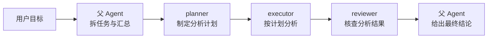
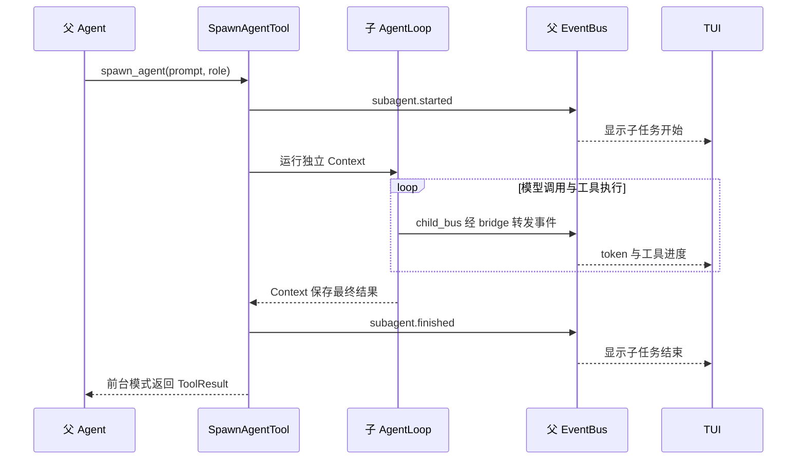
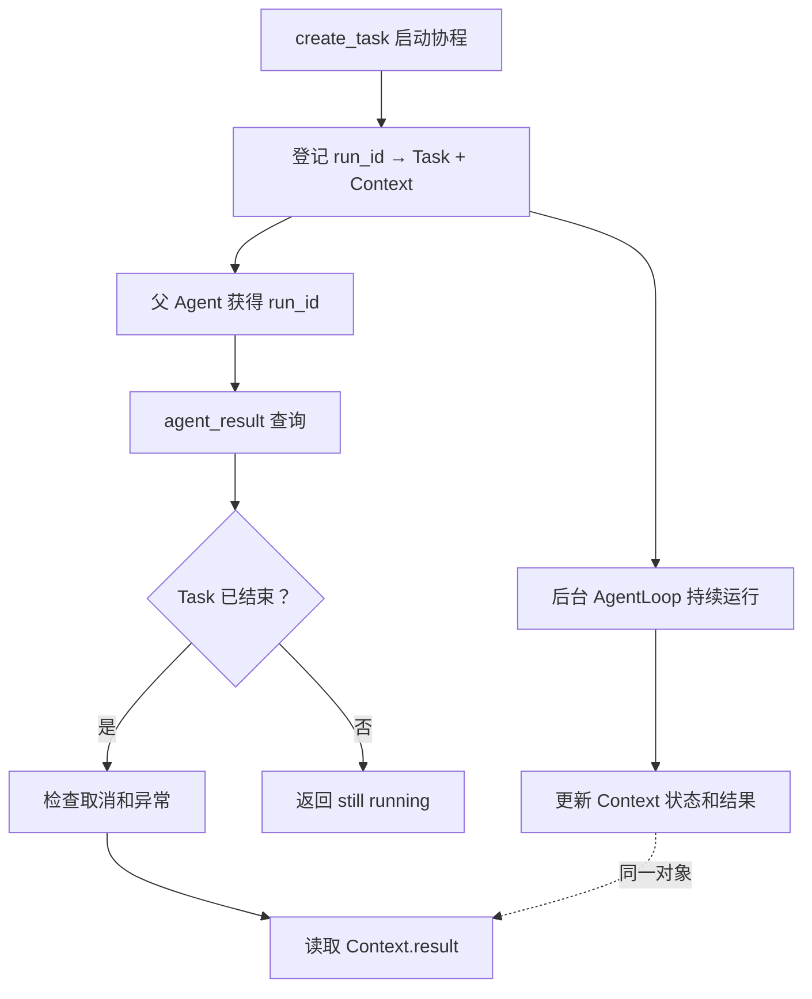
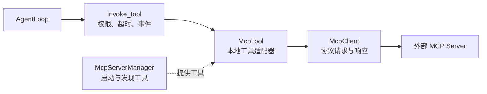

# KamaClaude S7：Skills、子 Agent 与 MCP

> 从一个 Agent 包办所有任务，走向可复用的工作流、明确的角色分工和可扩展的外部工具。

[](#)


这是一份可以直接放到 GitHub 的 S7 学习指南。内容按课程小节展开，结合关键代码、流程图、Windows 验证命令，以及实际遇到的路径、权限、后台任务、语言混用和 token 统计问题。

**适合谁读？** 已经了解 Python 异步编程、LLM 工具调用，以及 S4～S6 的会话、权限和上下文机制，希望继续学习多 Agent 组织方式的读者。

读完后，你应该能够回答：

- `/review` 和 `/orchestrate` 分别改变了什么？
- 父 Agent 没有文件工具，为什么子 Agent 仍然能读写文件？
- 后台任务为什么同时保存 `Task` 和 `ExecutionContext`？
- 子 Agent 的事件与最终结果通过什么路径返回？
- MCP 工具怎样进入已有的工具调用链？
- 怎样区分"程序运行结束"和"整个任务真正完成"？

> [!NOTE]
> 本文依据课程 S7、本地保存的 S7 源码快照和学习验证记录整理。代码块是教学节选，`...` 表示省略实现。标为"改进建议"的内容不代表课程版本已经实现。不同分支的行为可能有差异，请结合自己的源码核对。

## 目录

- [1. 本阶段要做什么](#overview)
- [2. 斜杠命令：把输入变成工作流](#skills)
- [3. 工具白名单：协调者的能力边界](#whitelist)
- [4. spawn_agent：创建独立上下文](#spawn)
- [5. 角色配置：planner、executor、reviewer](#profiles)
- [6. 事件桥：子 Agent 的进度怎样进入 TUI](#events)
- [7. 后台子 Agent：注册、查询与生命周期](#background)
- [8. MCP：从外部服务到普通工具](#mcp)
- [9. Windows 与 PyCharm 验证指南](#verification)
- [10. 小结与下一步](#next)
- [排查案例：从真实现象定位原因](#troubleshooting)
- [源码导航与学习自检](#source-map)
- [参考资料](#references)

---

<a id="overview"></a>

## 1. 本阶段要做什么

S6 之前，一个 Agent 已经能够持续对话、安全调用工具，并控制上下文增长。S7 进一步处理两个问题：复杂任务如何分工，外部工具如何接入。

| 能力 | 在本项目中的组成 | 解决的问题 |
|---|---|---|
| **Skill** | 提示词模板 + 工具白名单 | 把审查、编排等常用流程封装成命令 |
| **Subagent** | 独立上下文 + 角色 + 执行循环 | 把明确的子任务交给专门角色 |
| **MCP** | 协议客户端 + 工具适配器 | 使用外部服务器提供的工具 |

例如，对一个模块做重构风险分析，可以组织为：



三个阶段的数据通过父 Agent 显式传递。下一位角色不会自动知道上一位角色的完整对话。

### 先分清 Session、Run、Step 和工作流阶段

| 概念 | 含义 | 示例 |
|---|---|---|
| Session | 包含多轮消息的会话 | 先审查，再继续追问 |
| Run | 一次 Agent 执行 | 父任务和每个子任务都有自己的 run ID |
| Step | AgentLoop 的一次循环，通常包含一次模型调用 | 模型决定读文件，程序执行并回传结果 |
| 工作流阶段 | 业务层面的分工 | 规划、执行、审查 |

> [!IMPORTANT]
> TUI 的 `step 1`、`step 2` 不等于"规划阶段、执行阶段"。一次 `/review` 完全可能只需要两步：第一步读取代码，第二步输出报告，然后正常结束。

<a id="skills"></a>

## 2. 斜杠命令：把输入变成工作流

### 2.1 输入在哪里被识别

用户在 TUI 输入：

```text
/orchestrate 分析 src/kama_claude/core/runner.py 的重构风险
```

消息仍然经过 `session.send_message`。`SessionManager` 检测 `/` 前缀，查找 Skill，再把相应配置交给 `AgentRunner`。

```python
goal = content
system_prompt_override = None
tool_whitelist = None

if content.startswith("/"):
    parts = content[1:].split(None, 1)
    skill_name = parts[0]
    arguments = parts[1] if len(parts) > 1 else ""
    skill = self._skill_loader.resolve(skill_name)

    if skill is not None:
        goal = self._skill_loader.render_prompt(skill, arguments)
        system_prompt_override = skill.system_prompt_template
        tool_whitelist = skill.allowed_tools or None
        await self._bus.publish(SkillInvokedEvent(...))
```

- `split(None, 1)` 最多拆一次，将命令名称与完整参数分开。
- `resolve()` 找到 Skill 文件并解析配置。
- `goal` 表示本轮任务目标。
- `system_prompt_override` 替换默认系统提示词。
- `tool_whitelist` 决定本轮可以注册哪些工具。
- 找不到 Skill 时，这段实现保留原始输入，按普通消息继续处理。

### 2.2 Skill 文件由什么组成

```markdown
---
name: orchestrate
description: 使用规划、执行、审查流程完成复杂任务
allowed_tools:
  - spawn_agent
  - agent_result
  - task_create
  - task_update
  - task_list
---
你是多 Agent 协调者，请完成以下目标：

$ARGUMENTS

请先派生 planner，再派生 executor，最后派生 reviewer。
```

`---` 之间是 frontmatter 配置区；后面是提示词正文。展开参数的代码非常直接：

```python
return skill.system_prompt_template.replace("$ARGUMENTS", arguments)
```

### 2.3 查找顺序

```text
项目本地 .kama/skills/
    ↓ 未找到
用户全局 ~/.kama/skills/
    ↓ 未找到
内建 core/skills/builtin/
```

源码支持 `<name>.md`，也支持 `<name>/SKILL.md`。项目本地配置可以覆盖同名内建 Skill。

> [!TIP]
> Skill 在这里承担"可复用提示词 + 工具配置"的职责。它可以引导工作流，但不会自动变成一个强制执行所有阶段的状态机。

<details>
<summary>🔎 深入源码：展开后的 goal 不一定就是最终模型输入</summary>

这份实现把展开结果放进 `goal`，但 `system_prompt_override` 仍然使用原始模板。与此同时，会话路径会用历史消息填充 `prefill_messages`，`ExecutionContext` 优先采用这些消息。

因此，仅看到 `run.started.goal` 中已经替换 `$ARGUMENTS`，还不足以证明实际发送给模型的 system prompt 和 messages 都是展开后的文本。

排查时应检查真正的模型请求。改进时，可以把渲染后的文本用于系统提示词，并明确设计任务目标进入 messages 的方式，避免重复插入或丢失参数。

此外，示例直接访问 `parts[0]`。若输入只有 `/`，需要额外的空输入处理。

</details>

<a id="whitelist"></a>

## 3. 工具白名单：协调者的能力边界

`ToolRegistry` 保存"工具名 → 工具对象"的映射，并生成提供给模型的工具 schema。

```python
allowed = set(tool_whitelist) if tool_whitelist else None

def _ok(name):
    return allowed is None or name in allowed

for tool in [ReadFileTool(), BashTool(), WriteFileTool(), ListDirTool()]:
    if _ok(tool.name):
        registry.register(tool)
```

未注册的工具不会出现在本轮工具列表中。模型即使生成了那个工具名，执行层也会因为查找不到工具而拒绝调用。

### 当前两个 Skill 的工具集合

| Skill | 允许的工具 | 主要职责 |
|---|---|---|
| `/review` | `read_file`、`list_dir`、`bash` | 当前 Agent 直接审查代码 |
| `/orchestrate` | `spawn_agent`、`agent_result`、`task_create`、`task_update`、`task_list` | 父 Agent 调度角色并汇总 |

协调者需要文件内容时，正确路径是：

```text
父 Agent：spawn_agent
    → planner：read_file
    → planner 返回分析
    → 父 Agent 汇总或交给下一角色
```

> [!WARNING]
> 在这份源码中，`None` 和 `[]` 都会被当作"不额外限制候选工具"。空列表并不表示"禁止所有工具"。若要表达禁用所有工具，需要调整这段判断逻辑。

### 白名单与权限审批是两层控制

| 检查层 | 回答的问题 | 不通过时的表现 |
|---|---|---|
| 工具注册表 | 本轮是否拥有这个工具？ | `unknown tool` |
| 参数校验 | 参数是否符合工具接口？ | `schema_error` |
| 权限系统 | 这次调用是否允许执行？ | 等待审批，或 `permission_denied` |

例如，`spawn_agent` 可以在白名单内，同时仍然需要用户审批。给协调者增加 `read_file` 会改变其角色边界，不应只为了消除一次错误调用就直接放开全部工具。

<a id="spawn"></a>

## 4. spawn_agent：创建独立上下文

### 4.1 参数分别负责什么

```python
class SpawnAgentParams(BaseModel):
    description: str
    prompt: str
    run_in_background: bool = False
    subagent_type: str = ""
```

| 参数 | 作用 |
|---|---|
| `description` | 界面上显示的简短任务名称 |
| `prompt` | 子 Agent 所需的完整目标、背景、约束和交付要求 |
| `run_in_background` | 是否启动后立即返回，让任务后台运行 |
| `subagent_type` | 选择角色配置；如 planner、executor、reviewer |

### 4.2 每个子任务新建哪些对象

```python
child_run_id = new_run_id()
child_context = ExecutionContext(
    run_id=child_run_id,
    goal=p.prompt,
    max_steps=self._max_steps,
    system_prompt_override=profile.system_prompt if profile else None,
)

child_bus = EventBus()
child_registry = self._build_child_registry(child_bus, child_run_id, profile)
child_loop = AgentLoop(self._provider, child_registry, child_bus, ...)
```

- 新 run ID 区分任务与日志。
- 新 Context 保存独立的 messages、步骤、状态和结果。
- 新 Registry 按角色提供工具。
- 新 EventBus 收集子任务事件。
- 新 AgentLoop 执行模型调用和工具调用循环。

### 4.3 隔离与共享的范围

| 独立拥有 | 仍然共享或复用 |
|---|---|
| messages、运行状态和结果 | provider 客户端实例 |
| 工具注册表 | 权限管理器、session ID |
| 子 run 日志与任务文件 | 当前工作目录和文件系统 |

课程版本没有自动为每个子 Agent 创建容器、进程或 Git worktree；子 Agent 也不会自动获得父会话的 notes、项目上下文和完整历史。

> [!IMPORTANT]
> 上下文隔离不等于文件修改隔离。并行修改同一代码库时，还需要明确文件所有权或使用独立工作区；不会因为"创建了子 Agent"就自动避免冲突。

### 4.4 任务说明要自包含

❌ 不充分的任务：

```text
按刚才讨论的方案处理一下。
```

✅ 可执行的任务：

```text
分析 src/kama_claude/core/runner.py 的重构风险。
只读取文件，不修改代码。
重点检查依赖、状态管理和异常处理。
用简体中文输出：风险、源码依据、建议验证方式。
```

嵌套还有深度限制：`_depth >= 2` 会拒绝继续派生。深度限制控制层级，不限制同级任务总数；能否派生也取决于角色是否拥有 `spawn_agent`。

<a id="profiles"></a>

## 5. 角色配置：planner、executor、reviewer

Skill 组织当前流程，角色配置决定某个子 Agent 的职责和能力。

```toml
[agent]
description = "规划 agent：分析目标并拆解任务"
system_prompt = """
你是规划专家。只分析和拆解，不修改文件。
"""
allowed_tools = ["read_file", "list_dir", "task_create", "task_update"]
```

角色文件查找顺序：项目 `.kama/agents/` → 用户 `~/.kama/agents/` → 内建 `core/agents/builtin/`。

| 角色 | 职责 | 内建白名单 |
|---|---|---|
| planner | 制定计划和成功标准 | `read_file`、`list_dir`、`task_create`、`task_update` |
| executor | 按计划执行并报告产出 | `bash`、`read_file`、`write_file`、`list_dir`、`task_update`、`task_list` |
| reviewer | 检查实际产出和遗漏 | `read_file`、`list_dir`、`bash` |

父协调者没有 `write_file`，仍能派出有 `write_file` 的 executor，因为子 Registry 按自己的角色重新构造。

> [!WARNING]
> reviewer 的提示词要求只读，但它仍然拥有 `bash`；shell 命令可以修改文件。因此"只读角色"并不是完整的操作系统级只读保证。

还有三个值得核对的实现细节：

1. 每个子 Agent 有自己的 TaskManager。planner 创建的待办不会自动成为 executor 的待办列表，计划应通过 prompt 或明确的数据接口传递。
2. 角色配置中的 `model` 字段虽然被解析，这份 SpawnAgentTool 仍复用父 provider，没有据此自动切换模型。
3. 角色名不存在时，当前实现可能退回默认工具集合。生产实现宜明确报错，避免把配置拼写错误变成权限边界变化。

<a id="events"></a>

## 6. 事件桥：子 Agent 的进度怎样进入 TUI

子 Agent 有自己的 bus，而界面连接的是 daemon 的事件流。桥接函数负责转发：

```python
async def _bridge(event):
    await self._parent_bus.publish(event)

child_bus.subscribe(_bridge)
```



`subagent.started` 中包含 `run_id`、`parent_run_id` 和任务描述。TUI 用这些字段识别父子关系，并对工具块添加缩进。

### 进度事件与模型结果不要混淆

| 路径 | 面向谁 | 作用 |
|---|---|---|
| EventBus → IPC → TUI | 用户 | 实时显示进度 |
| ToolResult → 父 messages | 父 LLM | 提供后续决策依据 |

界面出现了子 Agent 的文字，不代表父 LLM 已自动收到全部文字。前台调用结束时返回结果；后台调用则通过 `agent_result` 查询。

> [!NOTE]
> TUI 会隐藏已识别子 Agent 的普通 step 分隔行与 usage 行，并对其工具调用缩进。父子输出在同一条事件流中显示，并不意味着它们共用模型上下文。

<a id="background"></a>

## 7. 后台子 Agent：注册、查询与生命周期

### 7.1 前台与后台的区别

| 模式 | spawn_agent 返回时间 | 如何获得结果 |
|---|---|---|
| 前台 | 子任务执行结束后 | 本次 ToolResult |
| 后台 | 任务启动登记后 | 后续调用 agent_result |

前台中的 `await` 暂停当前调用协程，事件循环仍可处理其他任务。后台则通过 `asyncio.create_task()` 独立调度：

```python
task = asyncio.create_task(
    self._run_background(child_loop, child_context, child_bus, ...)
)
self._task_registry.register(child_run_id, task, child_context)
return ToolResult(content=f"Subagent started in background. run_id={child_run_id}")
```

create_task 创建的是异步任务，不会自动创建新线程或进程。适合并行的任务应当相互独立；规划结果尚未产出时，依赖它的执行阶段仍需要等待。

### 7.2 三种 Registry/Manager 各管什么

| 对象 | 保存内容 | 作用 |
|---|---|---|
| ToolRegistry | 工具名 → 工具实例 | 控制工具可用性 |
| TaskManager | 任务记录与状态 | 管理业务待办 |
| BackgroundTaskRegistry | run ID → Task 与 Context | 查询后台子 Agent |

**创建一条 `task_create` 记录，不等于启动一个后台 Agent。**

### 7.3 为什么保存两个对象

```python
self._tasks: dict[
    str,
    tuple[asyncio.Task[None], ExecutionContext],
] = {}
```

- `Task`：是否执行完、是否取消、是否抛异常。
- `ExecutionContext`：Agent 是否达成终态、失败原因、最终文本。

`Task[None]` 的正常返回值是 None。文字结果位于 `context.result`，并不是 `task.result()`。

注册表保存 Context 的引用；子循环修改它后，查询端可以读到更新。同一 runner 中的父 spawn 工具、结果查询工具，以及允许存在的嵌套 spawn 工具，共用同一张表。



### 7.4 查询顺序为什么重要

```python
if not task.done():
    return ToolResult(content="still running")
if task.cancelled():
    return ToolResult(content="Subagent was cancelled.", is_error=True)

exc = task.exception()
if exc is not None:
    return ToolResult(content=str(exc), is_error=True)

return ToolResult(content=context.result or "Subagent completed with no text result.")
```

未完成的 Task 调用 `exception()` 会触发 `InvalidStateError`；已取消的 Task 调用它会抛出 `CancelledError`，所以要先判断前两个状态。

> [!IMPORTANT]
> 没有 Python 异常不代表 Agent 业务成功。子 Agent 可能将 Context 标记为 `failed` 后正常返回，例如达到 max_steps。当前 agent_result 没有进一步检查 context.status，这属于需要完善的状态处理。

### 7.5 生命周期还需要补齐什么

| 边界 | 课程实现中的情况 | 改进方向 |
|---|---|---|
| 跨消息查询 | 默认每条消息新建 runner 和注册表，后续消息无法查询旧任务，会得到 Unknown run_id | 让 session 或 daemon 持有管理器，并校验任务归属 |
| 总运行期限 | 后台 spawn 很快返回，工具超时不等于子任务总时限 | 为后台任务设置独立期限 |
| 并发数量 | 深度限制不限制同级任务数量 | 增加并发上限和排队机制 |
| 异常收尾 | 后台函数未用 finally 保证发布完成事件；异常或取消可能跳过发布 | 统一处理失败、取消和终态通知 |
| 取消与退出 | register/get/all 不等于已实现完整取消流程 | 明确归属，取消后 await/gather，再关闭依赖 |
| 结果保留 | Task、Context 持续占用内存 | 保存必要结果，按期限或数量清理 |
| 进程重启 | 内存 Task 无法直接恢复 | 持久化任务描述、状态和必要检查点 |

父任务取消也不会自动取消所有经 create_task 创建的后台任务。要先决定：子任务必须随父 run 结束，还是可以由 session 接管继续运行。

<details>
<summary>⚠️ 为什么日志缺少 subagent.finished，也不能直接认定子任务失败？</summary>

课程实现中的后台函数先退出子 EventWriter，再向父 bus 发布结束事件：

```python
async with EventWriter(run_path / "events.jsonl") as writer:
    writer.subscribe(bus)
    await loop.run(context)

await self._parent_bus.publish(SubagentFinishedEvent(...))
```

如果父 run 更早结束，它的 writer 也已关闭。此时结束事件可能已经发布并推送到 TUI，却没有写进父子任意一个 events.jsonl。

本次学习排查就遇到了这种情况：检查 daemon trace 后，能够找到子任务 success 结束事件，以及推送给客户端的记录。

排查时应区分：没有落盘、没有发布、没有送达界面、任务没有完成。改进可考虑由长期存在的事件记录器统一保存生命周期事件。

</details>

<a id="mcp"></a>

## 8. MCP：从外部服务到普通工具

MCP 即 Model Context Protocol。本章主要使用它的工具发现与工具调用能力。

### 8.1 四层职责



| 类 | 负责什么 |
|---|---|
| McpServerManager | 连接服务器、发现工具、管理连接生命周期 |
| McpClient | initialize、tools/list、tools/call 等协议交互 |
| McpTool | 将远端工具包装成 BaseTool |
| ToolRegistry | 让模型看到并调用包装后的工具 |

### 8.2 启动发现与每轮注入

```python
# daemon 启动：连接和发现
client = await self._connect(cfg)
tool_defs = await client.list_tools()
for tool_def in tool_defs:
    self._tools.append(McpTool(client, cfg.name, tool_def))

# 每次 run：仍需经过本轮白名单
for mcp_tool in self._mcp_manager.get_tools():
    if _ok(mcp_tool.name):
        registry.register(mcp_tool)
```

`tools/list` 取得名称、说明和输入 schema，只是发现工具，还没有执行具体操作。

### 8.3 本地名称与远端名称

```python
self.name = f"{server_name}__{tool_def.name}"
self.input_schema = tool_def.input_schema

async def invoke(self, params):
    content = await self._client.call_tool(
        self._tool_def.name, dict(params)
    )
    return ToolResult(content=content)
```

例如本地叫 `filesystem__read_file`，远端仍叫 `read_file`。前缀用于区分不同服务器和内建同名工具。

适配器将连接异常等转换为 `ToolResult(is_error=True, error_type="runtime_error")`，使上层复用现有调用链。

> [!NOTE]
> 共用 invoke_tool 不代表所有检查完全相同。McpTool 的 params_model 为 None，这份客户端没有自动把远端 JSON Schema 变成本地 Pydantic 校验。远端文件工具也不会自动继承内建文件工具的路径检查。

### 8.4 连接层实际做了什么

```text
连接 stdio 或 TCP
    → initialize
    → notifications/initialized
    → tools/list
    → tools/call
    → close
```

stdio 通过子进程 stdin/stdout 传输消息，并在后台排空 stderr，避免日志填满管道阻塞子进程。TCP 分支通过 `asyncio.open_connection()` 建立读写流。

当前客户端以"JSON + 换行"为消息边界，为请求生成 ID，并使用锁串行完成"发送 → 等待对应响应"。同一连接上的慢请求会阻塞后面的请求。

### 8.5 生产远程服务为什么通常使用 HTTP

| 方式 | 适用场景 | 与课程版本的关系 |
|---|---|---|
| stdio | 客户端管理本地工具进程 | 已实现，也是标准传输 |
| 自定义裸 TCP | 两端约定换行 JSON 的专用服务 | 已实现，但不能直接接普通 HTTP MCP 端点 |
| Streamable HTTP | 独立部署的远程 MCP 服务 | 课程版本未实现，需要扩展 |

TCP 与 HTTP 不属于同一协议层。这里要比较的是自定义 TCP 消息协议与标准 MCP Streamable HTTP；HTTP/1.1、HTTP/2 本身通常也运行在 TCP 之上。

按 MCP 2025-11-25 传输规范，HTTP 客户端需处理：

- 通过 POST 发送 JSON-RPC 消息。
- 同时支持 JSON 和 SSE 响应。
- 初始化后的协议版本头，以及服务器返回的会话 ID。
- 服务端消息、通知、会话关闭与可选的恢复机制。
- 部署所需的认证、TLS、代理与连接生命周期。

> [!TIP]
> 远程接入优先使用官方 MCP SDK 处理协议与会话，再保留现有 McpTool 适配层。一次 `httpx.post(...).json()` 不能覆盖完整 Streamable HTTP 行为。旧版 HTTP+SSE 与 Streamable HTTP 也不能直接混为一谈。

### 8.6 还需要注意的限制

先区分三个层面的错误：

| 错误层面 | 典型表现 | 课程实现中的处理 |
|---|---|---|
| 传输错误 | 连接断开、读写失败 | McpTool 捕获异常，返回 `is_error=True`、`runtime_error`；再由 invoke_tool 处理重试与失败事件 |
| JSON-RPC 错误 | 响应顶层含 `error`，如方法不存在 | `_call()` 抛出 McpToolError，适配器转为工具失败 |
| 工具执行失败 | 响应正常，但 `result.isError=true` | 当前 call_tool 只提取 text，可能把失败内容当作成功文本 |

改进适配器时应保留工具结果的错误标记，不能只用"请求是否抛异常"判断工具成功。

- 课程客户端只拼接工具结果中的 text，未完整保留图片、结构化内容和 `isError`。
- `tools/list` 的分页、服务端通知和并发响应分发仍需完善。
- 子 Agent 的 registry 没有自动注入 MCP 工具；只增加角色白名单名称不会让工具凭空存在。
- `/orchestrate` 默认也没有任何 `server__tool`。测试 MCP 时应使用拥有该工具的普通 run。
- 网络断开不代表服务端没有执行请求。有副作用的工具不能一律自动重试。

<a id="verification"></a>

## 9. Windows 与 PyCharm 验证指南

### 9.1 准备工作

下面命令适用于 PyCharm 的 **PowerShell 终端**。在包含 pyproject.toml、src 和 tests 的项目根目录执行：

```powershell
Get-Location
Test-Path .\pyproject.toml
Test-Path .\src\kama_claude\core\loop.py
```

两个 Test-Path 应返回 True。首次准备依赖时执行：

```powershell
uv sync --python 3.12
```

项目的模型凭据与服务配置应按项目运行文档准备，不要将密钥写进 README 或提交到仓库。

### 9.2 单元测试

下面四个文件在本地课程测试目录中存在。若你的分支结构不同，先核对文件名：

```powershell
uv run python -m pytest .\tests\unit\test_skill_loader.py .\tests\unit\test_agent_profile_loader.py .\tests\unit\test_spawn_agent_tool.py .\tests\unit\test_mcp_tool.py -v
```

> [!NOTE]
> MCP 工具单元测试使用模拟客户端，可以验证适配器行为，但不能证明真实 MCP 服务器能够连接。手动集成验证仍有必要。

### 9.3 分别启动 core 和 TUI

终端一：

```powershell
uv run kama-core
```

终端二，在同一个项目根目录：

```powershell
uv run kama-tui
```

相对文件路径以 **kama-core 的工作目录**为准。只改变 TUI 终端目录，不会改变已经运行的 core 进程的工作目录。

### 9.4 验证 Skill

在 **TUI 聊天输入框**输入：

```text
/review src/kama_claude/core/loop.py
```

观察：Skill 被识别、文件读取成功、输出"严重／建议／可选"格式的审查报告，以及 run 的结束状态。

这条命令验证的是 Skill，不要求创建子 Agent。模型生成了报告，也不代表报告中每个技术判断都正确，重要结论仍应对照依赖函数核实。

### 9.5 验证子 Agent

仍在 TUI 输入：

```text
/orchestrate 对 src/kama_claude/core/runner.py 做重构风险分析，不修改任何文件。依次使用 planner、executor、reviewer，子任务使用前台模式，等待每个阶段完成后再汇总。所有父子 Agent 用简体中文解释，并把语言要求写入每个子任务 prompt。
```

若出现 spawn_agent 权限卡片，阅读内容后在 TUI 按 `y` 允许一次，或按 `n` 拒绝。本章的子 Agent 工具同样经过 S5 权限系统。

正常运行时应能观察到：

```text
父 run
  ┌─ planner 开始
      读取文件、制定计划
  └─ planner 结束
  ┌─ executor 开始
      执行分析计划
  └─ executor 结束
  ┌─ reviewer 开始
      核查分析结果
  └─ reviewer 结束
父 Agent 汇总
```

> [!IMPORTANT]
> 这是一条由模型执行的手动验证指令，不是确定性的测试程序。模型是否正确派发任务、权限是否获批、接口是否可用，都会影响实际路径。失败时应检查具体事件，不要只看"输入了示例命令"。

### 9.6 验证 MCP 文件服务器

在 PowerShell 检查 Node.js，并准备测试目录：

```powershell
node --version
npx.cmd --version

$mcpDemoDir = Join-Path $env:TEMP "kama-mcp-demo"
New-Item -ItemType Directory -Force -Path $mcpDemoDir | Out-Null
Set-Content -LiteralPath (Join-Path $mcpDemoDir "hello.txt") -Value "Hello from Windows MCP" -Encoding UTF8
$mcpDemoDir.Replace('\', '/')
```

在用户配置文件 `~/.kama/config.toml` 中追加服务器配置，把最后一个参数替换成上面输出的实际路径：

```toml
[[mcp.servers]]
name = "filesystem"
transport = "stdio"
command = "cmd.exe"
args = ["/c", "npx.cmd", "-y", "@modelcontextprotocol/server-filesystem", "C:/Users/你的用户名/AppData/Local/Temp/kama-mcp-demo"]
```

重启 daemon，观察连接与工具发现日志。然后在 TUI 普通消息中请求使用 filesystem 服务器的 MCP 工具读取测试文件；工具名称以实际发现的列表为准。首次运行 npx 可能需要下载服务器软件包。

### 9.7 验收表

| 检查项 | 通过依据 |
|---|---|
| Skill 识别 | skill.invoked 或相应模型请求配置 |
| 白名单生效 | 实际发送的 tool_schemas 与预期一致 |
| 子任务启动 | spawn_agent 调用后出现 subagent.started |
| 父子关联 | child run ID 对应正确的 parent_run_id |
| 子任务完成 | 对应结束事件、状态及实际结果；必要时查 trace |
| 日志保存 | 子 run 目录下存在 events.jsonl |
| TUI 展示 | 子任务开始/结束、工具缩进可见 |
| MCP 连接 | 服务器连接与工具发现成功，真实工具调用返回预期内容 |
| 业务目标 | 各阶段有实际产出，最终结论有源码依据 |

<a id="next"></a>

## 10. 小结与下一步

S7 将工作流配置、角色执行和外部工具接入组合到同一套 AgentLoop、ToolRegistry、EventBus 机制中。

| 已建立的能力 | 后续值得完善的方向 |
|---|---|
| Skill 提示词与白名单 | 稳定的参数展开、输入校验、可验证的阶段推进 |
| 独立子上下文 | 显式上下文传递、角色语言约束、工作区隔离 |
| 后台任务与查询 | 跨轮管理、并发上限、取消、总期限、终态与结果保留 |
| 事件桥与 TUI | 生命周期可靠落盘、订阅清理、完整 token 汇总 |
| MCP 工具适配 | 官方 SDK、Streamable HTTP、结构化结果、合理重试 |

学习时可以按"先跑通前台角色链，再理解后台生命周期，最后接外部工具"的顺序推进。每次只验证一项能力，更容易把模型行为、程序行为和界面表现对应起来。

---

<a id="troubleshooting"></a>

## 🛠️ 排查案例：从真实现象定位原因

### 案例 1：No such file or directory

```text
/review KamaClaude/src/kama_claude/core/loop.py
```

如果 core 已从 KamaClaude 项目根目录启动，再加 KamaClaude/ 就会多出一层目录。改用：

```text
/review src/kama_claude/core/loop.py
```

输入时下划线无需转义。先在 core 的启动目录执行 Test-Path，能更快排除路径问题。

### 案例 2：unknown tool: read_file

在 `/orchestrate` 中，父协调者没有 read_file。这个错误意味着模型尝试调用了本轮未注册的工具，而不是目标文件不存在。

本次验证中，模型先选错工具，收到错误后继续推进，后来改用 spawn_agent。这说明白名单拒绝机制生效，但模型没有从第一步就遵循角色要求。

### 案例 3：看起来停住了，实际在等审批

如果最后事件是 `permission.requested`，应查看 TUI 审批卡片。权限等待超时也可能变成拒绝，因此仅凭 permission_denied 不能断定是用户主动按了拒绝。

`task_create done` 只表示任务记录写入成功，不说明子 Agent 已经开始。

### 案例 4：只有 step 1、step 2，后面没有了

对于 `/review`，这可以是正常行为：

```text
step 1：读取代码
step 2：生成审查报告
run.finished：success，steps=2
```

应根据结束事件与结果判断状态。不要把模型循环次数当成必须执行的业务阶段数量。

### 案例 5：父 run 显示 success，但子任务尚未完成

AgentLoop 在模型返回 `end_turn` 时将当前 Context 标记为 success。这个状态表示当前循环正常结束，不自动验证所有后台子任务或整个业务目标。

因此，父 Agent 说"已经启动任务"后结束，也可能出现父 run success。需要继续核对子任务状态与最终产出。

### 案例 6：开始中文，后来中英文混用

学习验证中，父协调者给子 Agent 生成了英文 prompt；planner 使用中文夹英文标题，executor 输出大量英文，reviewer 和父汇总又回到中文。

原因是各子 Agent 使用独立上下文，且角色没有固定输出语言。中文角色说明不等于明确的语言约束。

可以把下面规则同时放入协调者 Skill 和角色提示词：

```text
所有任务说明、进度解释和最终报告使用简体中文。
代码、路径、工具名保持原样。
创建子 Agent 时，必须把这条语言要求写入其 prompt。
```

`step`、`tokens`、`completed` 等界面固定文字仍需单独中文化，提示词不会修改这些 UI 文案。

### 案例 7：最后一行 tokens 是总消耗吗

当前 TUI 直接显示每次 `llm.usage` 的字段，没有累加；已识别子 Agent 的 usage 行还会被隐藏。因此最后一行通常只是父 Agent 最后一次模型调用的用量。

一次已完成的学习运行记录如下：

| 执行者 | 模型调用次数 | input_tokens 累计 | output_tokens 累计 |
|---|---:|---:|---:|
| 父 Agent | 5 | 22,029 | 3,201 |
| planner | 4 | 25,720 | 3,735 |
| executor | 8 | 85,645 | 5,592 |
| reviewer | 1 | 588 | 2,895 |
| **合计** | **18** | **133,982** | **15,423** |

该次父 Agent 最后一行仅为 `in=9998 out=943 cache=1261`。这些数据只用于说明统计范围，不代表其他任务的固定消耗。

> [!WARNING]
> 子事件会桥接进入父日志。若同时累加父日志和子日志，很容易重复计算。可以分别读取每个 run 自己的日志，只统计 run_id 与该目录一致的 llm.usage，再合并父子用量。这份 usage 事件没有请求 ID 或 step 字段，同一 run 中又有多次模型调用，不能仅按 run_id 去重。缓存读取、缓存写入与输入字段是否重叠，应按供应商返回口径处理；不能把所有列直接相加当作计费总量。

`ctx` 也是当前请求的上下文占用估算，不是累计花费比例。课程实现直接用 input_tokens 除以 provider 内置模型映射中的上下文窗口；未知模型默认按 200,000 计算，准确性还依赖模型窗口与接口字段的映射。

### 案例 8：怎样排查，才不会把上下文越用越大

先锁定一轮运行，再读取最少的相关证据：

```text
session_id、run_id、原始命令
    → 父子关系与最后事件
    → 失败工具、权限状态、最终结果
    → 必要的源码片段
    → 记录结论、证据位置和待确认项
```

优先筛选事件类型和关键字段，避免反复输出全部 token、工具返回源码和思考记录。跨阶段只保存目标、约束、已确认事实、未知项、证据位置和下一步。

<details>
<summary>🔍 PowerShell：只看指定 run 的关键事件</summary>

将两个占位符替换成实际值。下面读取的是已经保存的文件，不会操作运行中的 Agent。

```powershell
$sessionId = "sess-替换为实际会话ID"
$runId = "替换为实际运行ID"
$sessionRoot = Join-Path $env:USERPROFILE ".kama\sessions"
$eventFile = Join-Path $sessionRoot "$sessionId\runs\$runId\events.jsonl"

$events = Get-Content -LiteralPath $eventFile | ForEach-Object {
    $_ | ConvertFrom-Json
}

$events | Where-Object {
    $_.type -in @(
        "run.started", "run.finished",
        "subagent.started", "subagent.finished",
        "tool.call_failed", "permission.requested", "permission.denied"
    )
} | Select-Object type, run_id, parent_run_id, tool_name, status, error_message, ts |
    Format-Table -AutoSize
```

如果日志里缺少某个结束事件，再检查 trace 的事件发布与 IPC 推送记录；不要只根据这个筛选结果断言任务失败。

</details>

<a id="source-map"></a>

## 🗂️ 源码导航与学习自检

下面路径相对于项目根目录，源码通常位于 `src/kama_claude/` 下。

| 阅读顺序 | 模块 | 重点看什么 |
|---|---|---|
| 1 | `core/session/manager.py` | 命令解析、Skill 配置传递、runner 创建 |
| 2 | `core/skills/loader.py` | 文件查找、frontmatter、参数替换 |
| 3 | `core/runner.py` | 白名单过滤、依赖组装、后台注册表生命周期 |
| 4 | `core/context.py`、`core/loop.py` | 消息初始化、系统提示词、Step 与结束条件 |
| 5 | `core/agents/loader.py`、`core/agents/builtin/` | 角色配置及工具集合 |
| 6 | `core/subagent/tool.py`、`core/subagent/registry.py` | 创建、事件桥、前后台、结果查询 |
| 7 | `core/events/bus.py`、`core/events/writer.py` | 发布顺序、订阅与日志关闭 |
| 8 | `core/mcp/client.py`、`server.py`、`tool.py` | 连接、发现、适配与错误转换 |
| 9 | `core/tools/invocation.py` | 校验、审批、超时与重试 |
| 10 | `tui/app.py` | 事件展示、子任务缩进、usage 显示 |

可以用下面的问题检查自己是否真正理解：

- [ ] 能解释为什么 `/review` 可以读取文件，而 `/orchestrate` 的父 Agent 不行。
- [ ] 能区分工具白名单、权限审批与操作系统隔离。
- [ ] 能说明 TaskManager 与 BackgroundTaskRegistry 的差别。
- [ ] 知道前台结果、后台结果与 TUI 进度走的是哪些路径。
- [ ] 能解释为什么 Task 正常结束，Context 仍可能是 failed。
- [ ] 能判断跨轮查询、后台超时和取消由谁负责。
- [ ] 不会根据某个日志没有结束事件，就直接推断任务失败。
- [ ] 能说明 stdio、自定义 TCP 与 Streamable HTTP 的适用边界。
- [ ] 能分别验证运行完成、角色流程完成与业务目标达成。
- [ ] 能正确统计父子模型用量，并避免重复累加事件。

<a id="references"></a>

## 📚 参考资料

- **源码学习基线**：`stage/s7`
- [Python 3.12：asyncio 协程与任务](https://docs.python.org/3.12/library/asyncio-task.html)
- [MCP 2025-11-25：传输规范](https://modelcontextprotocol.io/specification/2025-11-25/basic/transports)
- [MCP 官方 Python SDK](https://github.com/modelcontextprotocol/python-sdk)

本文使用 GitHub Flavored Markdown、GitHub 提醒块和 Mermaid 图表。可以保留为 `README-S7.md`，也可以放到独立学习目录并命名为 `README.md`；不依赖作者机器上的绝对路径或私人运行日志。
